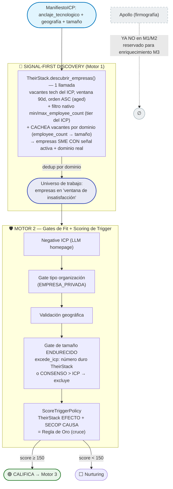
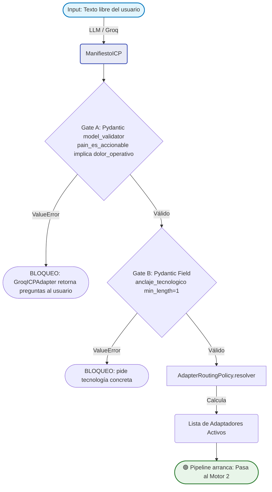
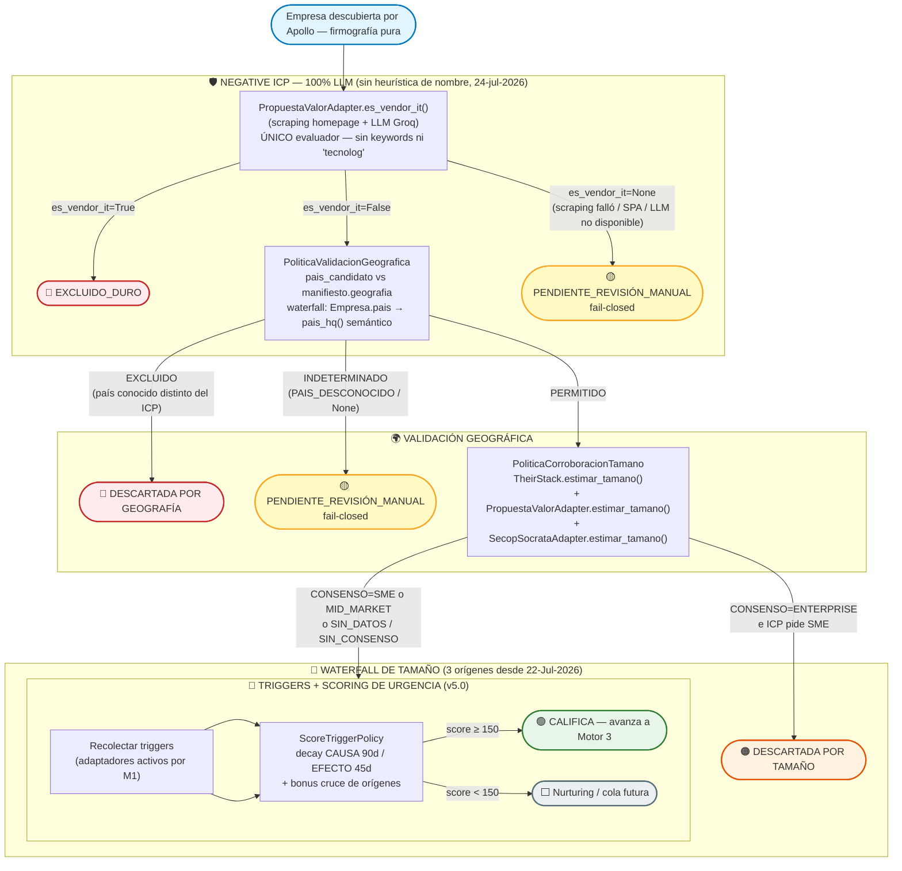
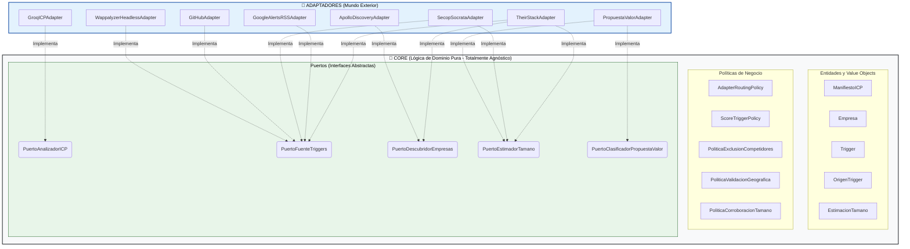

# Flujo Estructural: Motores 1 y 2 (El Prospector) — v7.0 (Signal-First Discovery — 25-Jul-2026)

> **✅ ESTADO: SIGNAL-FIRST DISCOVERY (v7.0, 25-Jul-2026) — REVIERTE el Apollo-only del 21-Jul.**
> Motor 1 ahora **descubre DESDE la fuente de trigger** (TheirStack: empresas con
> vacantes técnicas del stack del ICP, ventana 90d), no desde firmografía ciega
> (Apollo). Fundamento: SHiFT! + ABM + investigación web — un lead "oro" necesita
> **Fit × Trigger**; descubrir por firmografía ciega construía el Tier-3 TAM (lo
> menos accionable) y traía 60% de colegios/ONGs que el gate de tipo descartaba.
> Justificación e historia completas → `01_Gobernanza_EOS/02_backlog_y_rocas.md`, sección
> "Decisión: Inversión del Motor 1 a 'Signal-First Discovery'" (§BITÁCORA DE DECISIONES HISTÓRICAS).
>
> - **TheirStack = discoverer PRIMARIO** (ventana 90d → captura vacantes ENVEJECIDAS
>   ≥45d = TIER_0). Filtra por tecnología del ICP → no trae colegios/ONGs/medios.
> - **Apollo SALE del loop M1/M2** (reservado para enriquecimiento M3).
> - **SECOP = cruce de señal** (CAUSA → Regla de Oro con EFECTO de TheirStack). Aún
>   NO discoverer (da nombres sin dominio → requiere resolutor de dominio, diferido).
> - **RUES** sigue descartado como fuente automatizada.

Este documento destila la arquitectura técnica y operativa de los Motores 1 y 2.

## Flujo de Descubrimiento Signal-First (v7.0)



**Por qué Signal-First es superior al TAM firmográfico (baseline path A, 0 accionables):**
- Cada empresa descubierta YA tiene una señal activa (vacante) → está en una ventana, no es TAM frío.
- TheirStack filtra por tecnología → NO devuelve colegios/fundaciones/medios (no publican vacantes de Python/AWS) → elimina de raíz el 60% de desperdicio de Apollo.
- Trae dominio real → Negative ICP homepage, scoring por dominio y ccTLD funcionan sin resolución extra.
- El aging ≥45d tiera a TIER_0 las vacantes que la empresa NO logra llenar = fallo de reclutamiento = el dolor exacto de una consultora de staff-augmentation.

**Aging de vacante técnica por BANDAS (v7.3, 26-Jul-2026 — tras corrida #5):** el
`obtener_triggers` de TheirStack busca, por finalista, una **vacante de ROL TÉCNICO
aún abierta** (`is_closed=False` + `job_title_pattern_or`) dentro de una ventana de
FECHAS absolutas, en DOS bandas:

  - Banda TIER_0 [75-90 días]: si hay una vacante técnica abierta posteada hace ≥75d →
    **TIER_0** (sangrado activo real; califica sola, 200≥150).
  - Banda TIER_1 [45-75 días]: si no hubo TIER_0 → **TIER_1** (dificultad notable; NO
    califica sola, 100<150 — necesita cruce con otro origen).
  - Sin banda / query falla → fallback a la cache del discovery (vacante fresca →
    **TIER_2**, contexto).

  Por qué bandas y no umbral único de 45d: la corrida #5 salió 12/12 TIER_0 (falso
  positivo masivo) porque 45d de aging es ciclo de contratación NORMAL, no dolor. Las
  bandas reservan TIER_0 para aging FUERTE (≥75d) o para el cruce multi-origen
  (ScoreTriggerPolicy), restaurando la discriminación. Se usan 2 queries de ventana de
  fecha (robustas al `order_by` deprecado); TheirStack no cobra si devuelven 0, así que
  el costo es 1 crédito solo cuando hay señal.

  **Precisión (fix corrida #5):** el filtro de rol técnico es a nivel de VACANTE
  (`job_title_pattern_or`), NO a nivel empresa (`company_technology_slug_or` devolvía
  jobs de empresas que "mencionaron" la tech, no necesariamente el job devuelto → la
  vacante vieja podía no ser técnica). Además se corrigió el parseo a `job_title` /
  `technology_slugs` (campos reales de la API). `descubrir_empresas` sigue amplio
  (hiring, `is_closed=False`).

**Filtro anti-comercial + rol técnico en DISCOVERY (v7.4, 26-jul-2026 — tras corrida
#6):** tanto `descubrir_empresas` como la query de aging filtran por `job_title_pattern_or`
(rol dev/eng) Y `job_title_pattern_not` (excluye `comercial|ventas|vendedor|negocio|
fidelización|marketing|mercadeo`). Fix del falso positivo real: "Vendedor / Desarrollador
Comercial con Moto" (rol de VENTAS) se colaba como TIER_0 porque el regex matcheaba
"Desarrollador". Ahora la exclusión gana y el universo del discovery nace limpio de
vacantes no técnicas.

**Gate de FIT DE COMPRADOR (v7.3/v7.4):** `PropuestaValorAdapter` añade una 5ª pregunta
al LLM (`es_multinacional`) en la MISMA llamada cacheada. `PoliticaFitComprador`
(fail-open) descarta filiales de multinacionales (Novartis/Publicis/Leo/ContourGlobal):
firmográficamente "SME" locales pero fuera del ICP (compra de TI global/centralizada).
Va como Paso 1.6 del sandbox. **Excepción SECOP (v7.4):** una multinacional CON contrato
público local activo (trigger SECOP_SOCRATA) SÍ se permite — la plata pública local
valida que la compra se decide en Colombia (caso Atrys, el lead de mayor señal).

**Empresas no-tech-core (v7.4):** un bufete/empresa de otro sector que busca devs
INTERNOS SÍ está en el ICP (es cliente ideal de staff augmentation). No se filtra por
sector; el Negative ICP solo excluye COMPETIDORES (vendors de TI).

**Discovery por FUNDING vía TheirStack: ELIMINADO (v7.4).** El `/v1/companies/search`
devolvió 0 para PYMEs colombianas (cobertura nula). Se borró el discoverer por funding
y el origen `THEIRSTACK_FUNDING` para no mantener código muerto. El funding queda 100%
delegado a Google Alerts (feeds por marca + eventos). **Nota de arquitectura:** los
datos confirman que TheirStack NO tiene cobertura para ser el único descubridor en
LATAM → pendiente revertir el Motor 1 a HÍBRIDO (Apollo como descubridor de TAM amplio
con filtros duros anti-NGO/educación/gobierno; TheirStack solo como evaluador de señal
de urgencia en Motor 2).

**Tavily como respaldo de clasificación (v7.3):** `TavilyContextoAdapter.describir_empresa`
se inyecta en `PropuestaValorAdapter`; cuando la homepage no resuelve (DNS muerto/SPA/
403) se clasifica con búsqueda web en vez de caer a revisión manual por falla técnica.
Anti-bazuca: solo se invoca si el scraping falló (1.000 créditos gratis/mes).

**Funding vía Google News (v7.2, ÚNICA fuente de funding tras v7.4):** el
`GoogleAlertsRSSAdapter` detecta rondas por LLM; el sandbox lo alimenta con feeds por
MARCA + un feed de eventos (funding/liderazgo/M&A). Es la única vía de funding ahora que
se eliminó el discoverer por funding de TheirStack.

**Domain quality (v7.1):** antes de leer una homepage, `PropuestaValorAdapter`
resuelve el dominio por DNS (`socket.getaddrinfo`, stdlib, costo 0); un dominio que
no resuelve retorna `None` de inmediato (evita ~15s de timeout + Playwright sobre
dominios muertos).

**Cambio principal v7.0 (25-Jul-2026):** el Motor 1 dejó de ser "firmografía ciega
(Apollo)" y pasó a "descubrimiento por trigger (TheirStack)". El Motor 2 sigue
igual (gates de Fit + scoring), con el gate de tamaño endurecido (`excede_icp`).

---

## MOTOR 1: Analizador ICP + Enrutador Dinámico

**Objetivo:** Transformar lenguaje natural en un `ManifiestoICP` tipado, bloquear perfiles genéricos, y determinar qué adaptadores del Motor 2 tienen sentido según la categoría de empresa detectada.

### Puerto Requerido: `PuertoAnalizadorICP`

El Motor 1 no llama directamente a ningún LLM. Habla con la abstracción:

```python
class PuertoAnalizadorICP(ABC):
    @abstractmethod
    def analizar(self, descripcion_libre: str) -> ManifiestoICP:
        ...
```

El adaptador concreto (`ClaudeICPAdapter`, `OpenAIICPAdapter`, etc.) implementa este puerto. El Core no sabe qué LLM se usa.

### Flujo Lógico (v6.0 — corregido tras auditoría 22-Jul-2026):

> **Nota de honestidad (auditoría 22-Jul-2026):** las versiones previas de este
> documento describían un `ScoringPolicy.calcular()` con pesos ponderados
> (30% dolor, 25% tecnología, etc.) como parte del flujo del Motor 1. Esa
> clase **nunca se materializó en código** — no existe `ScoringPolicy` en
> `policies.py` ni en ningún otro módulo. Los únicos gates reales son los
> validadores Pydantic de `ManifiestoICP` (Gate A y Gate B, ambos vía
> `model_validator`/`Field(min_length=1)`, que lanzan `ValueError` y que
> `GroqICPAdapter` traduce a preguntas de clarificación). El diagrama se
> corrige para reflejar el código real; la tabla de pesos se retiene abajo
> solo como nota histórica de diseño, marcada explícitamente como no
> implementada.



**Nota sobre los Gates A y B (código real):**
Ambos Gates viven exclusivamente en `ManifiestoICP` (Pydantic v2), no en una
política separada:
1. **Gate A** — `@model_validator(mode="after") def validar_coherencia_dolor`:
   si `pain_es_accionable=True` y `dolor_operativo` es `None`, lanza `ValueError`.
2. **Gate B** — `anclaje_tecnologico: list[str] = Field(..., min_length=1)`:
   Pydantic rechaza el objeto si el LLM no devuelve al menos una tecnología.

En ambos casos, `GroqICPAdapter.analizar()` captura la `ValidationError` y la
traduce a un máximo de 3 preguntas de clarificación (`_generar_preguntas_clarificacion`),
conforme al contrato de `PuertoAnalizadorICP`. No hay un score numérico
intermedio: el objeto o es válido (pasa) o no lo es (bloquea con preguntas).

### AdapterRoutingPolicy — Lógica de Enrutamiento

Esta política es **lógica de dominio pura**. No conoce adaptadores concretos, solo `ManifiestoICP` y `OrigenTrigger`. Es testable unitariamente sin LLM.

**Reglas de enrutamiento derivadas de la investigación de mercado:**

```python
class AdapterRoutingPolicy:
    """
    Decide qué adaptadores del Motor 2 activar según el ManifiestoICP.
    Regla base: Google Alerts siempre activo (90% universal).
    Los demás se activan condicionalmente según la categoría de empresa.
    """

    CATEGORIAS_GOV_FACING = {
        CategoriaEmpresa.AGENCIA_IT,
        CategoriaEmpresa.CONSULTORA_IT,
        CategoriaEmpresa.BPO_MANAGED,
        CategoriaEmpresa.GOVTECH_REGTECH,
    }

    CATEGORIAS_STACK_VISIBLE = {
        CategoriaEmpresa.SAAS_B2B_HORIZONTAL,
        CategoriaEmpresa.SAAS_B2B_VERTICAL,
        CategoriaEmpresa.AGENCIA_IT,
    }

    CATEGORIAS_SIN_WAPPALYZER = {
        CategoriaEmpresa.CIBERSEGURIDAD,    # Ocultan stack deliberadamente
        CategoriaEmpresa.REGULADO_FINTECH,  # Core bancario no es web-visible
        CategoriaEmpresa.REGULADO_HEALTHTECH,
        CategoriaEmpresa.AI_ML_PLATFORM,    # Infraestructura no frontal
        CategoriaEmpresa.BPO_MANAGED,
    }

    def resolver(self, manifesto: ManifiestoICP) -> list[OrigenTrigger]:
        activos: list[OrigenTrigger] = [OrigenTrigger.GOOGLE_ALERTS]  # Siempre activo

        # TheirStack: útil para todas las categorías excepto reguladas puras (hiring discreto)
        categorias_sin_theirstack = {
            CategoriaEmpresa.REGULADO_FINTECH,
            CategoriaEmpresa.REGULADO_HEALTHTECH,
        }
        if manifesto.categoria_empresa not in categorias_sin_theirstack:
            activos.append(OrigenTrigger.THEIRSTACK)

        # SECOP: solo si el perfil tiene naturaleza gov-facing
        if manifesto.es_gov_facing or manifesto.categoria_empresa in self.CATEGORIAS_GOV_FACING:
            activos.append(OrigenTrigger.SECOP_SOCRATA)

        # Wappalyzer: solo donde el stack es web-visible y el dolor es deuda técnica de frontend/backend
        if manifesto.categoria_empresa in self.CATEGORIAS_STACK_VISIBLE \
                and manifesto.categoria_empresa not in self.CATEGORIAS_SIN_WAPPALYZER:
            activos.append(OrigenTrigger.WAPPALYZER)

        return activos
```

**Ejemplo de enrutamiento en tiempo de ejecución:**

| Input del usuario | `categoria_empresa` detectada | Adaptadores activados |
|---|---|---|
| "Fintech colombiana que necesita seguridad" | `REGULADO_FINTECH` | Google Alerts solamente |
| "Agencia IT sobrevendida con contrato gobierno" | `AGENCIA_IT` + `es_gov_facing=True` | Google Alerts + TheirStack + SECOP + Wappalyzer |
| "SaaS B2B de 100 empleados con monolito" | `SAAS_B2B_HORIZONTAL` | Google Alerts + TheirStack + Wappalyzer |
| "Consultora de ciberseguridad LATAM" | `CIBERSEGURIDAD` | Google Alerts + TheirStack |

### ScoringPolicy (Pesos) — ⚠️ DISEÑO HISTÓRICO, NUNCA IMPLEMENTADO

> Esta tabla documenta una idea de diseño temprana que **no se materializó
> en código**. No existe la clase `ScoringPolicy` en el repositorio. El Gate
> real de calidad del ManifiestoICP es binario (Pydantic válido/inválido —
> ver Gates A/B arriba), no un score ponderado. Se conserva aquí únicamente
> como referencia histórica por si se decide implementar en el futuro.

| Dimensión             | Peso |
|-----------------------|------|
| Dolor Operativo       | 30%  |
| Anclaje Tecnológico   | 25%  |
| Cargos Decisores      | 15%  |
| Vertical / Sector     | 15%  |
| Tamaño de Empresa     | 10%  |
| Geografía             |  5%  |

---

## MOTOR 2: Cascada de Triggers (Ejecución Condicional)

**Objetivo:** Ejecutar únicamente los adaptadores habilitados por el Motor 1 y capturar señales de mercado deterministas.

**Regla de calificación (v5.0):** la calificación de un prospecto la resuelve `ScoreTriggerPolicy` mediante un score numérico de urgencia (ver la sección "Signal-Based Selling v5.0" más abajo, que es la fuente de verdad). El principio de fondo se mantiene: un prospecto de dolor latente no avanza solo — se exige urgencia suficiente (una señal Tier 0 basta; una Tier 1 requiere corroboración de otro origen).

> **Contexto histórico (v3.0, superado):** la política previa `TriggerAggregationPolicy` retornaba un booleano según una regla de conteo (mínimo 2 triggers de orígenes distintos, al menos uno con `fecha_evento` < 45 días, umbral dinámico `min(2, len(adaptadores_activos))`). Fue reemplazada por el scoring numérico de `ScoreTriggerPolicy` en v5.0; se conserva en el código en paralelo hasta retirar el sandbox heredado.

### Puerto Requerido: `PuertoFuenteTriggers`

```python
class PuertoFuenteTriggers(ABC):
    @abstractmethod
    def obtener_triggers(self, empresa: Empresa) -> list[Trigger]:
        """
        Contrato de error: nunca propaga excepciones al Core.
        Errores de red o API → retorna [] con log interno.
        """
        ...
```

### Adaptadores y su Condición de Activación

| Adaptador                   | Siempre activo | Condición de activación                                                     | Cobertura          |
| --------------------------- | -------------- | --------------------------------------------------------------------------- | ------------------ |
| `GoogleAlertsRSSAdapter`    | ✅ SÍ           | Siempre                                                                     | 90% del árbol tech |
| `TheirStackAdapter`         | ❌ NO           | `categoria_empresa` no es REGULADO_FINTECH ni REGULADO_HEALTHTECH           | 65%                |
| `SecopSocrataAdapter`       | ❌ NO           | `es_gov_facing=True` o categoría gov-facing                                 | 40%                |
| `WappalyzerHeadlessAdapter` | ❌ NO           | `categoria_empresa` en {SAAS_B2B_HORIZONTAL, SAAS_B2B_VERTICAL, AGENCIA_IT} | 35%                |
| `GitHubAdapter`             | ❌ NO           | `categoria_empresa` en {SAAS_B2B_HORIZONTAL, SAAS_B2B_VERTICAL, AGENCIA_IT, CONSULTORA_IT, AI_ML_PLATFORM, CIBERSEGURIDAD} | ~40% (añadido en auditoría 22-Jul-2026, faltaba en esta tabla) |

#### 1. `GoogleAlertsRSSAdapter` — SIEMPRE ACTIVO
- **Implementación:** Google Alerts con salida RSS. Parseo con `feedparser`.
- **Input requerido de `Empresa`:** `nombre`.
- **Costo:** $0.
- **Triggers:** M&A, rondas de inversión, llegada nuevo C-Level técnico.
- **`nivel_confianza` ALTA:** Nuevo CTO/CIO/CDO confirmado < 6 meses.
- **`nivel_confianza` MEDIA:** Ronda de inversión anunciada.
- **`nivel_confianza` BAJA:** Mención en medios sin evento concreto.

#### 2. `TheirStackAdapter` — CONDICIONAL (activo para la mayoría)
- **Implementación:** API REST de TheirStack.
- **Input requerido de `Empresa`:** `nombre` y `dominio`.
- **Costo:** Según plan TheirStack (API key en secretos, nunca en Core).
- **Triggers:** Incompatibilidad de sistemas, crisis de talento.
- **`nivel_confianza` ALTA:** 3+ vacantes técnicas abiertas + nuevo stack adoptado simultáneamente.
- **`nivel_confianza` MEDIA:** 1-2 vacantes técnicas > 30 días.
- **`nivel_confianza` BAJA:** Vacante única, sin cruce con stack.
- **Descartado como criterio único:** ">30 días aislado" (alto volumen de ghost jobs).
- **Desactivado para:** `REGULADO_FINTECH`, `REGULADO_HEALTHTECH` (contratación discreta, alta tasa de falso positivo).

#### 3. `SecopSocrataAdapter` — CONDICIONAL (solo gov-facing)
- **Implementación:** `requests` + Socrata Open Data API (SODA) Colombia Compra Eficiente. Optimizado con full-text search `$q` en v6.0 (`$where LIKE` con wildcard inicial forzaba full scan, ~10.5s medido en vivo; `$q` es full-text indexado, ~0.5-1s medido en vivo). `$q` es fuzzy, por lo que `_buscar_contratos()` aplica un filtro de verificación en Python (`contiene_palabra_completa`) sobre los candidatos antes de convertirlos en Trigger.
- **Input requerido de `Empresa`:** `nombre` (usado como término de búsqueda `$q`; `nit_o_tax_id` no se usa hoy en la query, aunque el modelo lo expone).
- **Costo:** $0 (opcionalmente con `SECOP_APP_TOKEN` para elevar el límite de tasa).
- **Triggers:** Adjudicación de contratos a empresas tech. Extrae `es_pyme`, `urlproceso.url`, `codigo_de_categoria_principal` (UNSPSC) y `direccion_de_ejecucion_del_contrato`, incorporados a la descripción del Trigger.
- **`nivel_confianza` (código real, `_nivel_por_fecha()` en `secop_adapter.py`) — basado ÚNICAMENTE en antigüedad del contrato, SIN filtro de valor monetario:**
  - **ALTA:** contrato firmado hace ≤90 días (`_DIAS_ALTA`), alineado con el decay de CAUSA de `ScoreTriggerPolicy` (90d) para que un TIER_0 de SECOP siempre puntúe dentro de la ventana de scoring.
  - **MEDIA:** contrato firmado entre 90 y 365 días (`_DIAS_MEDIA`), o sin fecha parseable (default conservador).
  - **BAJA:** contrato firmado hace >365 días — omitido por defecto (`incluir_baja_confianza=False`).
- **`PuertoEstimadorTamano` (tercer origen del waterfall de tamaño, v6.0):** el campo `es_pyme` (dato verificado por la entidad contratante, no inferencia de LLM) se traduce a `SME` (si "Sí") o `MID_MARKET` (si "No"), con confianza `0.55`. Corregido en la auditoría 22-Jul-2026: el método existía pero no estaba conectado en `sandbox_tbbc_real.py::evaluar_consenso_tamano()`.
- **Desactivado para:** SaaS B2B puro, ciberseguridad, AI/ML platforms (no venden al gobierno en fase temprana) — vía `AdapterRoutingPolicy.CATEGORIAS_GOV_FACING`.

#### 4. `WappalyzerHeadlessAdapter` — CONDICIONAL (solo stack web visible)
- **Implementación real (código, `wappalyzer_adapter.py`):** SOLO `requests` + `BeautifulSoup`. Lee headers HTTP y meta tags del HTML — **NO usa Playwright ni ninguna librería `wappalyzer-next`** (corregido en auditoría 22-Jul-2026; versiones previas de este documento afirmaban lo contrario). Playwright sí existe en el proyecto, pero como fallback de `PropuestaValorAdapter` (Capa 2 del Negative ICP, no este adaptador) — ver sección "Reintentos Técnicos" más abajo.
- **Input requerido de `Empresa`:** campo `dominio`.
- **Costo:** $0.
- **Triggers:** Stack EOL en producción, ausencia de tecnologías habilitadoras.
- **`nivel_confianza` ALTA:** Stack EOL con versión mayor > 2 años en producción.
- **`nivel_confianza` MEDIA:** Stack desactualizado con soporte activo.
- **`nivel_confianza` BAJA:** Header presente sin versión detectable.
- **Fallo controlado:** dominio no resuelve, SSL error, timeout, o HTML sin patrones detectables → retorna `[]`. Al no ejecutar JavaScript (sin Playwright), un sitio SPA sin server-side rendering no expone nada más allá de headers HTTP y meta tags estáticos.
- **⚠️ LIMITACIÓN DOCUMENTADA:** Solo lee la "corteza" web (frontend, scripts). No detecta deuda técnica de backend (BD colapsadas, microservicios internos). Útil únicamente cuando el síntoma es stack frontend/web observable. Para TBBC, es señal secundaria, no primaria.
- **Desactivado para:** Ciberseguridad (ocultan stack deliberadamente), Fintech core (backend no web-visible), BPO, AI/ML platforms.

#### 5. `GitHubAdapter` — CONDICIONAL (empresas de producto/desarrollo/seguridad)
> **Nota de auditoría (22-Jul-2026):** este adaptador existe en código
> (`github_adapter.py`), está registrado en `OrigenTrigger.GITHUB` y en
> `AdapterRoutingPolicy.CATEGORIAS_CON_GITHUB`, pero nunca se documentó en
> esta sección. Se agrega aquí para que el documento sea un espejo fiel del
> código.
- **Implementación:** API pública de GitHub REST (`api.github.com`), sin autenticación obligatoria (60 req/h; con `GITHUB_TOKEN` personal, 5000 req/h).
- **Input requerido de `Empresa`:** `dominio` (se infiere el nombre de la organización de GitHub, ej. `acme.com` → `acme`).
- **Costo:** $0.
- **Triggers:** repos públicos activos (no archivados, no forks) cuyo lenguaje principal matchea `anclaje_tecnologico` del ICP.
- **`nivel_confianza` MEDIA:** hay al menos un repo activo con match de tecnología.
- **Sin match o sin repos:** no genera Trigger (retorna `[]` — ruido bajo, no se reporta BAJA).
- **Fallo controlado:** 404 (org/usuario no existe) → intenta como usuario individual antes de rendirse; 403 con `X-RateLimit-Remaining: 0` → rate limit, retorna `[]`.
- **Activado para:** `SAAS_B2B_HORIZONTAL`, `SAAS_B2B_VERTICAL`, `AGENCIA_IT`, `CONSULTORA_IT`, `AI_ML_PLATFORM`, `CIBERSEGURIDAD` (equipos de seguridad suelen tener repos públicos de herramientas).

### Flujo de Ejecución del Motor 2 (v5.0 — con exclusión de competidores, validación geográfica y scoring de urgencia):

> **Corrección de auditoría (22-Jul-2026):** el diagrama original decía
> "Empresa descubierta por TheirStack" en el nodo de entrada — obsoleto
> desde la refactorización v6.0, donde Motor 1 usa exclusivamente Apollo
> para el discovery (`ApolloDiscoveryAdapter`). Corregido abajo. El nodo TAM
> también se actualiza para incluir el tercer origen (SECOP `es_pyme`),
> conectado en código durante esta misma auditoría.



**Estados de salida (v4.1 — expandidos):**

| Estado | Significado | Siguiente paso |
|---|---|---|
| 🟢 **CALIFICA** | Pasó todos los filtros y tiene señales suficientes | Avanza a Motor 3 |
| 🔴 **EXCLUIDO_DURO** | Competidor confirmado (Capa 1 o Capa 2) o país distinto del ICP | Descarte permanente — 0 créditos de M3 gastados |
| 🟠 **DESCARTADA POR TAMAÑO** | Consenso confirma ENTERPRISE cuando el ICP pide SME | Descarte del batch; podría revisitarse con ICP diferente |
| 🟡 **PENDIENTE_REVISIÓN_MANUAL** | Análisis indeterminado (scraping/LLM fallaron, país no resoluble) | Cola manual — nunca se aprueba automáticamente |
| ⬜ **SEÑALES INSUFICIENTES** | No alcanzó el umbral de score de `ScoreTriggerPolicy` (150) | Cola futura; puede reactivarse si llega un trigger adicional |

**Principio de diseño (fail-closed):** cualquier ambigüedad no resoluble va a `PENDIENTE_REVISIÓN_MANUAL`, nunca a `CALIFICA` por defecto. El costo de revisar manualmente un falso negativo es mucho menor que el costo de contaminar la reputación del dominio de correo con un falso positivo.

---

## Signal-Based Selling v5.0 — ScoreTriggerPolicy (reemplaza el bool de TriggerAggregationPolicy)

**Diagnóstico del pivote:** la vieja `TriggerAggregationPolicy` hacía la **pregunta equivocada** (¿hay 2+ señales distintas en <45d? → bool). La correcta es *cuán urgente es el dolor HOY y cuánto dura esa urgencia*. `ScoreTriggerPolicy` responde con un score numérico.

### Distinción Causa vs. Efecto (SHiFT! — Craig Elias)

| Tipo | Qué es | Ventana de decay | Ejemplos |
|---|---|---|---|
| **CAUSA** | Evento que GENERARÁ el dolor; llega **antes** de que el prospecto busque solución | **90 días** | Contrato SECOP ganado, ronda de inversión, nuevo CTO |
| **EFECTO** | Evidencia de que el dolor **ya existe** | **45 días** | Vacante publicada, stack legacy, mención en prensa |

El decay uniforme de 45d de la versión anterior era incorrecto: le daba a las CAUSAS (de ciclo más largo) la misma ventana corta que a los EFECTOS. El decay diferencial es la aportación más valiosa de SHiFT!.

### Pesos y umbral

```
PUNTOS_BASE:  TIER_0 = 200   TIER_1 = 100   TIER_2 = 50   TIER_3 = 0
DECAY_DIAS:   CAUSA = 90     EFECTO = 45
UMBRAL_CALIFICACION = 150
BONUS_MULTI_ORIGEN  = +30   (2+ orígenes distintos activos)
BONUS_TIER0_CRUCE   = +50   (TIER_0 + otro origen = lead de oro — "Regla de Oro" TBBC)
```

- **TIER_0 califica solo** (200 ≥ 150): sangrado activo, ventana abierta hoy.
- **TIER_1 solo NO califica** (100 < 150): va a nurturing hasta que aparezca una segunda señal.
- **TIER_1 + TIER_2** = 100+50+30 = 180 ✅.
- **TIER_0 + TIER_0 (SECOP + vacante aging)** = 200+200+30+50 = **480** = lead de máxima prioridad.

### Los dos ejes de tiempo del aging de TheirStack (fix decay-vs-aging)

Una vacante con aging >45 días es la señal de fill-rate failure más fuerte — pero si su `fecha_evento` fuera `date_posted`, el propio decay de 45d de EFECTO la eliminaría. Solución: **dos ejes**.
- **Aging** (`now - date_posted`) → determina el **TIER** (≥45d = TIER_0).
- **Frescura de observación** (`now`) → determina el **decay**. Una vacante aún listada es señal de *estado continuo*, fresca en cada re-observación. Por eso el TIER_0 de aging usa `fecha_evento = now`.

Regla general: eventos puntuales (SECOP, CTO, ronda) usan la fecha real del evento; estados continuos (vacante aún abierta) usan la fecha de observación.

### Defaults conservadores (migración gradual, fail-closed)

Los campos `tipo_trigger`/`tier_urgencia` del modelo `Trigger` son **opcionales** con default `EFECTO`/`TIER_2`. Un trigger legacy sin migrar hereda el comportamiento más conservador (nunca infla el score). Esto permitió migrar adaptador por adaptador sin romper los 299 tests. `ScoreTriggerPolicy` convive con `TriggerAggregationPolicy` hasta retirar el sandbox viejo.

### Proximidad Social (Spear Selling) — fuera del score, plan futuro

La Proximidad Social (empleado anterior, defensor, socio, referencia) decide *a través de quién* entrar, no *si* califica. **No entra en el scoring** (rompería fail-closed y requiere CRM inexistente). Plan futuro: un campo a nivel de cuenta (alimentado desde CRM) que **reordena la cola de prospectos ya calificados**, nunca los califica. Detalle en `modelos_dominio_core.md` §5.0.2.

---

## Exclusión de Competidores (Negative ICP) — 100% LLM (v6.3, 24-jul-2026)

### ⛔ Capa 1 (heurística de nombre) — ELIMINADA

> **Cambio 24-jul-2026 (decisión del fundador):** se eliminó por completo la
> Capa 1 "gratis" que juzgaba el Negative ICP por el NOMBRE de la empresa
> (frozenset `_PALABRAS_CLAVE_VENDOR_IT` + prefijo `tecnolog`). Motivo: nada
> hardcodeado. Un keyword-match sobre el nombre produce **falsos positivos**
> (ej. "Tecnoaguas" — empresa de aguas, NO vendor de TI — quedaba excluida por
> contener "tecno…") y **falsos negativos** (un vendor cuyo nombre no incluye
> ninguna palabra clave pasaba como no-competidor). El código
> (`sandbox_tbbc_real.py`) ya no contiene esa lógica ni sus imports
> (`cualquiera_como_palabra_completa`, `PoliticaExclusionCompetidores` quedaron
> fuera del sandbox). La política pura `PoliticaExclusionCompetidores` (Core)
> se conserva —opera sobre enums de categoría, no sobre nombres— pero hoy NO la
> usa el sandbox; queda disponible para cuando el LLM entregue una
> `CategoriaEmpresa` completa del candidato (estado: IMPLEMENTADA pero no cableada).

### Único evaluador — PropuestaValorAdapter (LLM sobre la homepage)

Se invoca para **toda** empresa candidata. Lee el texto público de la homepage
(con fallback a `<title>` + `<meta name="description">` para SPAs sin SSR) y
llama a Groq `llama-3.3-70b-versatile` con un prompt JSON estructurado que
retorna varias señales de una sola llamada (cacheada por instancia):

```json
{
  "es_vendor_it": true/false,
  "tamano_estimado": "STARTUP|SME|MID_MARKET|ENTERPRISE|null",
  "pais_hq": "CO|GB|MX|null"
}
```

- Si `es_vendor_it=True` → `EXCLUIDO_DURO`.
- Si `es_vendor_it=False` → continúa al waterfall geográfico.
- Si `es_vendor_it=None` (scraping falló, SPA opaca, LLM no disponible) → `PENDIENTE_REVISIÓN_MANUAL` (fail-closed). **NUNCA se interpreta como "no es competidor".**

El resultado se cachea en un `dict[UUID, _AnalisisPropuestaValor | None]` por instancia del adaptador, de modo que las tres señales (`es_vendor_it`, `tamano_estimado`, `pais_hq`) se obtienen de una sola lectura web + una sola llamada LLM, reutilizadas por `PoliticaCorroboracionTamano` y `PoliticaValidacionGeografica` sin costo adicional.

---

## PoliticaValidacionGeografica (nueva en v4.1)

```python
class PoliticaValidacionGeografica:
    def evaluar(self, pais_candidato: str | None, geografia_icp: str | None) -> EstadoValidacionGeografica:
        # Si el ICP no restringe geografía → PERMITIDO
        # Si pais_candidato es None / PAIS_DESCONOCIDO ("XX") → INDETERMINADO (fail-closed)
        # Si ambos códigos ISO Alpha-2 coinciden → PERMITIDO
        # Si son distintos y conocidos → EXCLUIDO
```

El país candidato se resuelve en waterfall barato→caro:
1. `Empresa.pais` (ya viene de TheirStack/discovery, corregido tras bug del default `"CO"`).
2. Si `Empresa.pais == PAIS_DESCONOCIDO` → se usa `PropuestaValorAdapter.pais_hq()` (ya cacheado).

---

## Filtro de Co-ocurrencia Semántica en Google Alerts (v4.1)

**Problema raíz:** cuando el nombre de una empresa coincide con una palabra de uso coloquial común, el `match` por subcadena genera falsos positivos. Las comillas exactas en el query RSS reducen el ruido de tokenización pero no el ruido semántico (p. ej. noticias deportivas o de entretenimiento que contienen el término sin referirse a la empresa).

**Fix:** antes de aceptar una entrada RSS como trigger válido, se exige co-ocurrencia con al menos una palabra del glosario de negocio:

```python
_GLOSARIO_COOCURRENCIA_NEGOCIO = frozenset({
    "empresa", "compañía", "company", "startup", "software",
    "tecnología", "agencia", "consultora", "ceo", "cto", "cio",
    "fundador", "inversión", "funding", "ronda", "clientes",
    "servicios", "plataforma", "producto", "mercado", ...
})
```

**Regla adicional:** si el nombre de la empresa tiene ≤8 caracteres (nombre corto/genérico), el nivel de confianza máximo para ese trigger se limita a `BAJA`, y su `tier_urgencia`/`tipo_trigger` se capan a `TIER_2`/`EFECTO` (código real en `google_alerts_adapter.py::obtener_triggers()`) incluso si el texto contiene keywords de C-Level o inversión. Esto fuerza que `ScoreTriggerPolicy` (no `TriggerAggregationPolicy`, que quedó en desuso desde v5.0 — ver corrección de auditoría 22-Jul-2026) requiera corroboración de otra fuente antes de calificar el lead.

Los matches por `palabras_clave_extra` del ICP (dolor_operativo / anclaje_tecnologico) **no** pasan por este filtro adicional: ya son términos específicos de negocio.

---

## Mapa de Dependencias de Puertos — Vista Hexagonal v6.0 (corregido 22-Jul-2026)

> **Auditoría 22-Jul-2026:** el diagrama anterior (v3.0) no incluía
> `ApolloDiscoveryAdapter`, `PropuestaValorAdapter`, `GitHubAdapter`, ni los
> puertos `PuertoDescubridorEmpresas`, `PuertoEstimadorTamano` y
> `PuertoClasificadorPropuestaValor` — todos existen en código
> (`src/core/ports/interfaces.py`) desde el blindaje de Motor 2 (v4.1) y la
> refactorización de discovery (v6.0). Se actualiza el diagrama para que sea
> un espejo fiel del código real. `ScoringPolicy` se retira del diagrama
> (nunca se materializó — ver nota en la sección del Motor 1).



**Notas del diagrama v6.0:**
- `TheirStackAdapter` es el único adaptador con **triple** implementación de puerto (`PuertoFuenteTriggers` + `PuertoDescubridorEmpresas` + `PuertoEstimadorTamano`), aunque `descubrir_empresas()` ya NO se invoca en el flujo real de `sandbox_tbbc_real.py` (Motor 1 solo usa Apollo — ver nota de "Separación de Concerns" al inicio de este documento). El método sigue existiendo y probado por si se reactiva.
- `SecopSocrataAdapter` implementa `PuertoFuenteTriggers` + `PuertoEstimadorTamano` (agregado en v6.0, corregido en la auditoría 22-Jul-2026 para conectarlo al waterfall real — ver sección SECOP arriba).
- `PropuestaValorAdapter` implementa `PuertoClasificadorPropuestaValor` + `PuertoEstimadorTamano`, y además expone métodos de conveniencia fuera de los puertos del Core (`es_vendor_it()`, `pais_hq()`, `snippet_homepage()`) consumidos directamente por el composition root (`sandbox_tbbc_real.py`), no por el Core.

> **REGLA ABSOLUTA:** El Core nunca importa a los adaptadores. La `AdapterRoutingPolicy` retorna `OrigenTrigger` (un Enum del Core), no instancias de adaptadores. El orquestador de la aplicación (capa de casos de uso) resuelve el Enum a la instancia concreta del adaptador vía inyección de dependencias.

## Paquete de Revisión Persistente — `PaqueteRevisionAdapter` (v6.0)

**Problema que resuelve:** antes de esta pieza, cada empresa que caía en
`PENDIENTE_REVISION_MANUAL` (Negative ICP indeterminado) o `INDETERMINADO`
(geografía indeterminada) se imprimía como un banner en consola y se perdía
— la siguiente corrida repetía exactamente el mismo trabajo de LLM/scraping
sobre la misma empresa, sin memoria de que ya había sido evaluada.

**Implementación real** (`src/adapters/revision_manual/paquete_revision_adapter.py`):
- Persiste en un archivo JSON local (`revision_manual/pendientes.json`,
  fuera del control de versiones — ver `.gitignore`) un registro por empresa
  con: `motivo`, `snippet_homepage` (el mismo texto que ya leyó
  `PropuestaValorAdapter`, sin costo adicional), links de verificación de un
  clic (Google, LinkedIn, RUES búsqueda avanzada, y `urlproceso` de SECOP si
  hay un Trigger con esa URL), y `estado_revision`.
- `EstadoRevisionHumana`: `PENDIENTE` | `CONFIRMADO_PERMITIDO` | `CONFIRMADO_EXCLUIDO`.
- El orquestador (`sandbox_tbbc_real.py::main()`) consulta
  `obtener_decision_humana()` como **Paso 0**, ANTES del Negative ICP: si un
  humano ya marcó la empresa como `CONFIRMADO_PERMITIDO`/`CONFIRMADO_EXCLUIDO`
  en una corrida anterior, esa decisión se respeta sin volver a gastar LLM.
- Si una empresa cae en revisión manual, `_registrar_pendiente_con_evidencia()`
  llama a `adapter_pv.snippet_homepage(empresa)` (reutiliza el cache interno
  de `PropuestaValorAdapter`, no dispara una lectura de red adicional) y
  persiste el registro completo.

## Reintentos Técnicos en la Capa 2 (v6.0)

**Problema que resuelve:** muchos casos que terminaban en
`PENDIENTE_REVISION_MANUAL` no eran ambigüedad semántica real, sino fallas
técnicas de lectura (la raíz del dominio no tenía texto útil, pero la
empresa sí tenía contenido público en otra ruta).

**Implementación real** (`PropuestaValorAdapter._leer_texto_homepage()`),
cascada del más barato al más caro, deteniéndose en el primer resultado
utilizable:
1. Raíz del dominio vía `requests` + `BeautifulSoup` (comportamiento histórico).
2. Si (1) no dio NADA de texto (ni body visible ni fallback de meta tags):
   rutas alternas `/nosotros`, `/about`, `/quienes-somos`, `/about-us`, mismo
   método liviano.
3. Si ninguna ruta alterna dio texto: fallback pesado con **Playwright**
   (`_renderizar_con_playwright()`, Chromium headless, ejecuta JavaScript)
   sobre la raíz del dominio — último recurso para SPAs sin
   server-side rendering. Requiere `playwright install chromium` en el
   entorno (dependencia opcional en runtime: si no está disponible, retorna
   `None` sin lanzar excepción, mismo contrato del resto del adaptador).

---
*v3.0 — Motor 1 evolucionado a Enrutador Dinámico. AdapterRoutingPolicy documentada.*
*Wappalyzer rebajado a adaptador condicional con limitaciones documentadas.*
*v4.1 (17-Jul-2026) — Robustez de precisión del Motor 2: exclusión de competidores (Negative ICP) en cascada de 2 capas, PoliticaValidacionGeografica, co-ocurrencia semántica en Google Alerts, techo de confianza BAJA para nombres genéricos. Estados de salida expandidos. PropuestaValorAdapter documentado como adaptador dual con caché por instancia.*
*v5.0 (19-Jul-2026) — Signal-Based Selling materializado: ScoreTriggerPolicy reemplaza el bool de TriggerAggregationPolicy.*
*v6.0 (21-Jul-2026) — Separación de Concerns. Apollo es el único puerto de Discovery (M1) para asegurar un TAM puramente firmográfico. TheirStack pasa a ser exclusivo de Motor 2 (Señales). Optimización SECOP ($q full-text). Implementación de persistencia manual `pendientes.json` gestionada por `PaqueteRevisionAdapter` en el orquestador.*
*v6.1 (22-Jul-2026, auditoría holística) — Corregidas 6 discrepancias código↔documentación: (1) `SecopSocrataAdapter.estimar_tamano()` estaba implementado pero desconectado del waterfall real — conectado en `sandbox_tbbc_real.py`; (2) `GITHUB_TOKEN`/`SECOP_APP_TOKEN` faltaban en `.env.example`; (3) `ScoringPolicy` documentado como código real nunca existió — marcado como diseño histórico no implementado; (4) tabla de adaptadores no incluía `GitHubAdapter`; (5) Wappalyzer documentado erróneamente con Playwright (el código real usa solo `requests`+`BeautifulSoup`; Playwright es fallback de `PropuestaValorAdapter`); (6) umbrales de SECOP con montos en COP no existen en código (el criterio real es solo antigüedad del contrato). Diagramas Mermaid actualizados para reflejar Apollo como discoverer real y el tercer origen SECOP en el waterfall de tamaño. Documentadas las secciones "Paquete de Revisión Persistente" y "Reintentos Técnicos en la Capa 2", que existían en código sin documentación formal en este archivo.*

*v6.2 (22-Jul-2026, blindaje de precisión/scoring + investigación de descubrimiento) — Cambios en Motor 2: (a) `ScoreTriggerPolicy` ahora usa **agregación mejor-por-origen** (solo el trigger de mayor puntaje de cada origen suma; un origen ruidoso ya no califica un lead por sí solo); (b) **Google Alerts** pasó a **verificación semántica por LLM** (con degradación con gracia: sin LLM ⇒ TIER_3, nunca falso-alto); (c) **GitHub** verifica que la organización pertenezca al dominio de la empresa (anti-colisión de homónimos); (d) nuevo **gate de tipo de organización** (gobierno/ONG/medios/educación/gremio) vía la Capa 2 LLM; (e) **heurística de país por ccTLD** (IANA) antes del scraping caro; (f) TheirStack "dos ejes de tiempo" (aging ⇒ TIER, `fecha_evento=now` ⇒ decay) y SECOP ventana ALTA alineada al decay de CAUSA (90d). 444 tests verdes, `ruff` limpio en `src`. **La estrategia de descubrimiento (Apollo con post-filtro NAICS ∪ TheirStack con filtros tamaño+cargo, dedup por dominio) está EN INVESTIGACIÓN, decisión aún NO tomada — ver `01_Gobernanza_EOS/02_backlog_y_rocas.md`, sección "Bitácora de Decisiones — 22 de Julio de 2026" (§BITÁCORA DE DECISIONES HISTÓRICAS).***
