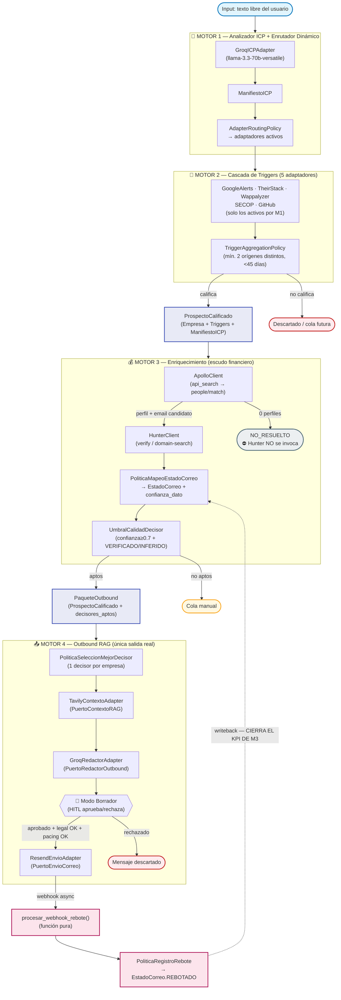

# Arquitectura y Paradigmas — Build Nuevo e Independiente

> Recomendación para construir un **buen sistema** (prospector propio y futuros productos), **desde cero y limpio** (sin reutilizar arquitectura/flujos/metodología de la contratante — ver [`../../estrategia/situacion-contractual-y-sociedad.md`](../../estrategia/situacion-contractual-y-sociedad.md)), respetando las **3 reglas de oro**. Fecha: **4-jul-2026**. *Fuentes externas reformuladas; enlaces citados.*

## 0. Principio rector "clean room"

Puedes usar **herramientas generales** (FastAPI, Postgres, un LLM, etc.) — eso es conocimiento de industria, tuyo para siempre. Lo que **no** puedes reutilizar es la **implementación específica** de la contratante (su código, esquema de BD, prompts, "pain framework", diseño de flujos). Ventaja: diseñar una **arquitectura distinta y mejor** es a la vez tu protección legal y tu mejora de producto. **Documenta tus decisiones de diseño con fecha** = evidencia de creación independiente.

## 1. Paradigmas de base (el "cómo pensamos el sistema")

| Paradigma | Qué aporta | Por qué para nosotros |
|-----------|------------|------------------------|
| **12-Factor Agents** (humanlayer / Dex Horthy) | "Un agente confiable es, sobre todo, software bien hecho": observable, interrumpible, recuperable, auditable, testeable. Tú **posees el control de flujo**; el LLM se usa solo donde el razonamiento probabilístico ayuda | Es la mejor guía para que el prospector sea **confiable en producción** y **no** una caja negra frágil. También te ayuda a **no depender** de un framework pesado (diseño propio). [Repo](https://github.com/humanlayer/12-factor-agents) (~21,5k★ may-2026) |
| **Arquitectura Hexagonal / Ports & Adapters** (o Clean Architecture) | Aísla el **dominio** (lógica de prospección) de la **infraestructura** (scrapers, LLM, BD, APIs). Cambiar Hunter→otro proveedor no toca el dominio | Testeable, desacoplada y **estructuralmente distinta** a un pipeline monolítico → clean-room + calidad |
| **Diseño dirigido por dominio (DDD-lite)** | Modelar el negocio: `Lead`, `Empresa`, `Trigger`, `Campaña`, `ICP`, `Job` como entidades con reglas claras | Claridad y mantenibilidad; base para multi-tenant |
| **Event-driven / colas** | Pipeline de prospección como **jobs idempotentes y reanudables** | Recuperable ante fallos (12-factor), escala por volumen |
| **Spec-driven (Kiro) + Security-driven + SOLID** | Especificar antes de codear; seguridad desde el diseño | Ya es tu estándar; evita deuda técnica |
| **Cost-aware LLM pipeline** | Rutear modelos por complejidad, cachear, medir costo por job | Protege el margen (ver [`costo-por-lead.md`](costo-por-lead.md)) |

## 2. Stack técnico recomendado (pragmático, tu fortaleza)

| Capa | Opción recomendada | Alternativas / nota |
|------|--------------------|--------------------|
| Lenguaje | **Python** (tu fuerte) | — |
| Orquestación de agentes | **Diseño propio guiado por 12-factor** (tú posees el control de flujo) + **PydanticAI** para salidas tipadas/estructuradas | **LangGraph** si necesitas grafos de estado con branching complejo (es el default de producción, pero mayor curva). CrewAI solo para prototipos de roles. Elegir **una** y no sobre-ingeniar |
| API / backend | **FastAPI + Pydantic v2** (async) | — |
| Estructura | **Hexagonal** (dominio / puertos / adaptadores) | Distinta de un pipeline de scripts en cascada |
| Datos | **PostgreSQL (Supabase)** con **RLS** multi-tenant; **esquema propio** diseñado desde cero | No reutilizar el esquema de la contratante |
| Jobs / workers | **Arq** o **Celery/RQ**, o **Modal** serverless; jobs **idempotentes y reanudables** | — |
| Observabilidad | Logging estructurado + **métricas de costo por job** + trazas | Alimenta el modelo de costo por lead |
| Config | **Variables de entorno** (12-factor), workers **stateless** | Secretos fuera del repo |
| Enriquecimiento | Proveedores detrás de **adaptadores** (Hunter/Apollo/Tavily intercambiables) | Evita lock-in y baja el riesgo de "cuello de botella Hunter" |
| Cumplimiento | **Habeas Data by design**: base legal por campaña, opt-out, datos corporativos | Ley 1581/2012 (ver validación §7) |

## 2.1 Diagrama de Arquitectura General del Pipeline (M1 → M4)

> **Estado real del código a 15-Jul-2026.** Este diagrama consolida los 4 motores construidos
> (specs detalladas en `prospector-m1-m2-design.md`, `prospector-m3-m4-design.md` y
> `prospector-m4-design.md`). Muestra cómo cada motor entrega su salida al siguiente y **cierra el
> lazo**: el webhook de rebotes de M4 escribe de vuelta sobre el `Decisor` que produjo M3, cerrando
> el KPI de bounce rate pendiente del piloto.



**Cómo leerlo:**
- Cada motor es una compuerta de costo: M2 no deja pasar señales aisladas, M3 no deja pasar contactos
  dudosos, M4 no deja pasar mensajes sin revisión humana.
- La flecha punteada rosa (`M4_FEED -.-> M3_MAP`) es el **lazo de retroalimentación de rebotes**: es
  el mecanismo, no solo un adorno visual, que permite medir el bounce rate real y cerrar el KPI
  pendiente del piloto de M3 (ver `prospector-m3-m4-design.md` §3.5).
- `ApolloClient` aparece con su flujo real de 2 pasos (`api_search` → `people/match`), vigente desde
  el fix aplicado tras la depreciación del endpoint directo de Apollo.

---

## 3. Repos/recursos para ESTUDIAR (no copiar)

- **[humanlayer/12-factor-agents](https://github.com/humanlayer/12-factor-agents)** — principios de agentes confiables.
- **PydanticAI / LangGraph** (docs oficiales) — para decidir la capa de orquestación. Comparativas 2026: LangGraph = default de producción para flujos con estado; PydanticAI = agentes tipados más limpios ([aihaven](https://aihaven.com/guides/best-open-source-ai-agent-frameworks/), [olostep](https://www.olostep.com/blog/agentic-ai-frameworks)).
- **ECC** (ver [`evaluacion-ecc.md`](evaluacion-ecc.md)) — skills `cost-aware-llm-pipeline`, `api-design`, `backend-patterns` como referencia.
- Referencias de **Arquitectura Hexagonal / Clean Architecture** para estructurar el dominio.

## 3.1 Principios de Arquitectura Derivados del Blindaje Motor 2 (17-Jul-2026)

Los siguientes principios surgieron de los 3 bugs descubiertos en el caso Parcero/UK. Se elevan a principios de arquitectura porque aplican a cualquier adaptador del sistema, no solo al Motor 2.

### Principio: Fail-Closed para Datos de Terceros

> **Cuando un adaptador externo retorna datos insuficientes, ambiguos o un error, el resultado de la operación es siempre `INDETERMINADO/PENDIENTE_REVISIÓN`, nunca `PERMITIDO` por defecto.**

**Motivación:** el comportamiento fail-open (asumir que "sin señal de peligro" = "seguro") es correcto en sistemas donde el costo del falso negativo supera al costo del falso positivo. En El Prospector, el costo de un falso positivo es mucho mayor que el de un falso negativo (mandar un prospecto válido a revisión manual). La revisión manual es barata y local; el daño de reputación del dominio de correo es costoso y sistémico.

**Contraejemplo (fail-open, PROHIBIDO):**
```python
# Anti-patrón: interpretar None como "no hay problema"
if adapter_pv.clasificar(empresa) is None:
    return PERMITIDO  # ← BUG: "no pude analizar" ≠ "confirmado no competidor"
```

**Implementación correcta (tri-estado explícito):**
```python
es_vendor: bool | None = adapter_pv.es_vendor_it(empresa)
# True  → EXCLUIDO_DURO
# False → continúa el pipeline
# None  → PENDIENTE_REVISIÓN_MANUAL  ← fail-closed
```

---

### Principio: Caché por Instancia en Adaptadores Duales

> **Cuando un adaptador implementa múltiples puertos que requieren los mismos datos externos, se usa un `dict[UUID, resultado | None]` por instancia del adaptador para reutilizar el resultado de la primera llamada en todas las invocaciones posteriores sobre la misma entidad.**

**Motivación:** `PropuestaValorAdapter` implementa `PuertoClasificadorPropuestaValor` y `PuertoEstimadorTamano` más expone `es_vendor_it()` y `pais_hq()`. Sin caché, el orquestador pagaría 4 lecturas web + 4 llamadas LLM por empresa. Con caché por instancia: 1 lectura web + 1 llamada LLM, con los 4 resultados derivados del mismo análisis.

```python
class PropuestaValorAdapter:
    def __init__(self) -> None:
        self._cache: dict[uuid.UUID, _AnalisisPropuestaValor | None] = {}

    def _analizar(self, empresa: Empresa) -> _AnalisisPropuestaValor | None:
        if empresa.id in self._cache:
            return self._cache[empresa.id]
        resultado = self._analizar_sin_cache(empresa)  # 1 lectura + 1 LLM
        self._cache[empresa.id] = resultado
        return resultado
```

**Invariante:** el caché es por instancia (no global). Para un orquestador multi-tenant real, el TTL apropiado sería la duración de un job de descubrimiento.

---

### Principio: Datos Ausentes con Centinela Explícito

> **Un campo que "no se sabe" nunca toma el valor del contexto del llamador como default silencioso. Se usa un centinela explícito del Core que el código que lo consume detecta y trata de forma fail-closed.**

**Contraejemplo (PROHIBIDO):**
```python
pais = empresa_data.get("country_code", "CO") or "CO"
# ← Miente: asume el país del ICP del cliente cuando el dato es ausente
```

**Implementación correcta:**
```python
# En models.py — constante del Core
PAIS_DESCONOCIDO: str = "XX"  # ISO 3166-1 reservado — no colisiona con ningún país real

# En TheirStackAdapter
pais_raw = empresa_data.get("country_code")
pais = pais_raw.upper()[:2] if pais_raw else PAIS_DESCONOCIDO
```

`PoliticaValidacionGeografica` trata `PAIS_DESCONOCIDO` como `INDETERMINADO` (fail-closed), nunca como aprobación automática.

---

## 4. Arquitectura COMERCIAL (las 3 reglas de oro en el producto) Diseñar el producto como **SaaS multi-tenant** con:

| Componente | Qué hace | Regla de oro |
|------------|----------|--------------|
| **Planes + cuotas** (Natural/Negocio/Growth/Business) | Enforzar el tope de Hunter (~1.500) y el volumen por plan | Ahorra dinero (no te pasas de cupo) |
| **Medición de uso / metering** | Costo por lead vigilado por cliente | Protege margen |
| **Facturación** | **Wompi / Mercado Pago / PSE** (Colombia) o Stripe (exterior) | Ganar dinero (cobrar bien) |
| **Onboarding self-serve + CRM** | El cliente arranca rápido y ve valor (M5) | Ahorra tiempo + retención |
| **Dashboard de resultados** | Mostrar leads/triggers/respuestas → prueba de valor | Ganar dinero (justifica renovación) |

> **Diferenciación (recordatorio del Pilar 4):** el foso NO es el scraper (es commoditizable). Es **nicho + calidad de trigger/copy + el tiempo que le ahorras al cliente**. La arquitectura debe optimizar **calidad del lead**, no volumen bruto.

## 5. Secuencia recomendada (no sobre-ingeniar)

1. **Spec en Kiro** del MVP propio (dominio + casos de uso + criterios de aceptación).
2. **Diseñar el dominio (DDD-lite)** y la estructura hexagonal → documentar decisiones (evidencia clean-room).
3. **MVP delgado:** 1 flujo end-to-end (descubrir → trigger → decisor → verificar email → copy) con **tu** orquestación (12-factor), adaptadores para proveedores.
4. **Medir costo por job real** (cierra el número del pricing).
5. **Capa comercial mínima:** planes + cuota + un cliente piloto (Catalina).
6. Iterar por calidad de lead, no por features.

> ⚠️ El cuello de botella hoy **no es técnico, es comercial**: construir lo mínimo para vender y validar, no una plataforma perfecta antes del primer peso.
