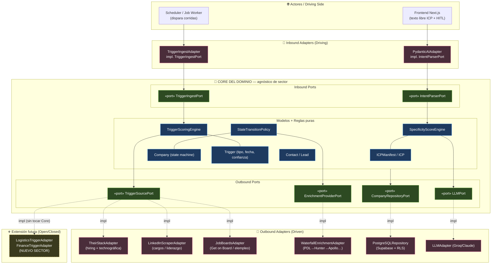
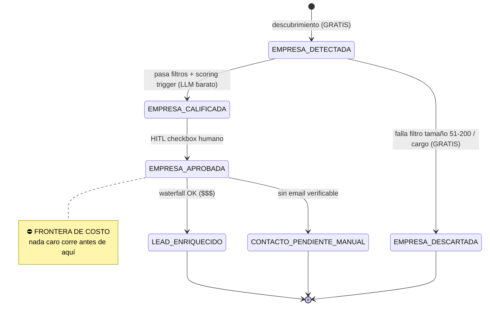

# Prospector — Diseño de Arquitectura M1 (ICP Parser) + M2 (Prospección & Triggers)

---
*   **Proyecto:** El Prospector Greenfield Build
*   **Fecha de Creación:** 6 de Julio de 2026
*   **Autoría:** Yeison Estiven Delgado Ordoñez · Fuente de la Verdad
---

> 🔴 **ATENCIÓN: DOCUMENTO DE DISEÑO CONCEPTUAL (SUPERADO)**
> Este documento fue redactado el 6-Jul como sandbox mental. El vocabulario de puertos (`IntentParserPort`, `WaterfallEnrichmentAdapter`, etc.) **fue descartado** en favor del código real documentado en `modelos_dominio_core.md` y `flujos_motor_1_y_2.md` (ej. `PuertoAnalizadorICP`, `ApolloClient`). 
> **NO utilices este documento para referenciar clases o adaptadores reales.** Úsalo solo para entender los conceptos de "Frontera de Costo" y la filosofía Hexagonal.
>
> Alineado conceptualmente con `docs/tecnico/arquitectura-y-paradigmas.md` (hexagonal + 12-factor agents + cost-aware)
> y con las reglas de negocio de `estrategia/reglas-del-juego.md`.

---

## 0. Caso de uso base (perfil de validación)

```json
{
  "mi_empresa": "TBBC",
  "sector": "tecnologia",
  "pais": "COLOMBIA",
  "mercado_objetivo": "Empresas que necesitan abasto en proyectos de tecnología o sufren de retrasos en entregas",
  "tamano_empresa": "51-200",
  "cargo_decision": "CTO, VP DE VENTAS, VP DE OPERACIONES",
  "dolor_cliente": "Abasto en proyectos tech, pérdida de tiempo/recursos, retrasos en entregas, falta de talento adecuado, sistemas mal estructurados, trabajo lento",
  "propuesta_valor": "Acompañamiento desde preventa técnica, diseño, implementación y operación (IA, arquitectura backend, integraciones cloud)"
}
```

**Insight de negocio que ancla el diseño:** el dolor de TBBC tiene un *proxy observable casi
perfecto* → una empresa 51–200 que publica vacantes técnicas y **no las llena rápido** está
señalando exactamente el dolor que TBBC resuelve (abasto/talento/retrasos). Por eso el **trigger
primario es el hiring**, no la prensa. Esto lo confirma la literatura 2026: la data de vacantes es la
señal pública más temprana y fiable de intención de compra
([Crustdata — job posting data APIs](https://crustdata.com/blog/best-apis-for-job-posting-data)), y
existen APIs technográficas que derivan el stack directamente de las ofertas de empleo
([TheirStack](https://theirstack.com/blog/best-technographic-data-apis)).
*Contenido reformulado por cumplimiento de licencias.*

---

## 1. Cómo leer esta arquitectura (guía rápida)

Antes de los diagramas, la brújula. Si nunca has leído una arquitectura hexagonal, lee esta sección
primero.

### 1.1 La metáfora del hexágono
Imagina el software como una **cebolla de tres capas**:

1. **Core del Dominio (centro).** Las reglas de negocio puras: cómo se calcula el Specificity Score,
   qué transiciones de estado son válidas, cómo se puntúa un trigger. **No sabe nada del mundo
   exterior:** ni de LinkedIn, ni de TheirStack, ni de Postgres, ni de que exista "el sector
   tecnología". Es matemática de negocio pura y se puede probar sin internet.
2. **Puertos (la frontera).** Son *contratos* (interfaces). El Core dice "necesito una fuente de
   triggers que sepa hacer `discover_companies()` y `fetch_triggers()`", pero **no le importa quién
   los implementa**. Un puerto es un enchufe en la pared.
3. **Adaptadores (borde exterior).** Son los *aparatos* que se enchufan al puerto: `TheirStackAdapter`,
   `LinkedInScraperAdapter`, `PostgreSQLRepository`. Cada adaptador traduce el mundo real (una API,
   una base de datos) al lenguaje que el Core entiende.

### 1.2 La regla de oro de la dependencia
> **Las flechas de dependencia siempre apuntan hacia adentro.** Los adaptadores conocen al Core; el
> Core JAMÁS conoce a los adaptadores.

Esto es lo que permite: **cambiar de proveedor (o agregar un sector nuevo) escribiendo un adaptador
nuevo, sin tocar una sola línea del Core.** Es el Open/Closed Principle hecho topología.

### 1.3 Dos lados del hexágono
- **Inbound / Driving (izquierda):** quién *provoca* que el sistema actúe. Ej. el frontend enviando
  el texto libre del ICP, o el scheduler disparando una corrida. Entran por **Inbound Ports**.
- **Outbound / Driven (derecha):** los recursos que el sistema *usa* para trabajar. Ej. la base de
  datos, las APIs de datos, el LLM. Se accede a ellos por **Outbound Ports**.

### 1.4 Cómo leer los dos diagramas de este documento
- El **diagrama hexagonal** (§3) responde: *¿quién habla con quién y quién puede cambiar sin romper
  nada?* Busca la caja azul central (Core): todo lo que la rodea es reemplazable.
- El **diagrama de máquina de estados** (§5) responde: *¿en qué orden ocurre el trabajo y en qué punto
  exacto se gasta el dinero?* Busca la nota "FRONTERA DE COSTO": nada caro corre antes de ella.

### 1.5 Glosario de 30 segundos
| Término | En una frase |
|---|---|
| **ICP** | Perfil de cliente ideal (a quién buscamos). |
| **Manifiesto** | El ICP convertido en datos estructurados y validados. |
| **Specificity Score** | Nota 0.0–1.0 de qué tan bien definido está el ICP; si es bajo, el sistema se frena. |
| **Trigger** | Señal de compra observable (una vacante, un CTO nuevo, un stack legacy). |
| **HITL** | *Human-in-the-loop*: un punto donde una persona aprueba antes de continuar. |
| **Waterfall / cascada** | Consultar varios proveedores de datos en orden hasta encontrar el dato bueno. |
| **Idempotencia** | Ejecutar dos veces produce el mismo resultado (no duplica ni re-cobra). |

---

## 2. Principios de diseño (no negociables)

1. **Core agnóstico de sector.** El Core no menciona "tecnología", "Colombia" ni ninguna API. Que el
   trigger primario de TBBC sea "presión de contratación" es conocimiento de un *adaptador*, no del Core.
2. **Puertos primero (Dependency Inversion).** El Core define las interfaces; los adaptadores dependen
   del Core. Nunca al revés.
3. **Determinismo antes que probabilismo (12-factor agents).** Yo controlo el flujo. El LLM se usa solo
   donde el razonamiento probabilístico aporta (parseo de texto libre, scoring semántico), detrás de un
   puerto y con salida tipada (PydanticAI).
4. **Cost-aware por diseño.** El orden de ejecución es barato → caro. El crédito de enriquecimiento se
   gasta únicamente después de filtros gratuitos + aprobación humana.
5. **Estado como fuente de la verdad.** Todo el progreso vive en Postgres; los workers son stateless,
   reanudables e idempotentes.
6. **Open/Closed.** Agregar un sector o un mercado internacional = nuevos adaptadores + una nueva
   `ScoringPolicy`. El Core no se modifica.

---

## 3. Diagrama de Arquitectura Hexagonal (M1 + M2)



**Cómo leerlo:** la caja azul central (Core) es intocable e independiente del mundo. Todo lo rosado
(adaptadores) es reemplazable. La caja amarilla punteada muestra que un sector nuevo entra como un
adaptador más, enchufado al mismo puerto `TriggerSourcePort`, **sin modificar el Core**.

---

## 4. Contratos de Puertos e Interfaces

> Convención: `Protocol`/`ABC` = puertos del Core; los adaptadores los implementan. Modelos con
> Pydantic v2. El Core no importa ninguna librería de red ni de base de datos.

### 4.1 Dominio puro

```python
class TriggerType(str, Enum):
    HIRING_PRESSURE   = "hiring_pressure"    # vacantes técnicas / stale
    LEADERSHIP_CHANGE = "leadership_change"  # nuevo CTO/VP
    TECH_SIGNAL       = "tech_signal"        # stack legacy / migración
    ANNOUNCEMENT      = "announcement"       # fallback

class Confidence(str, Enum):
    HIGH = "high"; MEDIUM = "medium"; LOW = "low"

class ICPManifest(BaseModel):          # salida tipada del parser (agnóstica de sector)
    vertical: str | None
    technical_anchor: list[str]        # stack / capas concretas
    operational_pain: str | None
    pain_is_actionable: bool
    decision_roles: list[str]
    company_size_range: tuple[int, int] | None
    geography: str | None
    is_international: bool
    legal_basis: str | None            # Habeas Data Ley 1581 (interés legítimo)

class SpecificityResult(BaseModel):
    score: float                       # 0.0 – 1.0
    verdict: Literal["VALIDO", "ACEPTABLE_CON_ADVERTENCIA", "INCOMPLETO"]
    blocking_reason: str | None
    clarifying_gaps: list[str]

class CompanyState(str, Enum):
    EMPRESA_DETECTADA         = "empresa_detectada"
    EMPRESA_DESCARTADA        = "empresa_descartada"
    EMPRESA_CALIFICADA        = "empresa_calificada"
    EMPRESA_APROBADA          = "empresa_aprobada"          # ⛔ gate de costo
    LEAD_ENRIQUECIDO          = "lead_enriquecido"
    CONTACTO_PENDIENTE_MANUAL = "contacto_pendiente_manual"
```

### 4.2 Inbound Ports (driving)

```python
class IntentParserPort(Protocol):
    """Convierte texto libre en manifiesto tipado. Impl: PydanticAIAdapter."""
    def parse(self, raw_text: str) -> ICPManifest: ...

class TriggerIngestPort(Protocol):
    """Punto de entrada del pipeline de descubrimiento para un job/ICP."""
    def run_discovery(self, job_id: UUID, icp: ICP) -> DiscoveryReport: ...
```

### 4.3 Motores del Core (lógica pura, testeable sin red)

```python
class SpecificityScoreEngine:
    def __init__(self, policy: ScoringPolicy): ...   # pesos inyectados, NO hardcode
    def evaluate(self, m: ICPManifest) -> SpecificityResult:
        # Gate A: pain no accionable -> dimensión = 0
        # Gate B: sin technical_anchor Y pain no es infra/dev/cloud -> BLOQUEO
        # score ponderado; verdict por umbral (0.60 / 0.80)
        ...

class TriggerScoringEngine:
    def score(self, company: Company, triggers: list[Trigger]) -> FitScore:
        # determinista; combina tier de señal + recency/confianza
        ...

class StateTransitionPolicy:
    """Única autoridad de transiciones válidas (evita estados corruptos)."""
    def can_transition(self, frm: CompanyState, to: CompanyState) -> bool: ...
```

### 4.4 Outbound Ports (driven)

```python
class TriggerSourcePort(Protocol):
    """Abstracción TOTAL de la fuente. El Core no sabe si es LinkedIn, un job board o gov."""
    def discover_companies(self, icp: ICP, limit: int) -> list[CompanySignal]: ...
    def fetch_triggers(self, company: Company) -> list[Trigger]: ...

class EnrichmentProviderPort(Protocol):
    """Cascada waterfall detrás de una sola interfaz. Impl intercambiable por costo/geo."""
    def enrich_contact(self, hint: ContactHint) -> EnrichedContact | None: ...

class CompanyRepositoryPort(Protocol):
    def save(self, c: Company) -> None: ...
    def update_state(self, id: UUID, to: CompanyState) -> None: ...
    def find_by_state(self, job_id: UUID, state: CompanyState) -> list[Company]: ...
    def exists(self, job_id: UUID, domain: str) -> bool: ...   # idempotencia

class LLMPort(Protocol):
    def structured_complete(self, prompt: str, schema: type[T]) -> T: ...
```

**Decisiones de diseño clave**
- `ScoringPolicy` inyectada → los pesos ("dolor = 0.30", favorecer infra/cloud) son *configuración*,
  no código del Core. Cambiar de sector = otra policy, mismo motor.
- `TriggerSourcePort` expone conceptos genéricos (`CompanySignal`, `Trigger`); que la señal venga de
  una vacante stale es interno del `TheirStackAdapter`/`JobBoardsAdapter`.
- `EnrichmentProviderPort` esconde toda la cascada: el Core pide "enriquece este contacto" y no sabe
  cuántos proveedores se consultaron ni en qué orden.

---

## 5. M1 — Filtro de Especificidad del ICP (detalle)

Objetivo: rechazar ICPs vagos **antes** de gastar un crédito. Para TBBC, "vago" = no ancla ni un
stack/capa técnica ni un dolor operativo concreto de infraestructura, desarrollo o nube.

### 5.1 Rúbrica del Specificity Score (0.0 – 1.0)

```
Ponderación por dimensión:
  dolor_operativo concreto ...... 0.30   (peso máximo: es el core de TBBC)
  stack_o_capa_tecnica .......... 0.25
  vertical_objetivo específico .. 0.15
  cargos_decisor válidos ........ 0.15
  tamano_empresa explícito ...... 0.10
  geografia definida ............ 0.05
```

### 5.2 Lógica de bloqueo (gates duros)

1. **Gate A (dolor):** si `operational_pain` es genérico/no accionable → esa dimensión = 0 y
   `blocking_reason = "dolor_no_accionable"`.
2. **Gate B (anclaje técnico):** si `technical_anchor` está vacío **Y** el dolor no es explícitamente
   de infra/dev/cloud → **bloqueo automático**, sin importar el score total. Sin anclaje técnico TBBC
   no puede diferenciar su propuesta.
3. **Umbral global:**
   - `score < 0.60` → `INCOMPLETO`: **no avanza a M2**; devuelve 2–3 preguntas de clarificación
     dirigidas al hueco detectado.
   - `0.60 ≤ score < 0.80` → `ACEPTABLE_CON_ADVERTENCIA`: avanza, la UI muestra qué se asumió.
   - `score ≥ 0.80` → `VALIDO`.

**Por qué el dolor pesa más que el stack:** el stack es fácil de nombrar pero no compra; el dolor
operativo concreto es lo que convierte una lista en un pipeline con intención real. Impacto: regla de
oro **Ahorrar dinero** (cero créditos quemados en ICPs de relleno).

---

## 6. M2 — Cascada de Triggers para Tech en Colombia (detalle)

Cuatro tiers ordenados por fiabilidad y costo. El motor recorre de arriba a abajo y **detiene el gasto
en cuanto tiene señal suficiente**. Ningún tier depende de prensa genérica.

### TIER 1 — Señal de Contratación (primaria, más barata y fiable)
Proxy casi perfecto del dolor de TBBC.
- **Fuentes:** TheirStack (vacantes estructuradas + stack derivado de ellas), Get on Board (núcleo
  tech LATAM), elempleo y Computrabajo (cobertura Colombia), LinkedIn Jobs vía scraper público.
- **Lógica determinista (sin LLM aún):**
  - `n_vacantes_tecnicas ≥ 3` simultáneas → señal de escalamiento/abasto.
  - `dias_vacante_abierta > 30` → dolor de talento (no logran llenar) → **el trigger de mayor valor**.
  - Cargos de las vacantes en la capa que TBBC sirve (backend, cloud, integraciones, IA).
- **Salida:** `TriggerType.HIRING_PRESSURE`, `Confidence.HIGH` (las vacantes traen fecha real).

### TIER 2 — Movimiento de Liderazgo Técnico
Un CTO/VP nuevo reestructura presupuesto y proveedores en sus primeros 90 días: ventana de compra.
- **Fuente:** LinkedIn (cambios de cargo públicos) vía scraper de datos indexados.
- **Lógica:** contratación/rotación reciente (<6 meses) de CTO, VP Operaciones o VP Ventas →
  `TriggerType.LEADERSHIP_CHANGE`.

### TIER 3 — Señal Technográfica (stack / ineficiencia)
- **Fuentes:** TheirStack / BuiltWith (histórico, amplia cobertura) / alternativas Wappalyzer.
- **Lógica:** stack legacy/desactualizado, migración cloud en curso, o tecnologías que TBBC integra →
  `TriggerType.TECH_SIGNAL`. (Opcional: monitoreo de status/uptime público como señal de fragilidad.)

### TIER 4 — Anuncios (fallback, menor fiabilidad para PYME)
Rondas de inversión, expansión, nuevos productos. Solo como refuerzo; nunca única señal para 51–200.

### Validación transversal
- **Recency obligatoria:** cada trigger carga `published_date`; si la confianza es `LOW`, se usa solo
  como contexto interno, **nunca como gancho del correo** (evita "vi que contratan" sobre algo viejo).
- **Score compuesto y transparente:** Tier 1 + Tier 2 simultáneos = cuenta **A**. La UI muestra qué
  señales sumaron, no solo una letra.

---

## 7. Flujo de Datos, Máquina de Estados y Escalabilidad

### 7.1 Máquina de estados (fuente de la verdad en Postgres/Supabase)



### 7.2 Orden de ejecución (barato → caro)

| Paso | Operación | Costo | Estado resultante |
|---|---|---|---|
| 1 | Descubrimiento (`TriggerSourcePort.discover_companies`) | Gratis/bajo | `EMPRESA_DETECTADA` |
| 2 | Filtros deterministas (tamaño 51–200, cargo, geo) | **Cero** | `EMPRESA_DESCARTADA` si falla |
| 3 | Scoring de trigger (LLM barato, temp. baja) | Bajo | `EMPRESA_CALIFICADA` (tier A/B/C) |
| 4 | **HITL** — aprobación por checkbox | **Cero** | `EMPRESA_APROBADA` ⛔ |
| 5 | Enriquecimiento en cascada (waterfall) | **$$$** | `LEAD_ENRIQUECIDO` / `CONTACTO_PENDIENTE_MANUAL` |

> **El punto crítico:** el paso 4 (HITL) es la **compuerta de costo**. Ningún crédito de
> enriquecimiento se consume sobre una empresa que el humano no marcó. El checkpoint humano es un
> mecanismo financiero, no solo de calidad.

### 7.3 `CONTACTO_PENDIENTE_MANUAL` — por qué existe
Para PYME tech colombianas la tasa de email verificable es imperfecta. En vez de descartar (perder el
trigger caro de conseguir) o inventar email (rebote + daño de dominio), el registro conserva empresa +
trigger + decisor por cargo, con `email = null`, y va a un tablero de trabajo manual. **No se pierde el
activo más caro (el trigger validado) por un fallo del dato más barato (el email).**

### 7.4 Concurrencia y escalabilidad (12-factor)
- **Workers stateless y reanudables:** el estado vive 100% en Postgres. Si un worker cae, otro retoma
  leyendo `find_by_state()`.
- **Aislamiento por job:** filas namespaced por `job_id`; `UNIQUE(job_id, domain)` garantiza
  idempotencia (una reanudación no reprocesa ni re-cobra). Reforzado por **RLS** multi-tenant
  (`auth.uid() = user_id`).
- **Paralelismo controlado:** pasos 1–3 (baratos) se paralelizan con un pool acotado; el paso 5 se
  procesa por lotes desde la cola de `EMPRESA_APROBADA` con **pacing** para respetar rate limits.
- **Telemetría de costo:** cada llamada a un adaptador de pago emite un evento de metering →
  alimenta la métrica de **costo por lead calificado**. El gate HITL es medible ("X% de empresas
  detectadas nunca gastaron crédito").

---

## 8. Extensibilidad (Open/Closed en la práctica)

Para agregar un **sector nuevo** o un **mercado internacional**:
1. Escribir un adaptador que implemente `TriggerSourcePort` (ej. `FinanceTriggerAdapter`).
2. Añadir/ajustar una `ScoringPolicy` con los pesos del nuevo dominio.
3. Registrar el adaptador en el composition root (inyección de dependencias).

**El Core (motores de scoring, máquina de estados, repositorio) no se modifica.** Esa es la garantía
estructural: nueva funcionalidad por extensión, no por modificación.

---

## 9. Cumplimiento y riesgos vigilados
- **Habeas Data (Ley 1581/2012):** el manifiesto incluye `legal_basis`; preferir datos corporativos.
- **ToS de terceros:** LinkedIn/job boards/APIs vía datos públicos indexados; mantener adaptadores
  alternativos ante bloqueos (la abstracción de `TriggerSourcePort` lo facilita).
- **Riesgo de dependencia de proveedor:** toda fuente vive tras un puerto; ningún proveedor está
  cableado al Core (mitiga cambios de pricing/roadmap de terceros).
- **Costo por lead calificado:** métrica unitaria de rentabilidad, vigilada vía telemetría (§7.4).

---

## 11. Correcciones Post-Piloto TBBC (17-Jul-2026) — 3 Bugs en Producción

> Esta sección documenta los fallos encontrados en la corrida real del sandbox con batch=15, su diagnóstico y la solución de arquitectura aplicada. Las correcciones son **código real en producción**, no propuestas.

### 11.1 Contexto: Caso Parcero/UK

La corrida TBBC con batch=15 calificó a "Parcero" (parcero.digital) como lead válido. Auditoría manual del fundador reveló:
- Es una agencia de transformación digital que construye apps y sitios para terceros → **competidor directo del cliente TBBC**.
- HQ en 12 Constance Street, Londres, UK → **fuera de la geografía del ICP (Colombia)**.
- Las alertas de Google capturaron noticias de fútbol (en Colombia, "parcero" = amigo en lenguaje coloquial) → **falso positivo por ruido semántico**.

Los tres fallos eran independientes y simultáneos, lo que multiplicó el riesgo.

---

### 11.2 Falla 1 — Fail-Open en PropuestaValorAdapter (Negative ICP)

**Causa raíz:** cuando `_leer_texto_homepage()` fallaba (caso típico: SPA en JavaScript donde BeautifulSoup solo ve el `<div id="root">` vacío sin ejecutar JavaScript), `_analizar_sin_cache()` retornaba `None`. El orquestador interpretaba `None` como "sin evidencia de competencia" → `PERMITIDO` automático (fail-open). Parcero.digital era una SPA que devolvía cuerpo vacío al scraper.

**Falla adicional dentro de la misma:** sin `pais_hq` en el JSON del LLM, la validación geográfica era imposible aunque el scraping hubiera funcionado.

**Fix aplicado:**

1. **Mejora del scraper:** se extrae `<title>` y `<meta name="description">` **antes** de `decompose()` de scripts. Si el body visible tiene <100 caracteres (umbral `_MIN_CARACTERES_TEXTO_SUFICIENTE`), se antepone el texto de meta tags como fallback. Parcero.digital tiene `<title>Parcero | Digital Agency</title>` y `<meta description="We build apps and sites for clients worldwide. HQ London, UK.">` — información suficiente para que el LLM la clasifique correctamente.

2. **Fail-closed en el orquestador:** el orquestador usa ahora `adapter_pv.es_vendor_it(empresa)` en lugar de `adapter_pv.clasificar(empresa)`. Esto permite distinguir:
   - `True` → EXCLUIDO_DURO
   - `False` → continúa pipeline
   - `None` → **PENDIENTE_REVISIÓN_MANUAL** (fail-closed) — nunca PERMITIDO

3. **Campo `pais_hq` en el prompt del LLM:** el `_SYSTEM_PROMPT` se actualizó para pedir tres campos en lugar de dos. `_RespuestaClasificacion` (BaseModel), `_AnalisisPropuestaValor` (dataclass) y el método `pais_hq()` público se actualizaron acordemente. `_normalizar_pais_hq()` valida que el valor sea exactamente 2 letras alfabéticas (código ISO Alpha-2) antes de aceptarlo — defensa contra alucinación del LLM (ej. "United Kingdom" en lugar de "GB").

---

### 11.3 Falla 2 — Default Silencioso de País en TheirStackAdapter

**Causa raíz:** línea en `_parsear_empresas_descubiertas()`:
```python
# ANTES (bug):
pais = empresa_data.get("country_code", "CO") or "CO"
```
Cuando TheirStack no reportaba `country_code` (caso común para empresas con presencia remota en LATAM pero HQ en otro continente), el adaptador asignaba Colombia silenciosamente. Esto violaba el principio "un dato ausente nunca asume el valor del ICP del cliente".

**Fix aplicado:**
```python
# DESPUÉS (correcto):
pais_raw = empresa_data.get("country_code")
pais = pais_raw.upper()[:2] if pais_raw else PAIS_DESCONOCIDO
```

Se agregó la constante `PAIS_DESCONOCIDO = "XX"` al Core (`models.py`) — código ISO reservado, no colisiona con ningún país real — y se creó `PoliticaValidacionGeografica` en `policies.py`:

```python
class PoliticaValidacionGeografica:
    def evaluar(self, pais_candidato: str | None, geografia_icp: str | None) -> EstadoValidacionGeografica:
        # 1. ICP sin restricción geográfica → PERMITIDO
        # 2. pais_candidato es None / "" / PAIS_DESCONOCIDO → INDETERMINADO (fail-closed)
        # 3. Ambos coinciden (insensible a mayúsculas) → PERMITIDO
        # 4. Distintos y conocidos → EXCLUIDO
```

El waterfall de resolución de país en el orquestador es:
1. `Empresa.pais` (ya corregido por TheirStack, costo cero).
2. Si es `PAIS_DESCONOCIDO` → `PropuestaValorAdapter.pais_hq()` (ya cacheado de la Capa 2 del Negative ICP).

---

### 11.4 Falla 3 — Falso Positivo en Google Alerts por Nombre Genérico

**Causa raíz:** `_empresa_mencionada()` hace substring match. "Parcero" matchea en textos como "El parcero de Falcao marcó el gol" (noticia de fútbol). Las comillas exactas en el query RSS reducen el ruido tokenizado pero no el ruido semántico.

**Fix aplicado:**

**Filtro de co-ocurrencia semántica:** una entrada RSS solo se acepta como trigger si, además del match de nombre/dominio, el texto contiene al menos una palabra del glosario de negocio (`empresa`, `software`, `agencia`, `CEO`, `startup`, `inversión`, `funding`, `ronda`, `clientes`, `plataforma`, etc.). Este filtro **solo** aplica a matches por nombre de empresa — los matches por `palabras_clave_extra` del ICP ya son términos específicos de negocio y no necesitan verificación adicional.

**Techo de confianza para nombres cortos:** si `len(empresa.nombre.strip()) <= 8` (heurística de nombre genérico/corto), el nivel de confianza del trigger se capea a `BAJA` independientemente de las keywords detectadas. Esto fuerza que `TriggerAggregationPolicy` requiera corroboración de otra fuente antes de calificar el lead.

---

### 11.5 Resultado: Corrida de Validación Post-Blindaje (batch=15, 17-Jul-2026)

| Categoría | Cantidad | Detalle |
|---|---|---|
| Empresas descubiertas | 13 | TheirStack discovery |
| Excluidas por competencia | 3 | Periferia IT Group, Parcero, Hitss Colombia — LLM confirmó es_vendor_it=True |
| Pendientes revisión manual | 2 | Itaú, Keralty — SPAs con JS que resistieron al fallback de meta tags |
| Descartadas por tamaño ENTERPRISE | 4 | Altipal, Seguros Bolívar, Berlitz, PwC |
| **Califican para Motor 3** | **2** | **Cielito (cielito.co), Colsubsidio** |
| Tasa de calificación bruta | 15.4% | Sobre empresas descubiertas |

**Validación del fundador sobre los 2 leads calificados:**
- **Colsubsidio:** división específica buscando desarrolladores. Probable construcción de plataforma interna o modernización de sistemas legacy. **Lead válido — avanza a Motor 3 con verificación previa.**
- **Cielito (cielito.co):** TheirStack encontró 3+ vacantes de Python/AWS/Kubernetes en ese dominio. No es la marca de alimentos "Cielito Lindo". Puede ser startup tech o empresa no-tecnológica armando equipo in-house — ambos perfiles son el ICP perfecto de TBBC. **Requiere verificación manual antes de enriquecer.**

**Suite de tests post-blindaje:** 275 tests pasando, 28 nuevos (política geográfica, `pais_hq`, fallback de meta tags, co-ocurrencia semántica, enum extendido). 0 regresiones. `ruff` limpio en todos los archivos tocados.

---

## 10. Fuentes consultadas
- [Crustdata — Best job posting data APIs](https://crustdata.com/blog/best-apis-for-job-posting-data)
- [TheirStack — Best technographic data APIs 2026](https://theirstack.com/blog/best-technographic-data-apis)
- [Get on Board — comunidad de empleos tech LATAM](https://www.getonbrd.com/)
- [Cleanlist — Best B2B data enrichment providers 2026](https://www.cleanlist.ai/blog/15-best-b2b-data-enrichment-providers-in-2025-ranked)
- [Tavily Alternatives 2026 — adquisición por Nebius](https://medium.com/@unicodeveloper/tavily-alternatives-in-2026-after-the-nebius-acquisition-9de526780686)

*Nota: el contenido de las fuentes fue reformulado y resumido por cumplimiento de restricciones de licencia.*
