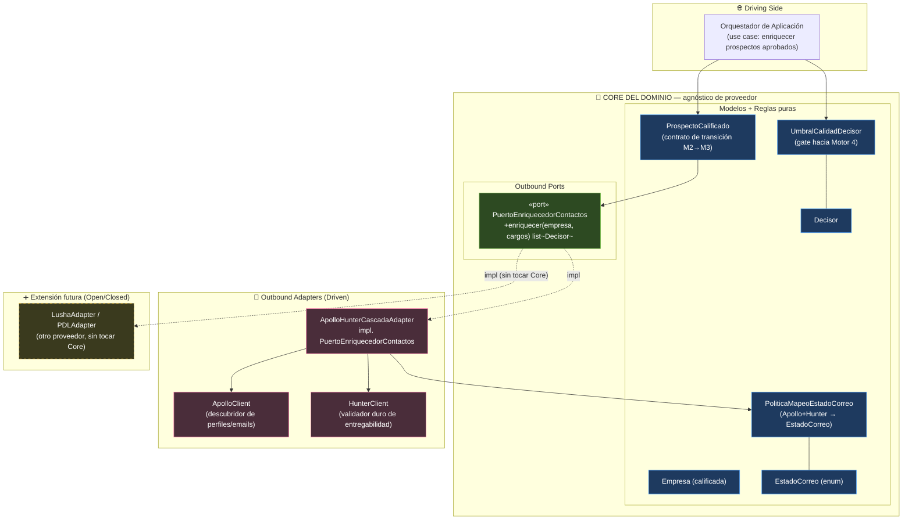
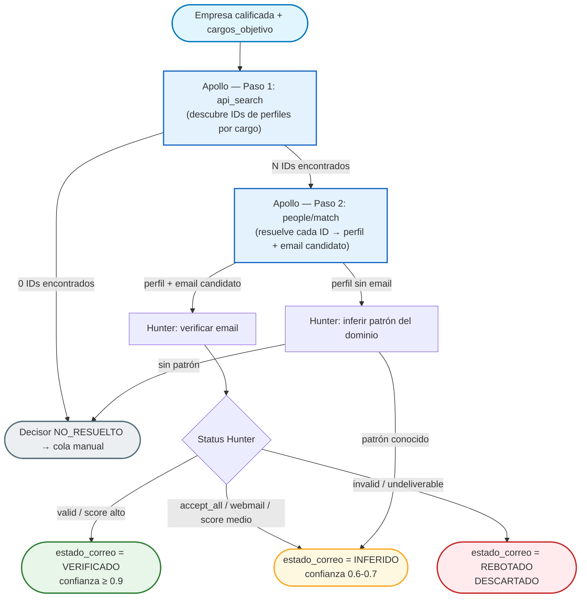
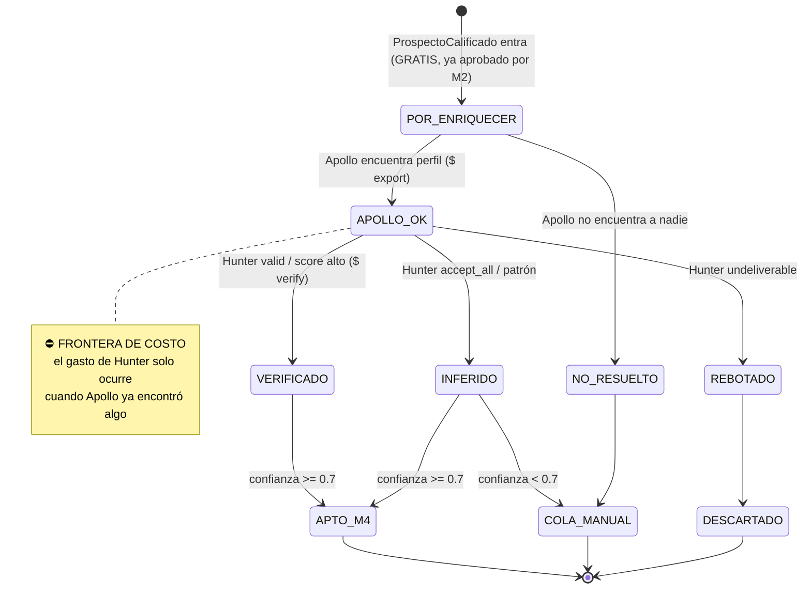

# Prospector — Diseño de Arquitectura M3 (Pre-CRM & Enriquecimiento) + antesala de M4

---
*   **Proyecto:** El Prospector —  Greenfield Build
*   **Fecha de Creación:** 14 de Julio de 2026
*   **Autoría:** Yeison Estiven Delgado Ordoñez · Fuente de la Verdad
*   **Estado:** ✅ SPEC APROBADA (revisión Principal Architect, 14-Jul-2026) — LUZ VERDE Fase 1 (Core + Puertos)
---

> **Naturaleza del documento.** Especificación de diseño técnico (no código de producción) para el
> Motor 3. Continúa la arquitectura hexagonal estricta de `prospector-m1-m2-design.md`: el Core es
> agnóstico de proveedor, los puertos son contratos y los adaptadores (Apollo, Hunter) son piezas
> reemplazables enchufadas por inyección de dependencias. Ningún nombre de proveedor vive dentro del
> Core.
>
> Alineado con `modelos_dominio_core.md` (entidades `Empresa`, `Decisor`, `Trigger`, `ManifiestoICP`,
> enums `EstadoCorreo`, `Seniority`, `AutoridadDecision`) y con `flujos_motor_1_y_2.md`
> (`TriggerAggregationPolicy` como compuerta de entrada a M3).

---

## 0. El argumento de negocio (por qué esta arquitectura nos ahorra dinero)

El Motor 3 es el punto donde el pipeline **empieza a gastar dinero real por contacto** (créditos de
Apollo y Hunter). Todo lo anterior (M1, M2) corre sobre fuentes gratis o casi gratis. Por eso el M3 no
es "un enriquecedor de correos": es un **escudo financiero**.

Tres formas concretas en que este diseño protege la caja:

1. **Cascada barato → caro con corte temprano.** Apollo descubre; Hunter valida solo lo que Apollo
   encontró. Nunca gastamos un crédito de verificación sobre un contacto que ni siquiera existe. El
   gasto se detiene en cuanto tenemos un dato suficientemente bueno.
2. **Umbral de calidad que frena contactos basura.** Un `Decisor` solo pasa al Motor 4 (outbound) si su
   correo está `VERIFICADO` o `INFERIDO` **y** su `confianza_dato ≥ 0.7`. Los correos que rebotarían se
   descartan **antes** de enviarse. Esto protege el activo más frágil y más caro de reconstruir del
   negocio: **la reputación de dominio** (SPF/DKIM/DMARC). Un dominio quemado por rebotes no se arregla
   con dinero rápido.
3. **Piloto obligatorio antes de escalar.** Apollo y Hunter pierden 10–20 puntos de precisión fuera de
   EE. UU. El diseño exige un piloto controlado de 100 empresas colombianas antes de abrir la llave a
   producción masiva. Es la diferencia entre gastar créditos aprendiendo con 100 registros o quemarlos
   a ciegas con 10.000.

> **En una frase para el Principal Architect:** el Motor 3 convierte "gastar en enriquecimiento" en
> "invertir solo en contactos con probabilidad real de entregar y responder", con un freno humano y
> estadístico antes de cada peso gastado.

---

## 1. Cómo leer esta arquitectura (guía rápida)

- **Core:** decide *qué contacto es lo bastante bueno* (`UmbralCalidadDecisor`) y *cómo se mapea un
  resultado de proveedor a un estado de correo* (reglas de mapeo). No sabe que Apollo o Hunter existen.
- **Puerto (`PuertoEnriquecedorContactos`):** el enchufe. El Core dice "dame los decisores de esta
  empresa"; no le importa quién los consigue.
- **Adaptador (`ApolloHunterCascadaAdapter`):** el aparato que se enchufa. Habla con Apollo y Hunter,
  ejecuta la cascada, y traduce los resultados al vocabulario del Core (`Decisor`, `EstadoCorreo`).

> **Regla de oro de la dependencia (idéntica a M1/M2):** las flechas apuntan hacia adentro. El
> adaptador conoce al Core; el Core JAMÁS conoce al adaptador. Cambiar Apollo por otro proveedor =
> escribir otro adaptador, sin tocar el Core.

---

## 2. Diagrama de Arquitectura Hexagonal (M3)



**Cómo leerlo:** la caja azul (Core) solo contiene reglas puras y el contrato del puerto. Toda la caja
rosada (Apollo, Hunter, la cascada) es reemplazable. La caja amarilla punteada muestra que un proveedor
nuevo entra como adaptador más, enchufado al mismo `PuertoEnriquecedorContactos`, **sin modificar el
Core**.

---

## 3. Los 5 puntos operativos (el contrato del Motor 3)

### 3.1 `PuertoEnriquecedorContactos` — el ABC

Vive en `src/core/ports/interfaces.py`, junto a `PuertoFuenteTriggers` y `PuertoDescubridorEmpresas`.

> **✅ Decisión final (Principal Architect, 14-Jul-2026):** firma **stateless** —
> `enriquecer(empresa, cargos)`. El adaptador no guarda estado del job entre llamadas y es
> thread-safe: puede ejecutar múltiples empresas en paralelo sin cargar contexto implícito de un
> `ManifiestoICP` completo. `cargos` se pasa explícito en cada invocación, resuelto por el
> orquestador desde `ProspectoCalificado.manifiesto.cargos_decisores` (ver §3.3).

```python
from abc import ABC, abstractmethod

class PuertoEnriquecedorContactos(ABC):
    """
    Puerto del Motor 3 (Caso C: ENRIQUECIMIENTO).

    Semántica respecto a los puertos existentes:
        - PuertoDescubridorEmpresas → DISCOVERY:      ¿Qué empresas encajan con el ICP?
        - PuertoFuenteTriggers      → SCORING:        ¿Tiene señales esta empresa?
        - PuertoEnriquecedorContactos → ENRICHMENT:   ¿Quién decide dentro de esta empresa
                                                       y cómo lo contacto de forma verificable?

    Dado una Empresa YA calificada por la TriggerAggregationPolicy y los cargos objetivo del
    ICP, retorna la lista de Decisores encontrados, cada uno con su correo y su
    estado_correo/confianza_dato resueltos.
    """

    @abstractmethod
    def enriquecer(self, empresa: Empresa, cargos: list[str]) -> list[Decisor]:
        """
        Firma stateless: el adaptador no guarda contexto de job entre llamadas.
        `cargos` viaja explícito (típicamente ManifiestoICP.cargos_decisores),
        resuelto por el orquestador en cada invocación. Esto habilita paralelismo
        seguro (thread-safe) sobre múltiples empresas sin contaminar el puerto
        con el ManifiestoICP completo.

        Contrato de error (idéntico a los demás puertos del sistema):
        NUNCA propaga excepciones al Core. Errores de red / rate limit / API caída
        → retorna [] con log interno. El Core jamás ve un stacktrace de un proveedor.

        Contrato de salida:
        - Cada Decisor retornado ya trae estado_correo y confianza_dato asignados
          por la PoliticaMapeoEstadoCorreo (ver §3.2).
        - La lista puede venir vacía (empresa sin decisores resolubles). Es un
          resultado válido, no un error.
        - El puerto NO filtra por calidad. Devuelve todo lo que encontró. El filtrado
          para Motor 4 lo hace el UmbralCalidadDecisor en la capa de orquestación (§3.4).
        """
        ...
```

---

### 3.2 Cascada Apollo → Hunter (política de ejecución)

**Roles no intercambiables:**

| Proveedor | Rol en la cascada | Qué aporta | Qué NO hace |
|-----------|-------------------|------------|-------------|
| **Apollo** | **Descubridor** | Encuentra perfiles por cargo dentro de la empresa (nombre, cargo, seniority) y propone el email | No garantiza entregabilidad; su "verified" es más laxo |
| **Hunter** | **Validador duro** | Verifica entregabilidad real del email (status + score) y/o infiere el patrón corporativo | No descubre personas; solo valida/infiere correos |

**Orden de ejecución (barato → caro, con corte temprano):**

> **✅ Actualizado (fix real de producción, 15-Jul-2026):** Apollo deprecó el endpoint directo
> `/v1/mixed_people/search` (respondía 422). `ApolloClient` ahora ejecuta el descubrimiento en **2
> pasos**: `api_search` encuentra los IDs de personas candidatas, y `people/match` resuelve cada ID a
> su perfil completo (incluido el email candidato). El diagrama refleja este flujo real, ya
> materializado en `src/adapters/enrichment/apollo_client.py` y confirmado en el piloto LATAM.



**Nota sobre el gate de calidad de Hunter (frontera de costo dentro del paso 2):** el corte temprano
original (Apollo 0 perfiles → cero llamadas a Hunter) sigue vigente exactamente igual con el flujo de
2 pasos: si `api_search` retorna 0 IDs, `people/match` nunca se invoca, y por tanto Hunter tampoco.
El costo adicional de `people/match` (una llamada extra por perfil descubierto) se paga solo sobre
IDs que `api_search` ya confirmó como candidatos reales — el mismo principio barato→caro, con un
peldaño más dentro de "Apollo".

**Regla de corte de costo:** Hunter (0.5 crédito por verificación) solo se invoca sobre emails que
Apollo (1 crédito por export) efectivamente descubrió. Si Apollo no encuentra a nadie, **cero créditos
de Hunter**. Una vez un email queda `VERIFICADO`, no se re-verifica.

**Mapeo canónico resultado → `Decisor.estado_correo`** (implementado por `PoliticaMapeoEstadoCorreo`,
lógica de dominio pura y testeable sin red):

| Apollo | Hunter (status / score) | `estado_correo` | `confianza_dato` | ¿Pasa a M4? |
|--------|-------------------------|-----------------|------------------|-------------|
| email encontrado | `valid` / score ≥ 90 | `VERIFICADO` | 0.90 | ✅ |
| email encontrado | `accept_all` o `webmail`, score ≥ 80 | `INFERIDO` | **0.70** | ✅ |
| email encontrado | `accept_all` o `webmail`, score 50–79 | `INFERIDO` | **0.65** | 🔴 (< 0.7) → cola manual |
| email encontrado | `invalid` / undeliverable / score < 50 | `REBOTADO` | 0.10 | 🔴 descartado |
| perfil sin email | patrón de dominio inferido por Hunter | `INFERIDO` | 0.55 | 🔴 (< 0.7) → manual |
| 0 perfiles / sin patrón | — | `NO_RESUELTO` | 0.0 | 🔴 → cola manual |

> **✅ Calibración aprobada (Principal Architect, 14-Jul-2026):** la banda `INFERIDO` se parte en dos
> según el score de Hunter en `accept_all`/`webmail`: **score ≥ 80 → `confianza_dato = 0.70`** (pasa el
> umbral de M4); **score 50–79 → `confianza_dato = 0.65`** (queda en cola manual, no se envía
> automáticamente). Esta calibración es la línea base para el piloto de §3.5; el piloto puede ajustarla
> con datos reales de bounce rate.

---

### 3.3 Contrato de transición Motor 2 → Motor 3

El Motor 3 arranca **solo** cuando la `TriggerAggregationPolicy` aprobó a la empresa (mínimo 2 señales
de orígenes distintos, al menos una fresca < 45 días). Lo que cruza la frontera se empaqueta en un DTO
inmutable del Core:

```python
from pydantic import BaseModel, ConfigDict, Field

class ProspectoCalificado(BaseModel):
    """
    Contrato de transición M2 → M3. Inmutable.
    Es TODO lo que el Motor 3 necesita saber del trabajo previo del pipeline.
    """
    model_config = ConfigDict(frozen=True)

    empresa: Empresa            = Field(..., description="Empresa ya calificada por TriggerAggregationPolicy.")
    triggers: list[Trigger]     = Field(..., min_length=1, description="Señales validadas. NO las usa el enriquecedor; viajan hacia el Motor 4 para personalizar el mensaje.")
    manifiesto: ManifiestoICP   = Field(..., description="Fuente de cargos_decisores → qué perfiles busca Apollo.")
```

| Input | Origen | Uso en M3 | Uso posterior (M4) |
|-------|--------|-----------|--------------------|
| `empresa` | M2 (calificada) | Apollo la busca por `dominio`/`nombre` — pasa a `enriquecer(empresa, cargos)` | Contexto del mensaje |
| `triggers` | M2 (`TriggerAggregationPolicy`) | **Ninguno directo** — el enriquecedor no los mira | Gancho de personalización del outbound |
| `manifiesto.cargos_decisores` | M1 | El orquestador lo extrae y lo pasa como `cargos` explícito a `enriquecer()` | — |

**Separación de responsabilidades clave:** el enriquecedor **no necesita los triggers**. Los triggers
son metadata del pipeline que el orquestador transporta hacia M4. El puerto recibe `Empresa` y
`cargos: list[str]` (no el `ProspectoCalificado` completo ni el `ManifiestoICP`): mantenemos el puerto
mínimo y evitamos que el adaptador tenga acceso a información que no le concierne. El orquestador es
quien hace `ProspectoCalificado.manifiesto.cargos_decisores` → argumento `cargos` en cada llamada,
lo que además hace la llamada **stateless y thread-safe** (§3.1): el adaptador no retiene contexto de
job entre invocaciones sobre empresas distintas.

---

### 3.4 Umbral de calidad para el Motor 4 (el freno de reputación)

Política de dominio pura. Vive en `src/core/domain/policies.py` junto a `TriggerAggregationPolicy`.

```python
class UmbralCalidadDecisor:
    """
    Gate de calidad entre Motor 3 y Motor 4.
    Protege la reputación de dominio: ningún correo dudoso se envía.
    """
    CONFIANZA_MINIMA: float = 0.7
    ESTADOS_APTOS: frozenset[EstadoCorreo] = frozenset({
        EstadoCorreo.VERIFICADO,
        EstadoCorreo.INFERIDO,
    })

    def es_apto_para_outbound(self, decisor: Decisor) -> bool:
        """
        True SOLO si el decisor cumple AMBAS condiciones:
          1. confianza_dato >= 0.7
          2. estado_correo ∈ {VERIFICADO, INFERIDO}

        Todo lo demás (REBOTADO, NO_RESUELTO, o INFERIDO con confianza < 0.7)
        se DESCARTA del envío automático y cae a la cola de trabajo manual.
        """
        return (
            decisor.confianza_dato >= self.CONFIANZA_MINIMA
            and decisor.estado_correo in self.ESTADOS_APTOS
        )

    def particionar(self, decisores: list[Decisor]) -> tuple[list[Decisor], list[Decisor]]:
        """Separa (aptos_para_M4, cola_manual) en una sola pasada."""
        aptos, manual = [], []
        for d in decisores:
            (aptos if self.es_apto_para_outbound(d) else manual).append(d)
        return aptos, manual
```

**Por qué esto es un mecanismo financiero, no solo de calidad:** cada correo `REBOTADO` que enviáramos
degrada la métrica de entregabilidad del dominio ante los proveedores de correo. Un dominio con alta
tasa de rebote termina en spam **para todos los contactos futuros**, incluidos los buenos. El umbral
convierte un riesgo sistémico (reputación) en un descarte barato y local (una fila que va a cola
manual). Preferimos perder un contacto dudoso que envenenar el canal completo.

---

### 3.5 Caveat LATAM (riesgo operativo — bloqueante para producción masiva)

> ⚠️ **ADVERTENCIA DE PRECISIÓN FUERA DE EE. UU.**
> Apollo y Hunter están optimizados para el mercado estadounidense. En Colombia y LATAM su precisión de
> descubrimiento y verificación **cae entre 10 y 20 puntos porcentuales**: más perfiles sin email, más
> `accept_all` ambiguos, más patrones de dominio no reconocidos. Adicionalmente, el costo real de estos
> proveedores corre **2–3× por encima del precio de lista** una vez sumados overages de créditos y
> verificaciones (ver `validacion/validacion-fuentes.md` §6).

**Gate obligatorio antes de habilitar producción masiva:**

1. **Piloto controlado de 100 empresas colombianas** ya calificadas por M2.
2. **Métricas a capturar por corrida del piloto:**
   - Tasa de resolución de Apollo (% de empresas con ≥ 1 perfil de cargo objetivo).
   - Distribución real de `estado_correo` (% VERIFICADO / INFERIDO / REBOTADO / NO_RESUELTO).
   - Créditos Apollo + Hunter consumidos por empresa procesada y por decisor apto.
   - Costo real por `Decisor` apto para M4 (el número que decide la rentabilidad).
   - Bounce rate real medido tras el envío (no estimado): rebotes / correos enviados.
3. **✅ KPI de aprobación (Principal Architect, 14-Jul-2026):** el piloto se aprueba para escalar
   SOLO si, sobre las 100 empresas, se cumplen **ambas** condiciones:
   - **Costo < $1.00 USD por decisor `APTO_M4`** (créditos Apollo + Hunter ÷ decisores que superaron
     `UmbralCalidadDecisor`).
   - **Bounce rate real < 2%** sobre los correos `VERIFICADO`/`INFERIDO` efectivamente enviados.

   Si cualquiera de los dos KPI falla, **no se escala**: se recalibra `confianza_dato` (§3.2), se
   sube el piso de score de Hunter, o se evalúa un proveedor alternativo tras el mismo puerto.
4. **Este gate es no-resoluble por IA:** exige correr un job real y medir. Queda documentado como
   pendiente en `validacion/validacion-fuentes.md` §4.

---

## 4. Máquina de estados del Decisor dentro del Motor 3



**Orden de ejecución (barato → caro):**

| Paso | Operación | Costo | Resultado |
|------|-----------|-------|-----------|
| 1 | Entrada de `ProspectoCalificado` (ya aprobado por M2) | Cero | `POR_ENRIQUECER` |
| 2 | Apollo: descubrir perfiles por cargo | $ (1 créd/export) | `APOLLO_OK` / `NO_RESUELTO` |
| 3 | Hunter: verificar/inferir email | $ (0.5 créd/verify) | `VERIFICADO` / `INFERIDO` / `REBOTADO` |
| 4 | `UmbralCalidadDecisor.particionar` | Cero | `APTO_M4` / `COLA_MANUAL` / `DESCARTADO` |

> El paso 4 es **gratis** y es el que protege la caja: descarta en memoria, sin enviar nada.

---

## 5. Aislamiento hexagonal y extensibilidad

- **El Core no importa Apollo ni Hunter.** Solo define `PuertoEnriquecedorContactos`,
  `PoliticaMapeoEstadoCorreo` y `UmbralCalidadDecisor`. Cero dependencias de red.
- **Un proveedor nuevo = un adaptador nuevo.** Cambiar a Lusha, PDL o Cognism = escribir un adaptador
  que implemente el puerto y registrarlo en el composition root. El Core no se toca (Open/Closed).
- **Contrato de error uniforme:** como los puertos de M2, el enriquecedor nunca propaga excepciones al
  Core. Fallo de proveedor → `[]` con log.
- **Determinismo del mapeo:** la traducción resultado-proveedor → `estado_correo` es lógica pura,
  testeable con mocks sin gastar un solo crédito.

---

## 6. Qué queda fuera de esta spec (alcance explícito)

- **Motor 4 (outbound RAG):** solo se documenta la *antesala* (el umbral que lo alimenta). El diseño de
  Tavily + LLM redactor es otra spec.
- **Persistencia:** el `CompanyRepositoryPort` y la cola manual se asumen del diseño M1/M2; aquí solo se
  define qué estado persiste (`Decisor.estado_correo`, `confianza_dato`).
- **Calibración fina de `confianza_dato`:** los números de la tabla §3.2 son la propuesta inicial;
  el piloto (§3.5) los ajusta con datos reales.

---

## 7. Decisiones cerradas por el Principal Architect (14-Jul-2026)

| # | Punto abierto | Resolución | Sección afectada |
|---|----------------|------------|-------------------|
| 1 | Firma del puerto | `enriquecer(empresa: Empresa, cargos: list[str]) -> list[Decisor]`. Stateless y thread-safe: el adaptador no retiene contexto de job. | §3.1 |
| 2 | Banda INFERIDO vs. umbral 0.7 | `accept_all`/`webmail` con score ≥ 80 → `confianza_dato = 0.70` (pasa a M4). Score 50–79 → `confianza_dato = 0.65` (cola manual). | §3.2 |
| 3 | Criterio de aprobación del piloto | KPI dual: costo < $1.00 USD por decisor `APTO_M4` **y** bounce rate real < 2%. Ambos deben cumplirse para escalar. | §3.5 |

**Luz verde otorgada para Fase 1 de M3:** materializar `PuertoEnriquecedorContactos`,
`ProspectoCalificado` y `UmbralCalidadDecisor` en el Core. Los adaptadores concretos de Apollo/Hunter
quedan fuera de esta fase (siguiente iteración).

---

## 8. Fuentes consultadas
- `02_Lineas_de_Producto/Outbound_Prospector/docs/tecnico/prospector-m1-m2-design.md` (arquitectura hexagonal base)
- `02_Lineas_de_Producto/Outbound_Prospector/docs/flujos_motor_1_y_2.md` (`TriggerAggregationPolicy`, handoff a M3)
- `02_Lineas_de_Producto/Outbound_Prospector/docs/modelos_dominio_core.md` (`Empresa`, `Decisor`, `EstadoCorreo`, enums)
- `02_Lineas_de_Producto/Outbound_Prospector/docs/validacion/validacion-fuentes.md` §6 (pricing Apollo/Hunter, costo oculto 2–3×)
- Grafo del proyecto (`graphify`): puertos en `src/core/ports/interfaces.py`, políticas en
  `src/core/domain/policies.py`, modelos en `src/core/domain/models.py`.

*Nota: el contenido de fuentes externas fue reformulado y resumido por cumplimiento de restricciones de licencia.*
