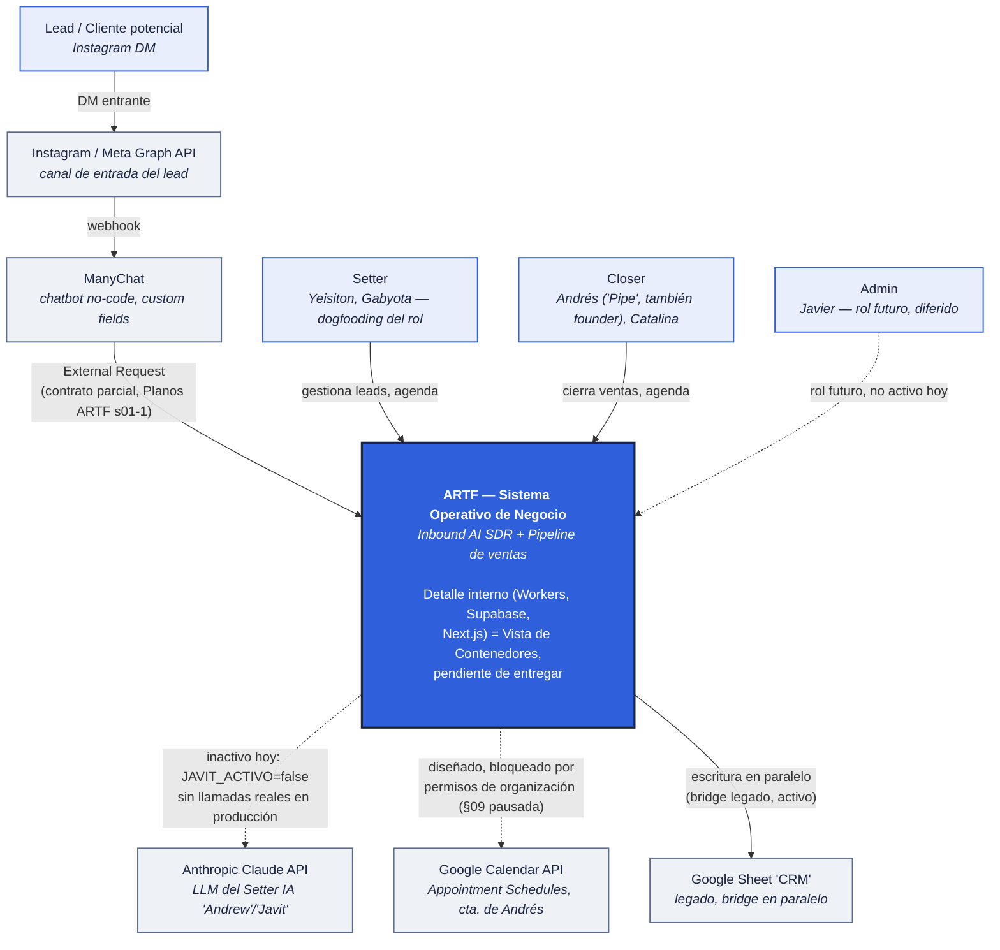
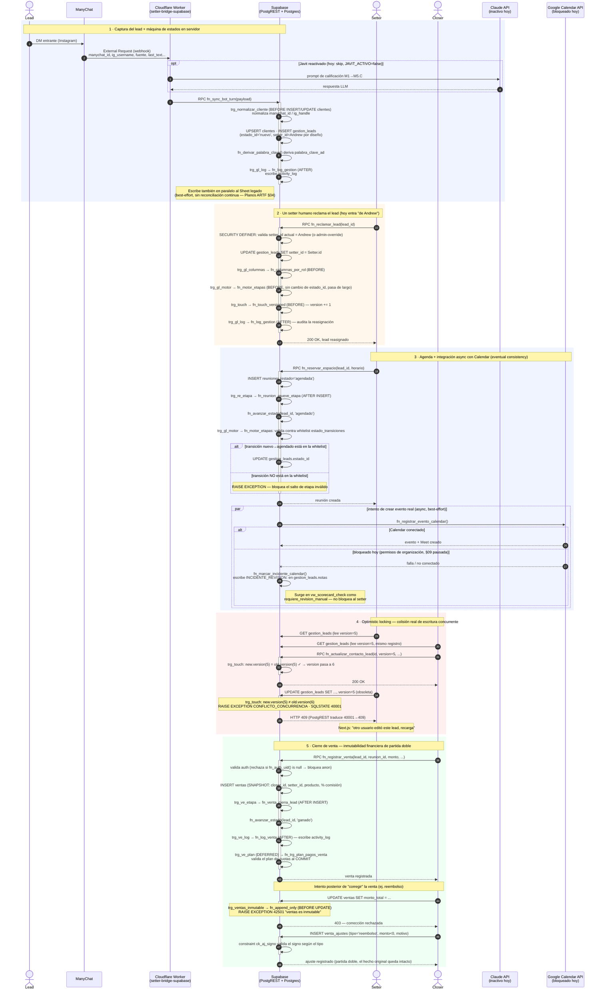

# Arquitectura Objetivo — Diagrams as Code (ARTF)

> **Qué es esto y qué NO es.** "Planos ARTF" (el Artifact de claude.ai) es el
> tracker de la auditoría AS-IS: investigación flujo-por-flujo, con checklists
> que viven en el navegador de Yeisiton, no en git. Este documento es distinto
> a propósito — es la **arquitectura objetivo (TO-BE)**, expresada como código
> (Mermaid + DBML) que vive en este repo, se versiona con git y evoluciona por
> commits/diffs, no por edición manual de un documento hosteado fuera del repo.
> Decisión tomada 21-ago-2026: el trabajo de "Antigravity" que iba a ocupar la
> sección 13 de Planos ARTF se saca del artefacto — se retoma más adelante,
> aparte, cuando se reestructure el prompt de Antigravity a la medida del
> proyecto. No bloquea esto.

## Filosofía: Views & Beyond + C4, en código

**Views & Beyond (V&B)** — la metodología del propio
`Arquitectura RTF - Views & Beyond.pdf` de Javier — nos da el *por qué* dividir
en vistas: ningún diagrama único puede representar módulos estáticos, flujo en
tiempo de ejecución y asignación a infraestructura a la vez sin saturarse. Es
el mismo principio que ya aplicamos al partir la auditoría AS-IS en 16
secciones en vez de un solo documento.

Lo que V&B **no** formaliza es *cuánto detalle va en cada vista* — eso queda a
criterio del arquitecto, y es la fuente típica de diagramas que mezclan
niveles (un componente Kanban de UI al lado de un trigger de Postgres en el
mismo dibujo). Para eso tomamos prestado el **modelo C4** (Simon Brown), que sí
formaliza niveles con semántica explícita:

- **Nivel 1 — Contexto:** el sistema es UNA caja negra; solo importan actores
  humanos y sistemas de terceros con los que intercambia información.
- **Nivel 2 — Contenedores:** se abre la caja negra en sus piezas
  desplegables/ejecutables reales (cada Worker, cada base de datos, cada app).
- **Nivel 3 — Componentes** (dentro de un contenedor) y **Nivel 4 — Código**:
  no los usamos todavía — para el tamaño real de ARTF hoy (2 Workers, una base,
  un frontend) añadirían ruido sin información nueva; se reevalúa si el sistema
  crece.

**Regla de esta ronda:** las 3 vistas que V&B exige (Módulos, C&C, Despliegue)
se documentan con granularidad C4 (Contexto/Contenedores), no con UML libre.

## Por qué Mermaid + DBML, no diagramas estáticos

- **Mermaid** — texto plano en el mismo commit que el código que describe,
  diff-eable en cualquier PR, se renderiza nativo en GitHub (`.md`), en los
  Artifacts de Claude Code, y en cualquier IDE con plugin. Cero dependencia de
  una herramienta externa de dibujo.
- **DBML** — mejor que un `erDiagram` de Mermaid para el modelo de datos *real*
  porque expresa tipos de columna, constraints, defaults e índices. Ya existe
  un `erDiagram` de Mermaid real en la sección 06 de "Planos ARTF" (generado en
  vivo el 19-ago vía `list_tables`) — se queda donde está, como overview rápido
  dentro del tracker de investigación. Un `schema.dbml` nuevo en este repo se
  vuelve la **fuente de verdad versionada** del modelo de datos completo,
  actualizado junto con cada migración que cambie el esquema (mismo criterio
  anti-bazuca que ya rige el proyecto: no construir un pipeline
  `pg_dump`→DBML automatizado hasta que la actualización manual empiece a
  doler de verdad — no antes).

**Herramientas ya conectadas:** Mermaid renderiza nativo aquí (Claude Code) y
en GitHub, cero configuración. DBML no tiene renderer nativo en este entorno —
el visor estándar es dbdiagram.io (externo); el archivo fuente vive en git de
todas formas, el renderer es reemplazable. La skill `artifact-diagramming` de
Claude Code queda disponible si en algún punto se quiere una versión
interactiva pan-zoom como Artifact — no se usa hoy porque el pedido explícito
es que los planos vivan en el repo, no en un host externo.

---

## 1. Principios fundamentales — verificados contra la fuente, no asumidos

Se consultó de nuevo `Arquitectura RTF - Views & Beyond.pdf` vía NotebookLM
(21-ago-2026) pidiendo la cita textual completa de la sección 10 ("Rationale
de la arquitectura"). **Hallazgo importante que cambia cómo se usa este
documento:** esos 7 principios (D1–D7) justifican el sistema **Sheets/Apps
Script original** — el propio PDF lo etiqueta como "Actual" en su tabla de
madurez técnica, contra una "Propuesta (ERD v2 Supabase)". El sistema real de
producción hoy **ya superó la propuesta del PDF** (está en Supabase v3, no en
el ERD v2 que el documento discute). Tabla de vigencia, verificada contra el
esquema SQL real corrido en vivo hoy:

| # | Decisión original (PDF, sistema Sheets) | Vigencia hoy | Qué la reemplazó (verificado en vivo) |
|---|---|---|---|
| D1 | Google Sheets como sistema de registro | **Superada** | Supabase/Postgres es la única fuente de verdad transaccional; el Sheet sigue vivo solo como bridge de salida en paralelo (Planos ARTF §04), no como registro primario |
| D2 | Apps Script + web app, sin backend dedicado | **Superada** | `artf-pipeline-app` (Next.js) + Supabase (backend gestionado) — ya hay backend/frontend dedicados reales |
| D3 | Setter IA en Cloudflare Worker serverless | **Vigente, con matiz** | 2 Workers reales existen; el conversacional ("Javit") está `JAVIT_ACTIVO=false` — solo el bridge de captura corre en producción hoy |
| D4 | Aislamiento por rol vía columnas disjuntas + `LockService` de Apps Script | **Superada y reemplazada por algo más fuerte** | RLS + Column-Level Security real (`fn_columnas_por_rol`) + optimistic locking transaccional (columna `version`, conflicto `SQLSTATE 40001`/HTTP 409) — deja de ser un lock advisory de aplicación sobre un almacén sin transacciones |
| D5 | Fórmulas vivas en vez de ETL | **Superada para el CRM operativo** | Vistas SQL reales (`vw_pipeline`, `vw_scorecard_check`, `vw_embudo_diario`); el Sheet de reportes sigue vivo solo mientras dura la migración |
| D6 | Modelo de cuota AC/AD/AE (una fecha + monto + estado) | **Superada** | `ventas` 1:N `pagos_cuotas`, partida doble real vía `venta_ajustes`, inmutabilidad por trigger (`fn_append_only`) |
| D7 | EOS/Traction como capa de gobernanza | **Vigente, sin cambios** | El ciclo datos→decisión sigue siendo el Pulso L10 semanal; ahora alimentado por `vw_embudo_diario` en vez de fórmulas de Sheets |

**Principios nuevos, no documentados en el PDF porque nacieron *después* de la
migración a Supabase v3** (verificados en vivo hoy, no de memoria):

- **Máquina de estados server-side real:** `estado_transiciones` (whitelist) +
  `fn_motor_etapas` (valida) + `fn_avanzar_estado` (helper llamado por
  `fn_reunion_mueve_etapa`/`fn_venta_cierra_lead`) — el motor de pipeline ya no
  vive en ningún cliente (ni Apps Script ni Next.js); es un invariante de la
  base, válido sin importar quién escriba (Worker IA, Next.js, importación
  manual).
- **Inmutabilidad financiera de partida doble** — `ventas` es append-only
  (`fn_append_only` bloquea UPDATE/DELETE con `SQLSTATE 42501`), toda
  corrección es una fila nueva con signo en `venta_ajustes`. No existía ni en
  el Sheet ni en el ERD v2 original del PDF.
- **Cierre de raíz de grants por default:** `ALTER DEFAULT PRIVILEGES` a nivel
  de rol (`postgres`) revocando `EXECUTE` a `anon` — cierra para siempre un
  patrón de vulnerabilidad que se repitió 4 veces (Fase 2, Fase 2b, 18-ago,
  20-ago) antes de encontrarse la causa raíz real. Verificado hoy mismo con
  `pg_default_acl` en vivo.

## 2. Estrategia de vistas

| Vista | Nivel C4 | Formato | Estado |
|---|---|---|---|
| **Contexto** | 1 | Mermaid `flowchart` | **Entregada abajo** |
| **Contenedores / C&C** (flujo dinámico ManyChat→Workers→Supabase→Calendar→Next.js) | 2 | Mermaid `sequenceDiagram` (caso de uso: lead nuevo end-to-end) + `flowchart` de piezas estáticas | Pendiente — se hace después de validar el Contexto |
| **Datos (ERD)** | — | Mermaid `erDiagram` (ya existe, Planos ARTF §06) + `schema.dbml` nuevo como fuente de verdad completa | Pendiente — DBML nuevo, Mermaid ya existe y se mantiene |
| **Despliegue** | opcional | Actualización de la sección 8 del PDF original | Pendiente — el PDF menciona Apps Script como runtime del Formulario Closer, ya reemplazado por Next.js/Vercel |

---

## 3. Primer entregable: Diagrama de Contexto de Sistema

### Fundamento de cada decisión de representación

- **Cloudflare Workers, Supabase y Next.js quedan DENTRO de la caja del
  sistema, no como sistemas externos.** Son código y datos que ARTF es dueño
  de operar — la semántica C4 de Contexto es "qué opera el equipo" vs "de qué
  depende el equipo sin controlarlo". Un Worker desplegado en Cloudflare sigue
  siendo "nuestro" tanto como un servidor propio lo sería; Supabase aloja nuestra
  lógica de negocio real (RLS, triggers, RPCs), no es una capacidad genérica de
  terceros como lo es Google Calendar. Esto es exactamente lo que evita que el
  Contexto se sature — el detalle de esas piezas es la Vista de Contenedores,
  todavía no entregada.
- **Instagram, ManyChat, Google Calendar y la Claude API sí son externos**
  porque son capacidades que ARTF no opera ni puede modificar — son el
  contrato con el que el sistema debe convivir, con sus propios límites (los
  documentados en Planos ARTF: contrato de payload sin confirmar en §01, plan
  Pro requerido para leaked-password-protection en §07, permisos de
  organización bloqueando Calendar en §09).
- **`flowchart` con subgrafo en vez de la sintaxis `C4Context` nativa de
  Mermaid** — Mermaid sí soporta `C4Context` desde v9, pero el soporte de
  renderizado de GitHub para ese tipo específico de diagrama es inconsistente
  en producción, y el pedido explícito de hoy es que esto viva y se lea bien
  en el repo. `flowchart` con `classDef`/`style` es el subconjunto de Mermaid
  con el soporte más amplio y estable (GitHub, Claude Code, cualquier IDE) —
  se sacrifica algo de semántica C4 explícita (no hay un tag "Person"/"System"
  nativo) y se compensa con las convenciones visuales documentadas aquí mismo.
- **Líneas punteadas = integración diseñada pero no activa hoy** (Claude API,
  Google Calendar); **líneas sólidas = tráfico real en producción hoy**
  (Instagram→ManyChat→Worker, y la escritura en paralelo al Sheet). Esto
  refleja el estado *verificado*, no el estado *diseñado* — mismo criterio de
  honestidad que ya rige el resto de "Planos ARTF" (`JAVIT_ACTIVO=false`
  documentado como confirmado leyendo código real, no supuesto).
- **Admin (Javier) queda como actor punteado/diferido**, no se omite —
  coincide con la sección 10 (Roles) de Planos ARTF: es un plan real a futuro,
  no una tarea pendiente de decidir ahora.

---

## 4. Segundo entregable: Vista de Contenedores/C&C — ciclo de vida Lead→Venta

Abre la caja `SYS` del diagrama de Contexto en sus piezas reales, siguiendo el
caso de uso más crítico de punta a punta: captura de un lead nuevo, reclamo por
un setter, agenda con integración async a Calendar, una colisión real de
escritura concurrente, y el cierre de una venta con su modelo de inmutabilidad
financiera. Deliberadamente **no** es un happy path — cada uno de los 5 puntos
de abajo tiene su rama de fallo real, no solo el camino feliz.

### Fundamento de cada decisión de representación

- **5 `rect` = las 5 restricciones técnicas exigidas, una a una** — mismo
  principio V&B/C4 de no saturar una vista aplicado *dentro* de un solo
  diagrama: cada zona de color es autocontenida y se puede leer sin el resto.
- **Excepciones como `Note over DB`, no como flechas `--x` hacia sí mismo** —
  un self-loop `DB--xDB` renderiza ambiguo en la mayoría de visores Mermaid
  (incluido GitHub); una `Note` es inequívoca y sigue dejando claro *dónde* se
  lanza el `RAISE EXCEPTION`. `--x` se reservó solo para el mensaje real
  perdido entre dos participantes distintos (`GCal--xDB`), su uso correcto.
- **La colisión de concurrencia usa Setter y Closer reales, no "cliente A/B"
  abstractos** — porque la RLS real (§07 de Planos ARTF) permite que ambos
  roles toquen el mismo `gestion_leads` legítimamente (setter por
  `setter_id`, closer por `closer_id`); no es un escenario inventado, es la
  intersección real de sus permisos.
- **Hallazgo nuevo verificado el 21-ago-2026, no documentado antes en ningún
  lado:** el orden de disparo de los triggers `BEFORE UPDATE` sobre
  `gestion_leads` es alfabético — `fn_columnas_por_rol` → `fn_motor_etapas` →
  `fn_touch_versioned` (verificado con `pg_trigger`/`pg_get_triggerdef` en
  vivo). No cambia el resultado final (cualquier `RAISE` aborta toda la
  sentencia), pero documenta cuál validación fallaría primero ante una fila
  inválida.
- **`fn_append_only` se llama `trg_ventas_inmutable` en `ventas`** — verificado
  en vivo, no asumido del nombre genérico de la función. Existe también un
  `trg_no_truncate` (BEFORE TRUNCATE) que blinda la inmutabilidad incluso
  contra un `TRUNCATE` — no está en el diagrama por no ser parte del flujo de
  negocio, pero confirma que la protección no tiene huecos obvios.
- **`GCal` y `Claude` quedan en `alt`/`opt` explícitos, no como llamadas
  garantizadas** — representación literal de "eventual consistency": el
  sistema sigue avanzando (el setter recibe su reunión creada) sin importar si
  Calendar respondió o no; el fallback (`INCIDENTE_REVISION:`) es asíncrono y
  no bloqueante, exactamente como está implementado hoy.

---

*Próximo paso: la Vista de Datos (DBML) — tablas clave, relaciones explícitas
y notas de los constraints reales verificados en esta ronda.*
