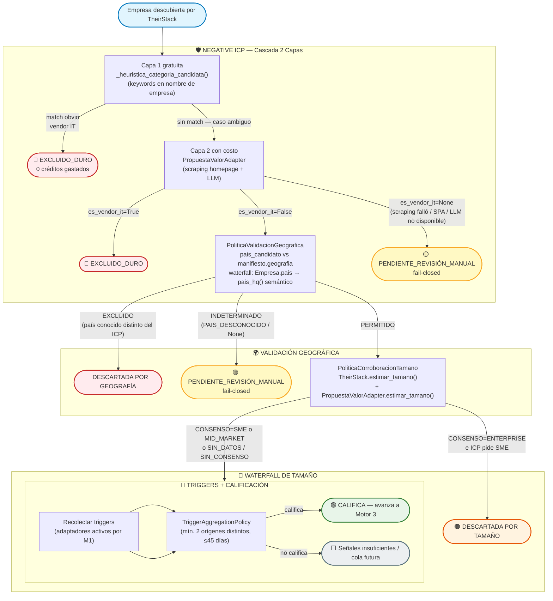
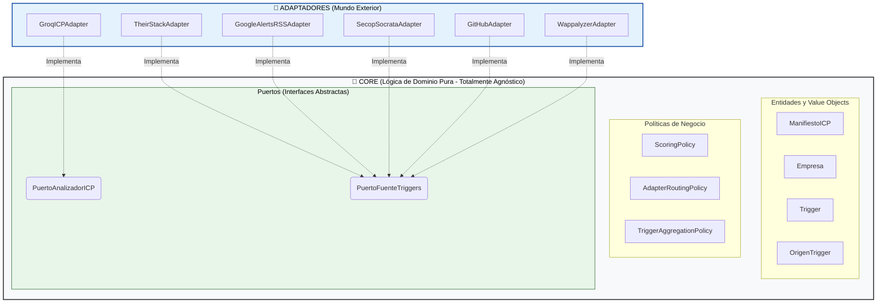

# Flujo Estructural: Motores 1 y 2 (El Prospector) — v4.1 (Blindaje Motor 2 — 17-Jul-2026)

Este documento destila la arquitectura técnica y operativa de los Motores 1 y 2.
**Cambio principal v3.0:** El Motor 1 ya no es solo un Analizador de ICP. Es un **Analizador + Enrutador Dinámico**. Produce un `ManifiestoICP` tipado Y una lista de adaptadores a activar, calculada por la `AdapterRoutingPolicy`. El Motor 2 ejecuta únicamente los adaptadores que el Motor 1 habilitó.
**Cambio principal v4.1 (17-Jul-2026):** El Motor 2 incorpora tres capas de blindaje derivadas de los 3 fallos del caso Parcero/UK: Negative ICP en cascada (Capa 1 determinista + Capa 2 semántica con fail-closed), validación geográfica explícita, y filtro de co-ocurrencia semántica en Google Alerts. Los estados de salida se expanden de 2 a 3: **CALIFICA / DESCARTADA / PENDIENTE_REVISIÓN_MANUAL**.

---

## MOTOR 1: Analizador ICP + Enrutador Dinámico

**Objetivo:** Transformar lenguaje natural en un `ManifiestoICP` tipado, bloquear perfiles genéricos, y determinar qué adaptadores del Motor 2 tienen sentido según la categoría de empresa detectada.

### Puerto Requerido: `PuertoAnalizadorICP`

El Motor 1 no llama directamente a ningún LLM. Habla con la abstracción:

```python
class PuertoAnalizadorICP(ABC):
    @abstractmethod
    def analizar(self, descripcion_libre: str) -> ManifiestoICP:
        ...
```

El adaptador concreto (`ClaudeICPAdapter`, `OpenAIICPAdapter`, etc.) implementa este puerto. El Core no sabe qué LLM se usa.

### Flujo Lógico (v3.0 con Enrutamiento):


**Nota sobre la doble validación en Gates A y B:**
Los Gates son redundantes con los validadores Pydantic de `ManifiestoICP`. Esto es intencional:
1. A nivel de modelo (Pydantic): rechaza el objeto con `ValueError` antes de llegar al Gate.
2. A nivel de política: `ScoringPolicy` puede bloquear con score bajo incluso si el objeto es válido.

### AdapterRoutingPolicy — Lógica de Enrutamiento

Esta política es **lógica de dominio pura**. No conoce adaptadores concretos, solo `ManifiestoICP` y `OrigenTrigger`. Es testable unitariamente sin LLM.

**Reglas de enrutamiento derivadas de la investigación de mercado:**

```python
class AdapterRoutingPolicy:
    """
    Decide qué adaptadores del Motor 2 activar según el ManifiestoICP.
    Regla base: Google Alerts siempre activo (90% universal).
    Los demás se activan condicionalmente según la categoría de empresa.
    """

    CATEGORIAS_GOV_FACING = {
        CategoriaEmpresa.AGENCIA_IT,
        CategoriaEmpresa.CONSULTORA_IT,
        CategoriaEmpresa.BPO_MANAGED,
        CategoriaEmpresa.GOVTECH_REGTECH,
    }

    CATEGORIAS_STACK_VISIBLE = {
        CategoriaEmpresa.SAAS_B2B_HORIZONTAL,
        CategoriaEmpresa.SAAS_B2B_VERTICAL,
        CategoriaEmpresa.AGENCIA_IT,
    }

    CATEGORIAS_SIN_WAPPALYZER = {
        CategoriaEmpresa.CIBERSEGURIDAD,    # Ocultan stack deliberadamente
        CategoriaEmpresa.REGULADO_FINTECH,  # Core bancario no es web-visible
        CategoriaEmpresa.REGULADO_HEALTHTECH,
        CategoriaEmpresa.AI_ML_PLATFORM,    # Infraestructura no frontal
        CategoriaEmpresa.BPO_MANAGED,
    }

    def resolver(self, manifesto: ManifiestoICP) -> list[OrigenTrigger]:
        activos: list[OrigenTrigger] = [OrigenTrigger.GOOGLE_ALERTS]  # Siempre activo

        # TheirStack: útil para todas las categorías excepto reguladas puras (hiring discreto)
        categorias_sin_theirstack = {
            CategoriaEmpresa.REGULADO_FINTECH,
            CategoriaEmpresa.REGULADO_HEALTHTECH,
        }
        if manifesto.categoria_empresa not in categorias_sin_theirstack:
            activos.append(OrigenTrigger.THEIRSTACK)

        # SECOP: solo si el perfil tiene naturaleza gov-facing
        if manifesto.es_gov_facing or manifesto.categoria_empresa in self.CATEGORIAS_GOV_FACING:
            activos.append(OrigenTrigger.SECOP_SOCRATA)

        # Wappalyzer: solo donde el stack es web-visible y el dolor es deuda técnica de frontend/backend
        if manifesto.categoria_empresa in self.CATEGORIAS_STACK_VISIBLE \
                and manifesto.categoria_empresa not in self.CATEGORIAS_SIN_WAPPALYZER:
            activos.append(OrigenTrigger.WAPPALYZER)

        return activos
```

**Ejemplo de enrutamiento en tiempo de ejecución:**

| Input del usuario | `categoria_empresa` detectada | Adaptadores activados |
|---|---|---|
| "Fintech colombiana que necesita seguridad" | `REGULADO_FINTECH` | Google Alerts solamente |
| "Agencia IT sobrevendida con contrato gobierno" | `AGENCIA_IT` + `es_gov_facing=True` | Google Alerts + TheirStack + SECOP + Wappalyzer |
| "SaaS B2B de 100 empleados con monolito" | `SAAS_B2B_HORIZONTAL` | Google Alerts + TheirStack + Wappalyzer |
| "Consultora de ciberseguridad LATAM" | `CIBERSEGURIDAD` | Google Alerts + TheirStack |

### ScoringPolicy (Pesos — sin cambio en v3.0):

| Dimensión             | Peso |
|-----------------------|------|
| Dolor Operativo       | 30%  |
| Anclaje Tecnológico   | 25%  |
| Cargos Decisores      | 15%  |
| Vertical / Sector     | 15%  |
| Tamaño de Empresa     | 10%  |
| Geografía             |  5%  |

---

## MOTOR 2: Cascada de Triggers (Ejecución Condicional)

**Objetivo:** Ejecutar únicamente los adaptadores habilitados por el Motor 1 y capturar señales de mercado deterministas.

**Regla de Oro (actualizada v3.0):** Un lead **nunca** avanza al Motor 3 con una sola señal. La `TriggerAggregationPolicy` evalúa:
1. Mínimo 2 triggers de **orígenes distintos** (mismo adaptador repetido no cuenta).
2. Al menos uno con `fecha_evento` dentro de los últimos **45 días**.
3. **Nuevo:** El umbral mínimo se calcula como `min(2, len(adaptadores_activos))`. Si el enrutador solo habilitó 1 adaptador (caso raro), 1 trigger válido es suficiente.

### Puerto Requerido: `PuertoFuenteTriggers`

```python
class PuertoFuenteTriggers(ABC):
    @abstractmethod
    def obtener_triggers(self, empresa: Empresa) -> list[Trigger]:
        """
        Contrato de error: nunca propaga excepciones al Core.
        Errores de red o API → retorna [] con log interno.
        """
        ...
```

### Adaptadores y su Condición de Activación

| Adaptador                   | Siempre activo | Condición de activación                                                     | Cobertura          |
| --------------------------- | -------------- | --------------------------------------------------------------------------- | ------------------ |
| `GoogleAlertsRSSAdapter`    | ✅ SÍ           | Siempre                                                                     | 90% del árbol tech |
| `TheirStackAdapter`         | ❌ NO           | `categoria_empresa` no es REGULADO_FINTECH ni REGULADO_HEALTHTECH           | 65%                |
| `SecopSocrataAdapter`       | ❌ NO           | `es_gov_facing=True` o categoría gov-facing                                 | 40%                |
| `WappalyzerHeadlessAdapter` | ❌ NO           | `categoria_empresa` en {SAAS_B2B_HORIZONTAL, SAAS_B2B_VERTICAL, AGENCIA_IT} | 35%                |

#### 1. `GoogleAlertsRSSAdapter` — SIEMPRE ACTIVO
- **Implementación:** Google Alerts con salida RSS. Parseo con `feedparser`.
- **Input requerido de `Empresa`:** `nombre`.
- **Costo:** $0.
- **Triggers:** M&A, rondas de inversión, llegada nuevo C-Level técnico.
- **`nivel_confianza` ALTA:** Nuevo CTO/CIO/CDO confirmado < 6 meses.
- **`nivel_confianza` MEDIA:** Ronda de inversión anunciada.
- **`nivel_confianza` BAJA:** Mención en medios sin evento concreto.

#### 2. `TheirStackAdapter` — CONDICIONAL (activo para la mayoría)
- **Implementación:** API REST de TheirStack.
- **Input requerido de `Empresa`:** `nombre` y `dominio`.
- **Costo:** Según plan TheirStack (API key en secretos, nunca en Core).
- **Triggers:** Incompatibilidad de sistemas, crisis de talento.
- **`nivel_confianza` ALTA:** 3+ vacantes técnicas abiertas + nuevo stack adoptado simultáneamente.
- **`nivel_confianza` MEDIA:** 1-2 vacantes técnicas > 30 días.
- **`nivel_confianza` BAJA:** Vacante única, sin cruce con stack.
- **Descartado como criterio único:** ">30 días aislado" (alto volumen de ghost jobs).
- **Desactivado para:** `REGULADO_FINTECH`, `REGULADO_HEALTHTECH` (contratación discreta, alta tasa de falso positivo).

#### 3. `SecopSocrataAdapter` — CONDICIONAL (solo gov-facing)
- **Implementación:** `sodapy` + Socrata Open Data API (SODA) Colombia Compra Eficiente.
- **Input requerido de `Empresa`:** `nit_o_tax_id` o `nombre`.
- **Costo:** $0.
- **Triggers:** Adjudicación de contratos de alto valor a empresas tech.
- **`nivel_confianza` ALTA:** Contrato > COP 500M en últimos 45 días.
- **`nivel_confianza` MEDIA:** Contrato entre COP 100M-500M.
- **`nivel_confianza` BAJA:** Proceso licitatorio abierto (sin adjudicar).
- **Desactivado para:** SaaS B2B puro, ciberseguridad, AI/ML platforms (no venden al gobierno en fase temprana).

#### 4. `WappalyzerHeadlessAdapter` — CONDICIONAL (solo stack web visible)
- **Implementación:** `wappalyzer-next` (Python + Playwright). Lee cabeceras HTTP.
- **Input requerido de `Empresa`:** campo `dominio`.
- **Costo:** $0.
- **Triggers:** Stack EOL en producción, ausencia de tecnologías habilitadoras.
- **`nivel_confianza` ALTA:** Stack EOL con versión mayor > 2 años en producción.
- **`nivel_confianza` MEDIA:** Stack desactualizado con soporte activo.
- **`nivel_confianza` BAJA:** Header presente sin versión detectable.
- **Fallo controlado:** Dominio no resuelve o bloquea Playwright → retorna `[]`.
- **⚠️ LIMITACIÓN DOCUMENTADA:** Solo lee la "corteza" web (frontend, scripts). No detecta deuda técnica de backend (BD colapsadas, microservicios internos). Útil únicamente cuando el síntoma es stack frontend/web observable. Para TBBC, es señal secundaria, no primaria.
- **Desactivado para:** Ciberseguridad (ocultan stack deliberadamente), Fintech core (backend no web-visible), BPO, AI/ML platforms.

### Flujo de Ejecución del Motor 2 (v4.1 — post-blindaje Parcero/UK):



**Estados de salida (v4.1 — expandidos):**

| Estado | Significado | Siguiente paso |
|---|---|---|
| 🟢 **CALIFICA** | Pasó todos los filtros y tiene señales suficientes | Avanza a Motor 3 |
| 🔴 **EXCLUIDO_DURO** | Competidor confirmado (Capa 1 o Capa 2) o país distinto del ICP | Descarte permanente — 0 créditos de M3 gastados |
| 🟠 **DESCARTADA POR TAMAÑO** | Consenso confirma ENTERPRISE cuando el ICP pide SME | Descarte del batch; podría revisitarse con ICP diferente |
| 🟡 **PENDIENTE_REVISIÓN_MANUAL** | Análisis indeterminado (scraping/LLM fallaron, país no resoluble) | Cola manual — nunca se aprueba automáticamente |
| ⬜ **SEÑALES INSUFICIENTES** | No alcanzó el umbral de TriggerAggregationPolicy | Cola futura; puede reactivarse si llega un trigger adicional |

**Principio de diseño (fail-closed):** cualquier ambigüedad no resoluble va a `PENDIENTE_REVISIÓN_MANUAL`, nunca a `CALIFICA` por defecto. El costo de revisar manualmente un falso negativo es mucho menor que el costo de contaminar la reputación del dominio de correo con un falso positivo.

---

## Capas del Blindaje Negative ICP (v4.1)

### Capa 1 — Heurística de nombre (gratis, determinista)

```python
_PALABRAS_CLAVE_VENDOR_IT: frozenset[str] = frozenset({
    "software", "tecnolog", "consultora", "consulting", "it services",
    "systems", "solutions", "soluciones digitales", "digital agency",
    "agencia digital", "outsourcing", "development", "developers",
    "system integrator", "fábrica de software", ...
})
```

Si el nombre de la empresa candidata contiene alguna de estas palabras, se asume que tiene la misma `CategoriaEmpresa` que el cliente → `EXCLUIDO_DURO` instantáneo sin gastar un token de LLM.

### Capa 2 — PropuestaValorAdapter (con costo — LLM sobre la homepage)

Se invoca **solo** cuando la Capa 1 no pudo decidir. Lee el texto público de la homepage (con fallback a `<title>` + `<meta name="description">` para SPAs sin SSR) y llama a Groq `llama-3.3-70b-versatile` con un prompt JSON estructurado que retorna tres señales:

```json
{
  "es_vendor_it": true/false,
  "tamano_estimado": "STARTUP|SME|MID_MARKET|ENTERPRISE|null",
  "pais_hq": "CO|GB|MX|null"
}
```

- Si `es_vendor_it=True` → `EXCLUIDO_DURO`.
- Si `es_vendor_it=False` → continúa al waterfall geográfico.
- Si `es_vendor_it=None` (scraping falló, SPA opaca, LLM no disponible) → `PENDIENTE_REVISIÓN_MANUAL` (fail-closed). **NUNCA se interpreta como "no es competidor".**

El resultado se cachea en un `dict[UUID, _AnalisisPropuestaValor | None]` por instancia del adaptador, de modo que las tres señales (`es_vendor_it`, `tamano_estimado`, `pais_hq`) se obtienen de una sola lectura web + una sola llamada LLM, reutilizadas por `PoliticaCorroboracionTamano` y `PoliticaValidacionGeografica` sin costo adicional.

---

## PoliticaValidacionGeografica (nueva en v4.1)

```python
class PoliticaValidacionGeografica:
    def evaluar(self, pais_candidato: str | None, geografia_icp: str | None) -> EstadoValidacionGeografica:
        # Si el ICP no restringe geografía → PERMITIDO
        # Si pais_candidato es None / PAIS_DESCONOCIDO ("XX") → INDETERMINADO (fail-closed)
        # Si ambos códigos ISO Alpha-2 coinciden → PERMITIDO
        # Si son distintos y conocidos → EXCLUIDO
```

El país candidato se resuelve en waterfall barato→caro:
1. `Empresa.pais` (ya viene de TheirStack/discovery, corregido tras bug del default `"CO"`).
2. Si `Empresa.pais == PAIS_DESCONOCIDO` → se usa `PropuestaValorAdapter.pais_hq()` (ya cacheado).

---

## Blindaje Google Alerts — Co-ocurrencia Semántica (v4.1)

**Problema raíz (caso Parcero):** el nombre de empresa "Parcero" es una palabra coloquial del español colombiano. Las comillas exactas en el query RSS reducen el ruido tokenizado pero no el ruido semántico (ej. noticias de fútbol donde aparece "el parcero del goleador").

**Fix:** antes de aceptar una entrada RSS como trigger válido, se exige co-ocurrencia con al menos una palabra del glosario de negocio:

```python
_GLOSARIO_COOCURRENCIA_NEGOCIO = frozenset({
    "empresa", "compañía", "company", "startup", "software",
    "tecnología", "agencia", "consultora", "ceo", "cto", "cio",
    "fundador", "inversión", "funding", "ronda", "clientes",
    "servicios", "plataforma", "producto", "mercado", ...
})
```

**Regla adicional:** si el nombre de la empresa tiene ≤8 caracteres (nombre corto/genérico), el nivel de confianza máximo para ese trigger se limita a `BAJA`, incluso si el texto contiene keywords de C-Level o inversión. Esto fuerza que `TriggerAggregationPolicy` requiera corroboración de otra fuente antes de calificar el lead.

Los matches por `palabras_clave_extra` del ICP (dolor_operativo / anclaje_tecnologico) **no** pasan por este filtro adicional: ya son términos específicos de negocio.

---

## Mapa de Dependencias de Puertos — Vista Hexagonal v3.0



> **REGLA ABSOLUTA:** El Core nunca importa a los adaptadores. La `AdapterRoutingPolicy` retorna `OrigenTrigger` (un Enum del Core), no instancias de adaptadores. El orquestador de la aplicación (capa de casos de uso) resuelve el Enum a la instancia concreta del adaptador vía inyección de dependencias.

---
*v3.0 — Motor 1 evolucionado a Enrutador Dinámico. AdapterRoutingPolicy documentada.*
*Wappalyzer rebajado a adaptador condicional con limitaciones documentadas.*
*v4.1 (17-Jul-2026) — Blindaje Motor 2: Negative ICP en cascada 2 capas, PoliticaValidacionGeografica, co-ocurrencia semántica Google Alerts, techo BAJA para nombres genéricos. Estados de salida expandidos. PropuestaValorAdapter documentado como adaptador dual con caché por instancia.*
