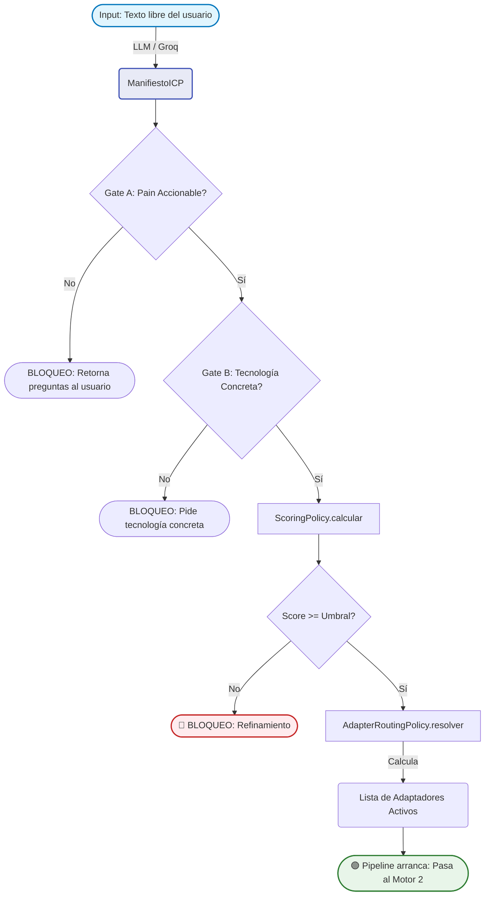
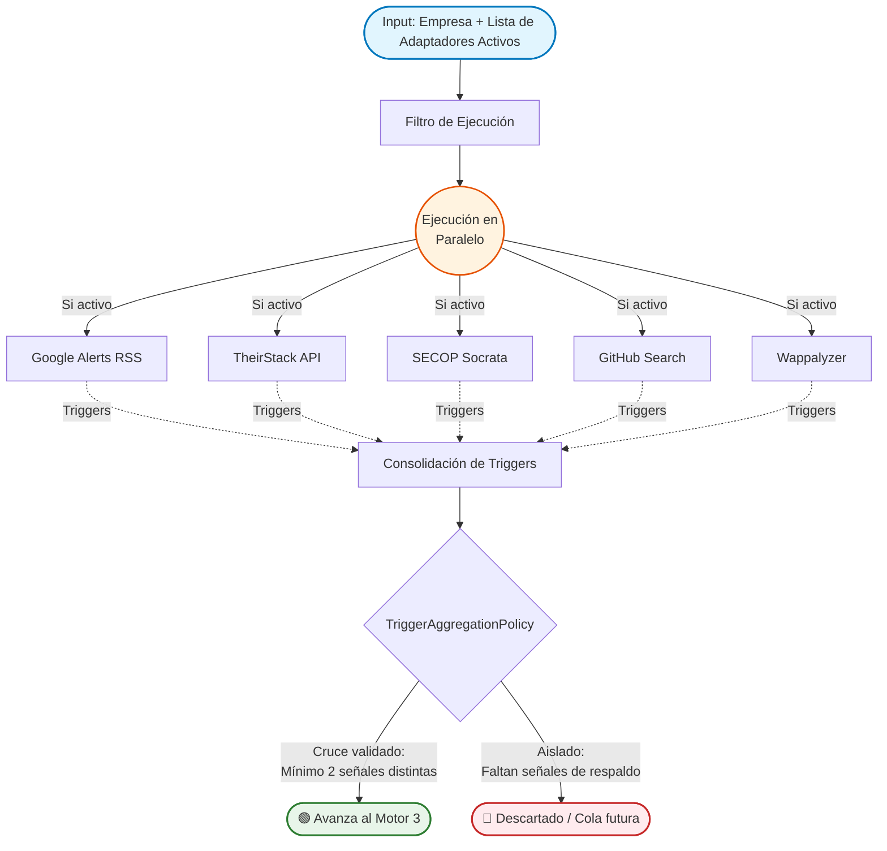
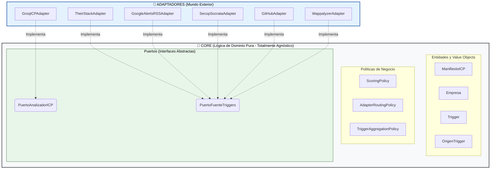

# Flujo Estructural: Motores 1 y 2 (El Prospector) — v3.0 (Enrutador Dinámico)

Este documento destila la arquitectura técnica y operativa de los Motores 1 y 2.
**Cambio principal v3.0:** El Motor 1 ya no es solo un Analizador de ICP. Es un **Analizador + Enrutador Dinámico**. Produce un `ManifiestoICP` tipado Y una lista de adaptadores a activar, calculada por la `AdapterRoutingPolicy`. El Motor 2 ejecuta únicamente los adaptadores que el Motor 1 habilitó.

---

## MOTOR 1: Analizador ICP + Enrutador Dinámico

**Objetivo:** Transformar lenguaje natural en un `ManifiestoICP` tipado, bloquear perfiles genéricos, y determinar qué adaptadores del Motor 2 tienen sentido según la categoría de empresa detectada.

### Puerto Requerido: `PuertoAnalizadorICP`

El Motor 1 no llama directamente a ningún LLM. Habla con la abstracción:

```python
class PuertoAnalizadorICP(ABC):
    @abstractmethod
    def analizar(self, descripcion_libre: str) -> ManifiestoICP:
        ...
```

El adaptador concreto (`ClaudeICPAdapter`, `OpenAIICPAdapter`, etc.) implementa este puerto. El Core no sabe qué LLM se usa.

### Flujo Lógico (v3.0 con Enrutamiento):



**Nota sobre la doble validación en Gates A y B:**
Los Gates son redundantes con los validadores Pydantic de `ManifiestoICP`. Esto es intencional:
1. A nivel de modelo (Pydantic): rechaza el objeto con `ValueError` antes de llegar al Gate.
2. A nivel de política: `ScoringPolicy` puede bloquear con score bajo incluso si el objeto es válido.

### AdapterRoutingPolicy — Lógica de Enrutamiento

Esta política es **lógica de dominio pura**. No conoce adaptadores concretos, solo `ManifiestoICP` y `OrigenTrigger`. Es testable unitariamente sin LLM.

**Reglas de enrutamiento derivadas de la investigación de mercado:**

```python
class AdapterRoutingPolicy:
    """
    Decide qué adaptadores del Motor 2 activar según el ManifiestoICP.
    Regla base: Google Alerts siempre activo (90% universal).
    Los demás se activan condicionalmente según la categoría de empresa.
    """

    CATEGORIAS_GOV_FACING = {
        CategoriaEmpresa.AGENCIA_IT,
        CategoriaEmpresa.CONSULTORA_IT,
        CategoriaEmpresa.BPO_MANAGED,
        CategoriaEmpresa.GOVTECH_REGTECH,
    }

    CATEGORIAS_STACK_VISIBLE = {
        CategoriaEmpresa.SAAS_B2B_HORIZONTAL,
        CategoriaEmpresa.SAAS_B2B_VERTICAL,
        CategoriaEmpresa.AGENCIA_IT,
    }

    CATEGORIAS_SIN_WAPPALYZER = {
        CategoriaEmpresa.CIBERSEGURIDAD,    # Ocultan stack deliberadamente
        CategoriaEmpresa.REGULADO_FINTECH,  # Core bancario no es web-visible
        CategoriaEmpresa.REGULADO_HEALTHTECH,
        CategoriaEmpresa.AI_ML_PLATFORM,    # Infraestructura no frontal
        CategoriaEmpresa.BPO_MANAGED,
    }

    def resolver(self, manifesto: ManifiestoICP) -> list[OrigenTrigger]:
        activos: list[OrigenTrigger] = [OrigenTrigger.GOOGLE_ALERTS]  # Siempre activo

        # TheirStack: útil para todas las categorías excepto reguladas puras (hiring discreto)
        categorias_sin_theirstack = {
            CategoriaEmpresa.REGULADO_FINTECH,
            CategoriaEmpresa.REGULADO_HEALTHTECH,
        }
        if manifesto.categoria_empresa not in categorias_sin_theirstack:
            activos.append(OrigenTrigger.THEIRSTACK)

        # SECOP: solo si el perfil tiene naturaleza gov-facing
        if manifesto.es_gov_facing or manifesto.categoria_empresa in self.CATEGORIAS_GOV_FACING:
            activos.append(OrigenTrigger.SECOP_SOCRATA)

        # Wappalyzer: solo donde el stack es web-visible y el dolor es deuda técnica de frontend/backend
        if manifesto.categoria_empresa in self.CATEGORIAS_STACK_VISIBLE \
                and manifesto.categoria_empresa not in self.CATEGORIAS_SIN_WAPPALYZER:
            activos.append(OrigenTrigger.WAPPALYZER)

        return activos
```

**Ejemplo de enrutamiento en tiempo de ejecución:**

| Input del usuario | `categoria_empresa` detectada | Adaptadores activados |
|---|---|---|
| "Fintech colombiana que necesita seguridad" | `REGULADO_FINTECH` | Google Alerts solamente |
| "Agencia IT sobrevendida con contrato gobierno" | `AGENCIA_IT` + `es_gov_facing=True` | Google Alerts + TheirStack + SECOP + Wappalyzer |
| "SaaS B2B de 100 empleados con monolito" | `SAAS_B2B_HORIZONTAL` | Google Alerts + TheirStack + Wappalyzer |
| "Consultora de ciberseguridad LATAM" | `CIBERSEGURIDAD` | Google Alerts + TheirStack |

### ScoringPolicy (Pesos — sin cambio en v3.0):

| Dimensión             | Peso |
|-----------------------|------|
| Dolor Operativo       | 30%  |
| Anclaje Tecnológico   | 25%  |
| Cargos Decisores      | 15%  |
| Vertical / Sector     | 15%  |
| Tamaño de Empresa     | 10%  |
| Geografía             |  5%  |

---

## MOTOR 2: Cascada de Triggers (Ejecución Condicional)

**Objetivo:** Ejecutar únicamente los adaptadores habilitados por el Motor 1 y capturar señales de mercado deterministas.

**Regla de Oro (actualizada v3.0):** Un lead **nunca** avanza al Motor 3 con una sola señal. La `TriggerAggregationPolicy` evalúa:
1. Mínimo 2 triggers de **orígenes distintos** (mismo adaptador repetido no cuenta).
2. Al menos uno con `fecha_evento` dentro de los últimos **45 días**.
3. **Nuevo:** El umbral mínimo se calcula como `min(2, len(adaptadores_activos))`. Si el enrutador solo habilitó 1 adaptador (caso raro), 1 trigger válido es suficiente.

### Puerto Requerido: `PuertoFuenteTriggers`

```python
class PuertoFuenteTriggers(ABC):
    @abstractmethod
    def obtener_triggers(self, empresa: Empresa) -> list[Trigger]:
        """
        Contrato de error: nunca propaga excepciones al Core.
        Errores de red o API → retorna [] con log interno.
        """
        ...
```

### Adaptadores y su Condición de Activación

| Adaptador | Siempre activo | Condición de activación | Cobertura |
|---|---|---|---|
| `GoogleAlertsRSSAdapter` | ✅ SÍ | Siempre | 90% del árbol tech |
| `TheirStackAdapter` | ❌ NO | `categoria_empresa` no es REGULADO_FINTECH ni REGULADO_HEALTHTECH | 65% |
| `SecopSocrataAdapter` | ❌ NO | `es_gov_facing=True` o categoría gov-facing | 40% |
| `WappalyzerHeadlessAdapter` | ❌ NO | `categoria_empresa` en {SAAS_B2B_HORIZONTAL, SAAS_B2B_VERTICAL, AGENCIA_IT} | 35% |

#### 1. `GoogleAlertsRSSAdapter` — SIEMPRE ACTIVO
- **Implementación:** Google Alerts con salida RSS. Parseo con `feedparser`.
- **Input requerido de `Empresa`:** `nombre`.
- **Costo:** $0.
- **Triggers:** M&A, rondas de inversión, llegada nuevo C-Level técnico.
- **`nivel_confianza` ALTA:** Nuevo CTO/CIO/CDO confirmado < 6 meses.
- **`nivel_confianza` MEDIA:** Ronda de inversión anunciada.
- **`nivel_confianza` BAJA:** Mención en medios sin evento concreto.

#### 2. `TheirStackAdapter` — CONDICIONAL (activo para la mayoría)
- **Implementación:** API REST de TheirStack.
- **Input requerido de `Empresa`:** `nombre` y `dominio`.
- **Costo:** Según plan TheirStack (API key en secretos, nunca en Core).
- **Triggers:** Incompatibilidad de sistemas, crisis de talento.
- **`nivel_confianza` ALTA:** 3+ vacantes técnicas abiertas + nuevo stack adoptado simultáneamente.
- **`nivel_confianza` MEDIA:** 1-2 vacantes técnicas > 30 días.
- **`nivel_confianza` BAJA:** Vacante única, sin cruce con stack.
- **Descartado como criterio único:** ">30 días aislado" (alto volumen de ghost jobs).
- **Desactivado para:** `REGULADO_FINTECH`, `REGULADO_HEALTHTECH` (contratación discreta, alta tasa de falso positivo).

#### 3. `SecopSocrataAdapter` — CONDICIONAL (solo gov-facing)
- **Implementación:** `sodapy` + Socrata Open Data API (SODA) Colombia Compra Eficiente.
- **Input requerido de `Empresa`:** `nit_o_tax_id` o `nombre`.
- **Costo:** $0.
- **Triggers:** Adjudicación de contratos de alto valor a empresas tech.
- **`nivel_confianza` ALTA:** Contrato > COP 500M en últimos 45 días.
- **`nivel_confianza` MEDIA:** Contrato entre COP 100M-500M.
- **`nivel_confianza` BAJA:** Proceso licitatorio abierto (sin adjudicar).
- **Desactivado para:** SaaS B2B puro, ciberseguridad, AI/ML platforms (no venden al gobierno en fase temprana).

#### 4. `WappalyzerHeadlessAdapter` — CONDICIONAL (solo stack web visible)
- **Implementación:** `wappalyzer-next` (Python + Playwright). Lee cabeceras HTTP.
- **Input requerido de `Empresa`:** campo `dominio`.
- **Costo:** $0.
- **Triggers:** Stack EOL en producción, ausencia de tecnologías habilitadoras.
- **`nivel_confianza` ALTA:** Stack EOL con versión mayor > 2 años en producción.
- **`nivel_confianza` MEDIA:** Stack desactualizado con soporte activo.
- **`nivel_confianza` BAJA:** Header presente sin versión detectable.
- **Fallo controlado:** Dominio no resuelve o bloquea Playwright → retorna `[]`.
- **⚠️ LIMITACIÓN DOCUMENTADA:** Solo lee la "corteza" web (frontend, scripts). No detecta deuda técnica de backend (BD colapsadas, microservicios internos). Útil únicamente cuando el síntoma es stack frontend/web observable. Para TBBC, es señal secundaria, no primaria.
- **Desactivado para:** Ciberseguridad (ocultan stack deliberadamente), Fintech core (backend no web-visible), BPO, AI/ML platforms.

### Flujo de Ejecución del Motor 2 (v3.0):



---

## Mapa de Dependencias de Puertos — Vista Hexagonal v3.0



> **REGLA ABSOLUTA:** El Core nunca importa a los adaptadores. La `AdapterRoutingPolicy` retorna `OrigenTrigger` (un Enum del Core), no instancias de adaptadores. El orquestador de la aplicación (capa de casos de uso) resuelve el Enum a la instancia concreta del adaptador vía inyección de dependencias.

---
*v3.0 — Motor 1 evolucionado a Enrutador Dinámico. AdapterRoutingPolicy documentada.*
*Wappalyzer rebajado a adaptador condicional con limitaciones documentadas.*
