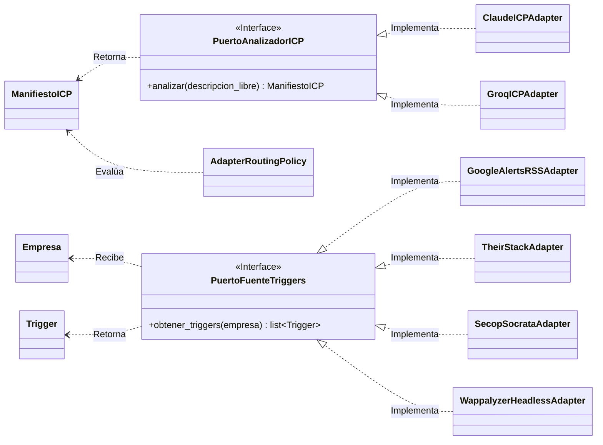

# Modelos de Dominio y Contratos (Core) — v4.1 (Blindaje Motor 2 — 17-Jul-2026)

Este documento especifica los contratos de datos (entidades de dominio) para el sistema El Prospector, usando Pydantic v2.

**Regla de Arquitectura Absoluta:** Estos modelos pertenecen al Core. Son estériles y agnósticos. No importan ninguna librería de adaptador (TheirStack, Playwright, feedparser, sodapy). Si un modelo importa algo externo, es una violación hexagonal inmediata.

---

## ENUMS COMPARTIDOS (Vocabulario Controlado del Dominio)

Toda decisión de negocio que involucre categorías fijas se codifica como Enum. Strings libres en campos categóricos son una vulnerabilidad de contrato.

```python
from enum import Enum

class CategoriaEmpresa(str, Enum):
    """
    Taxonomía de empresa detectada por el LLM (Motor 1).
    Alimenta la AdapterRoutingPolicy para decidir qué adaptadores activar.
    Basada en investigación de mercado B2B Tech LATAM 2026.
    """
    SAAS_B2B_HORIZONTAL  = "SAAS_B2B_HORIZONTAL"  # CRM, ERP, HRIS, Marketing Automation
    SAAS_B2B_VERTICAL    = "SAAS_B2B_VERTICAL"     # SaaS sectorial semi-regulado
    AGENCIA_IT           = "AGENCIA_IT"             # Fábrica de software, desarrollo a medida
    CONSULTORA_IT        = "CONSULTORA_IT"          # System integrators, transformación digital
    BPO_MANAGED          = "BPO_MANAGED"            # Operación continua, outsourcing
    CIBERSEGURIDAD       = "CIBERSEGURIDAD"         # Producto o servicio de seguridad
    AI_ML_PLATFORM       = "AI_ML_PLATFORM"         # LLM tooling, MLOps, agentic frameworks
    REGULADO_FINTECH     = "REGULADO_FINTECH"       # PSP, lending, cripto, open banking
    REGULADO_HEALTHTECH  = "REGULADO_HEALTHTECH"    # EHR, diagnóstico, telemedicina
    GOVTECH_REGTECH      = "GOVTECH_REGTECH"        # Gobierno electrónico, compliance automatizado

class TamanoEmpresa(str, Enum):
    STARTUP    = "STARTUP"       # < 50 empleados
    SME        = "SME"           # 50–200 empleados
    MID_MARKET = "MID_MARKET"    # 200–1000 empleados
    ENTERPRISE = "ENTERPRISE"    # > 1000 empleados

class BaseLegal(str, Enum):
    # Ley 1581/2012 (Colombia): NO existe "interés legítimo" (eso es GDPR).
    # Regla = consentimiento previo, expreso e informado. Autoridad: SIC.
    CONSENTIMIENTO_EXPLICITO = "CONSENTIMIENTO_EXPLICITO"  # Regla general (Art. 9)
    EJECUCION_CONTRATO       = "EJECUCION_CONTRATO"        # Relación contractual existente
    DATO_PUBLICO             = "DATO_PUBLICO"              # Excepción de dato público (Art. 10)

class NivelConfianza(str, Enum):
    ALTA  = "ALTA"
    MEDIA = "MEDIA"
    BAJA  = "BAJA"

class OrigenTrigger(str, Enum):
    WAPPALYZER      = "WAPPALYZER"
    THEIRSTACK      = "THEIRSTACK"
    SECOP_SOCRATA   = "SECOP_SOCRATA"
    GOOGLE_ALERTS   = "GOOGLE_ALERTS"
    GITHUB          = "GITHUB"          # v3.2 — Inteligencia de código
    PROPUESTA_VALOR = "PROPUESTA_VALOR" # v4.1 — Capa 2 Negative ICP (PropuestaValorAdapter)

class EstadoEmpresa(str, Enum):
    # v3.1 — Ciclo de vida de la Empresa (Discovery vs pre-CRM)
    DESCUBIERTA = "DESCUBIERTA"   # Creada por PuertoDescubridorEmpresas, sin validar
    VERIFICADA  = "VERIFICADA"    # Default; validada manualmente o por cruce
    EN_PIPELINE = "EN_PIPELINE"   # Outbound iniciado
    ARCHIVADA   = "ARCHIVADA"     # Descartada del pipeline activo

class EstadoCorreo(str, Enum):
    VERIFICADO  = "verificado"
    INFERIDO    = "inferido"
    NO_RESUELTO = "no_resuelto"
    MANUAL      = "manual"
    REBOTADO    = "rebotado"

class Seniority(str, Enum):
    IC        = "IC"         # Individual Contributor
    LEAD      = "LEAD"
    MANAGER   = "MANAGER"
    DIRECTOR  = "DIRECTOR"
    VP        = "VP"
    C_LEVEL   = "C_LEVEL"

class AutoridadDecision(str, Enum):
    DECISION_MAKER = "DECISION_MAKER"
    INFLUENCER     = "INFLUENCER"
    GATEKEEPER     = "GATEKEEPER"
    UNKNOWN        = "UNKNOWN"
```

---

## 1. ManifiestoICP (Perfil de Cliente Ideal)

Salida estructurada del Analizador de Intención (Motor 1).

**Regla de Diseño:** Los pesos de calificación (Scoring) no pertenecen a este modelo. Viven en `ScoringPolicy`.

**Vulnerabilidades cerradas en v2.1:**
- `anclaje_tecnologico` ahora exige `min_length=1`. Lista vacía dispara el Gate B automáticamente.
- `model_validator` garantiza que `pain_es_accionable=True` implique `dolor_operativo` no nulo ni vacío. Estado incoherente es ahora imposible.
- `base_legal` es ahora `BaseLegal` Enum. Strings libres como `"sí"` o `""` son rechazados por el contrato.
- `tamano_empresa` es ahora `TamanoEmpresa` Enum. Normalización garantizada.

```python
from pydantic import BaseModel, Field, model_validator
from datetime import datetime, timezone
from typing import Optional
import uuid

class ManifiestoICP(BaseModel):
    id: uuid.UUID                       = Field(default_factory=uuid.uuid4)
    dolor_operativo: Optional[str]      = Field(default=None, description="Texto libre del dolor. Requerido si pain_es_accionable=True.")
    pain_es_accionable: bool            = Field(..., description="False bloquea el pipeline en Gate A.")
    anclaje_tecnologico: list[str]      = Field(..., min_length=1, description="Mínimo 1 tecnología. Lista vacía bloquea en Gate B.")
    categoria_empresa: CategoriaEmpresa = Field(..., description="Taxonomía detectada por el LLM. Alimenta AdapterRoutingPolicy.")
    vertical: str                       = Field(..., description="Vertical de negocio en texto libre. Ej: 'Retail', 'Salud'.")
    es_gov_facing: bool                 = Field(default=False, description="True si la empresa vende o entrega servicios al gobierno. Activa SecopSocrataAdapter.")
    cargos_decisores: list[str]         = Field(..., min_length=1)
    tamano_empresa: TamanoEmpresa       = Field(...)
    geografia: str                      = Field(...)
    base_legal: BaseLegal               = Field(..., description="Cumplimiento Habeas Data Ley 1581.")
    fecha_generacion: datetime          = Field(default_factory=lambda: datetime.now(timezone.utc))

    @model_validator(mode="after")
    def validar_coherencia_dolor(self) -> "ManifiestoICP":
        if self.pain_es_accionable and not self.dolor_operativo:
            raise ValueError(
                "Estado incoherente: pain_es_accionable=True requiere dolor_operativo no nulo."
            )
        return self
```

**Campos nuevos en v3.0 (enrutamiento dinámico):**
- `categoria_empresa`: Enum de taxonomía detectada por el LLM. Es el input principal de `AdapterRoutingPolicy`.
- `es_gov_facing`: Booleano que activa `SecopSocrataAdapter`. Separado de `categoria_empresa` porque una `AGENCIA_IT` puede o no tener contratos gubernamentales.

---

## 2. Empresa

Entidad principal del pre-CRM. Inmutable por diseño DDD.

**Principio de diseño crítico — "un dato ausente NUNCA asume el valor del ICP" (v4.1):**
El campo `pais` tenía históricamente un default silencioso `"CO"` en el adaptador TheirStack
(`pais = empresa_data.get("country_code", "CO") or "CO"`). Este bug permitió que una empresa con
HQ en Londres (UK) pasara como candidata colombiana porque TheirStack no reportaba `country_code`
y el adaptador asumía el país del ICP del cliente. Fix: se eliminó el default. Si la fuente no
reporta el país, el campo recibe la constante `PAIS_DESCONOCIDO` (ver sección 2.2), que
`PoliticaValidacionGeografica` trata como `INDETERMINADO` (fail-closed), nunca como aprobación
automática. **Documentar con fecha = evidencia de decisión de arquitectura.**

**Vulnerabilidades cerradas en v2.1:**
- Campos "estándar" ahora están explícitamente definidos. Especificación "datos firmográficos estándar" era inimplementable.
- `model_config = ConfigDict(frozen=True)` ahora está explícito. Sin esto, el desarrollador puede omitirlo.
- `tamano` usa `TamanoEmpresa` Enum.

```python
from pydantic import BaseModel, ConfigDict, Field
from datetime import datetime, timezone
import uuid

class Empresa(BaseModel):
    model_config = ConfigDict(frozen=True)

    id: uuid.UUID                   = Field(default_factory=uuid.uuid4)
    nombre: str                     = Field(..., min_length=1)
    dominio: str                    = Field(..., description="Ej: acme.com. Clave para Wappalyzer.")
    nit_o_tax_id: Optional[str]     = Field(default=None, description="NIT colombiano u equivalente.")
    tamano: TamanoEmpresa           = Field(...)
    vertical: str                   = Field(...)
    pais: str                       = Field(default="CO")
    ciudad: Optional[str]           = Field(default=None)
    estado: EstadoEmpresa           = Field(default=EstadoEmpresa.VERIFICADA, description="v3.1 — Ciclo de vida. DESCUBIERTA si la creó PuertoDescubridorEmpresas.")
    fecha_captura: datetime         = Field(default_factory=lambda: datetime.now(timezone.utc))
```

**Nota v3.1:** El campo `estado` distingue empresas descubiertas automáticamente (Caso B) de las verificadas. El default `VERIFICADA` preserva compatibilidad con registros creados manualmente.

---

## 2.2 Constante Centinela PAIS_DESCONOCIDO (nueva en v4.1)

```python
# En src/core/domain/models.py — antes de la clase EstadoEmpresa
PAIS_DESCONOCIDO: str = "XX"
```

**Por qué existe:** "XX" es el rango reservado ISO 3166-1 para "código de usuario/no asignado". No es ningún país real, por lo que no puede colisionar con ningún dato legítimo. Se usa como centinela explícito para representar "el origen de datos no reportó el país de esta empresa".

**Qué resuelve:** la alternativa de usar `None`, `""` o un país real por defecto (`"CO"`) son todas opciones peligrosas:
- `None`/`""` puede confundirse con "sin restricción geográfica" si el código que lo consume no distingue claramente entre "sin dato" y "sin restricción".
- Un país real como `"CO"` miente activamente — afirma saber el país cuando no se sabe.

**Cómo se usa:** `PoliticaValidacionGeografica.evaluar()` trata `PAIS_DESCONOCIDO` igual que `None`: retorna `EstadoValidacionGeografica.INDETERMINADO` (fail-closed). El orquestador manda estas empresas a la cola de revisión manual.

---

## 2.3 Enums de Afinamiento Motor 2 (nuevos en v4.1)

```python
class EstadoConsensoTamano(str, Enum):
    """
    Resultado de PoliticaCorroboracionTamano (Motor 2 — waterfall de tamaño).
    Ningún origen individual es confiable por sí solo para TamanoEmpresa.
    """
    CONSENSO    = "CONSENSO"     # 2+ orígenes distintos coinciden (o tiers adyacentes)
    SIN_CONSENSO = "SIN_CONSENSO" # 2+ estimaciones pero en conflicto
    SIN_DATOS   = "SIN_DATOS"    # Ningún origen reportó tamaño

class ResultadoExclusionCompetidor(str, Enum):
    """
    Resultado de PoliticaExclusionCompetidores (Motor 2 — Negative ICP).
    3 cubetas del framework de la industria (hard / conditional / permitido)
    + 1 cuarto estado fail-closed (v4.1).
    """
    PERMITIDO                   = "PERMITIDO"                   # No compite con el cliente
    EXCLUIDO_DURO               = "EXCLUIDO_DURO"               # Misma CategoriaEmpresa → descarte
    REQUIERE_ANALISIS_SEMANTICO = "REQUIERE_ANALISIS_SEMANTICO" # Categorías vecinas → delegar a Capa 2
    PENDIENTE_REVISION_MANUAL   = "PENDIENTE_REVISION_MANUAL"   # Capa 2 indeterminada (fail-closed, v4.1)

class EstadoValidacionGeografica(str, Enum):
    """
    Resultado de PoliticaValidacionGeografica (Motor 2 — waterfall geográfico).
    Nuevo en v4.1.
    """
    PERMITIDO     = "PERMITIDO"     # País candidato coincide con geografía del ICP (o ICP sin restricción)
    EXCLUIDO      = "EXCLUIDO"      # País candidato conocido y distinto del ICP
    INDETERMINADO = "INDETERMINADO" # País candidato desconocido — fail-closed, nunca PERMITIDO
```

**Diseño del cuarto estado `PENDIENTE_REVISION_MANUAL`:** antes de v4.1, `ResultadoExclusionCompetidor` solo tenía 3 valores. Cuando la Capa 2 (`PropuestaValorAdapter`) no podía determinar `es_vendor_it` (scraping falló, SPA opaca, LLM no disponible), el orquestador (`sandbox_tbbc_real.py`) retornaba `PERMITIDO` por defecto — el "fail-open". Este es exactamente el fallo que dejó pasar a Parcero/UK. El cuarto estado fuerza que el orquestador trate la ambigüedad como "revisar manualmente", no como "aprobado".

---

## 2.4 ValueObject EstimacionTamano (nuevo en v4.1)

```python
class EstimacionTamano(BaseModel):
    """
    Una estimación CRUDA de tamaño de empresa, reportada por UN solo origen.
    PoliticaCorroboracionTamano recibe list[EstimacionTamano] de orígenes distintos
    y exige consenso de al menos 2 antes de aceptar un TamanoEmpresa como válido.
    No es un Trigger: es un dato firmográfico crudo, no una señal de intención de compra.
    """
    model_config = ConfigDict(frozen=True)

    origen: OrigenTrigger    # Mismo Enum que Trigger — reutilización intencional
    tamano_estimado: TamanoEmpresa
    confianza: float         = Field(default=1.0, ge=0.0, le=1.0)
    # TheirStack usa 1.0 (dato firmográfico real de employee_count)
    # PropuestaValorAdapter usa 0.6 (inferencia de lenguaje corporativo, no headcount real)
```

**Por qué está separado de Trigger:** un `Trigger` es una señal de intención de compra con fecha de evento, nivel de confianza y descripción legible. Una `EstimacionTamano` es un dato firmográfico crudo sin fecha de evento ni relación con señales de compra. `TriggerAggregationPolicy` no debe interpretar datos de tamaño; `PoliticaCorroboracionTamano` no debe interpretar señales de intención. Son policies distintas sobre datos distintos.

---

## 3. Trigger (Señal de Mercado)

Señal capturada por un adaptador del `PuertoFuenteTriggers` (Motor 2).

**Regla de Diseño:** Un lead nunca se aprueba con un solo Trigger. La evaluación cruzada ocurre en `TriggerAggregationPolicy`, no en este modelo.

**Vulnerabilidades cerradas en v2.1:**
- `origen` es ahora `OrigenTrigger` Enum. Un typo como `"TheiStack"` es rechazado inmediatamente.
- `empresa_id` agregado. Sin FK a Empresa, la política de "mínimo 2 vectores por empresa" era matemáticamente imposible de evaluar.
- `fecha_captura` tiene `default_factory` explícito.
- **Política de asignación de `nivel_confianza` por adaptador** (ver tabla abajo).

```python
class Trigger(BaseModel):
    id: uuid.UUID                   = Field(default_factory=uuid.uuid4)
    empresa_id: uuid.UUID           = Field(..., description="FK a Empresa. Obligatorio para cruce de señales.")
    origen: OrigenTrigger           = Field(...)
    nivel_confianza: NivelConfianza = Field(...)
    descripcion: str                = Field(..., min_length=1, description="Descripción legible del trigger detectado.")
    fecha_captura: datetime         = Field(default_factory=lambda: datetime.now(timezone.utc))
    fecha_evento: Optional[datetime]= Field(default=None, description="Fecha del evento original (ej. fecha del contrato SECOP). Obligatorio para calcular data decay.")
```

### Política de Asignación de NivelConfianza por Adaptador

Sin esta política, dos adaptadores asignan `ALTA` con criterios distintos, invalidando la validación cruzada.

| Adaptador         | Criterio ALTA                                        | Criterio MEDIA                              | Criterio BAJA                              |
|-------------------|------------------------------------------------------|---------------------------------------------|--------------------------------------------|
| `WAPPALYZER`      | Stack EOL en producción (versión mayor > 2 años)     | Stack desactualizado pero con soporte activo | Header presente pero sin versión detectable |
| `THEIRSTACK`      | 3+ vacantes técnicas abiertas + nuevo stack adoptado | 1-2 vacantes técnicas open > 30 días        | Vacante única, sin cruce con stack         |
| `SECOP_SOCRATA`   | Contrato adjudicado > COP 500M en últimos 45 días    | Contrato adjudicado entre 100M-500M         | Proceso licitatorio abierto (sin adjudicar)|
| `GOOGLE_ALERTS`   | Nuevo C-Level (CTO/CIO/CDO) confirmado < 6 meses     | Ronda de inversión anunciada                | Mención en medios sin evento concreto      |

---

## 4. Decisor (Contacto)

Relación N:1 con Empresa.

**Vulnerabilidades cerradas en v2.1:**
- `empresa_id` agregado. Sin FK, el Decisor era una entidad flotante sin contexto.
- `seniority` es ahora `Seniority` Enum.
- `autoridad_decision` es ahora `AutoridadDecision` Enum.
- `confianza_dato` tiene validadores `ge=0.0, le=1.0`. Valores fuera de rango eran aceptados silenciosamente.
- `ultima_verificacion` tiene `default_factory` explícito.

```python
from pydantic import EmailStr

class Decisor(BaseModel):
    id: uuid.UUID                         = Field(default_factory=uuid.uuid4)
    empresa_id: uuid.UUID                 = Field(..., description="FK a Empresa.")
    nombre: str                           = Field(...)
    cargo_original: str                   = Field(..., description="Texto exacto del cargo en la fuente.")
    cargo_normalizado: str                = Field(..., description="Cargo estandarizado internamente.")
    seniority: Seniority                  = Field(...)
    autoridad_decision: AutoridadDecision = Field(default=AutoridadDecision.UNKNOWN)
    correo: Optional[EmailStr]            = Field(default=None, description="Ausencia válida. Pasa a estado no_resuelto.")
    estado_correo: EstadoCorreo           = Field(default=EstadoCorreo.NO_RESUELTO)
    ultima_verificacion: datetime         = Field(default_factory=lambda: datetime.now(timezone.utc))
    confianza_dato: float                 = Field(..., ge=0.0, le=1.0, description="Confianza del dato entre 0.0 y 1.0.")
```

---

## 4.1 ProspectoCalificado — Contrato de Transición Motor 2 → Motor 3 (v3.4)

**Nueva en v3.4.** Diseño completo en `tecnico/prospector-m3-m4-design.md` §3.3.

DTO inmutable que empaqueta todo lo que el Motor 3 necesita del trabajo previo del pipeline.

```python
class ProspectoCalificado(BaseModel):
    model_config = ConfigDict(frozen=True)

    empresa: Empresa                = Field(..., description="Empresa ya calificada por TriggerAggregationPolicy.")
    triggers: list[Trigger]         = Field(..., min_length=1, description="Señales validadas. El enriquecedor NO las usa; viajan hacia el Motor 4 para personalizar el mensaje.")
    manifiesto: ManifiestoICP        = Field(..., description="Fuente de cargos_decisores.")
```

**Nota de diseño:** `PuertoEnriquecedorContactos.enriquecer()` NO recibe este DTO completo. El
orquestador extrae `empresa` y `manifiesto.cargos_decisores` y los pasa como argumentos explícitos
(`enriquecer(empresa, cargos)`), manteniendo el puerto mínimo y stateless.

---

## 5. Regla de Validación Cruzada de Triggers (TriggerAggregationPolicy)

Esta política NO es un modelo Pydantic. Es la lógica de dominio pura que decide si un prospecto avanza al Motor 3.

**Contrato de la política:**

```python
from collections import defaultdict

class TriggerAggregationPolicy:
    MINIMO_VECTORES: int = 2
    VENTANA_DIAS_DECAY: int = 45

    def evaluar(self, triggers: list[Trigger], adaptadores_activos: list[OrigenTrigger] | None = None) -> bool:
        """
        Retorna True si el prospecto cumple el umbral mínimo de señales.

        Regla 1: Mínimo MINIMO_VECTORES triggers de orígenes DISTINTOS.
                 Mismo origen repetido no cuenta como validación cruzada.
        Regla 2: Al menos uno debe tener fecha_evento dentro de VENTANA_DIAS_DECAY días.
        Regla 3 (v3.0): Si el enrutador solo habilitó 1 adaptador (caso edge),
                        el umbral se ajusta a min(MINIMO_VECTORES, len(adaptadores_activos)).
                        Esto evita que el sistema bloquee prospectos válidos cuando
                        la AdapterRoutingPolicy conscientemente redujo el scope.
        """
        # Calcular el umbral mínimo real según adaptadores disponibles
        umbral = self.MINIMO_VECTORES
        if adaptadores_activos is not None:
            umbral = min(self.MINIMO_VECTORES, len(adaptadores_activos))

        if len(triggers) < umbral:
            return False

        origenes_distintos = {t.origen for t in triggers}
        if len(origenes_distintos) < umbral:
            return False

        hoy = datetime.now(timezone.utc)
        ventana = timedelta(days=self.VENTANA_DIAS_DECAY)
        tiene_senial_fresca = any(
            t.fecha_evento and (hoy - t.fecha_evento) <= ventana
            for t in triggers
        )

        return tiene_senial_fresca
```

---

## 5.1 Regla de Umbral de Calidad para el Motor 4 (UmbralCalidadDecisor) — v3.4

**Nueva en v3.4.** Diseño completo en `tecnico/prospector-m3-m4-design.md` §3.4. Gate de calidad
entre Motor 3 y Motor 4: protege la reputación de dominio, ningún correo dudoso se envía.

```python
class UmbralCalidadDecisor:
    CONFIANZA_MINIMA: float = 0.7
    ESTADOS_APTOS: frozenset[EstadoCorreo] = frozenset({
        EstadoCorreo.VERIFICADO,
        EstadoCorreo.INFERIDO,
    })

    def es_apto_para_outbound(self, decisor: Decisor) -> bool:
        """True solo si confianza_dato >= 0.7 Y estado_correo en {VERIFICADO, INFERIDO}."""
        return (
            decisor.confianza_dato >= self.CONFIANZA_MINIMA
            and decisor.estado_correo in self.ESTADOS_APTOS
        )

    def particionar(self, decisores: list[Decisor]) -> tuple[list[Decisor], list[Decisor]]:
        """Separa (aptos_para_m4, cola_manual) en una sola pasada."""
        ...
```

**Calibración aprobada (14-Jul-2026):** en la cascada Apollo→Hunter, `accept_all`/`webmail` con
score de Hunter ≥ 80 mapea a `confianza_dato = 0.70` (apto); score 50-79 mapea a `0.65` (cola
manual). Ver tabla completa de mapeo en `tecnico/prospector-m3-m4-design.md` §3.2.

---

## 6. Puertos del Dominio (Interfaces Hexagonales)

**CRÍTICO:** Estas interfaces abstractas son el contrato que el Core exige a los adaptadores. Ningún adaptador puede ser instanciado directamente por el Core. Solo se inyectan a través de estas interfaces.

```python
from abc import ABC, abstractmethod

class PuertoFuenteTriggers(ABC):
    """Puerto que todo adaptador del Motor 2 debe implementar (Caso A: SCORING)."""

    @abstractmethod
    def obtener_triggers(self, empresa: Empresa) -> list[Trigger]:
        """
        Dado una Empresa, retorna la lista de Triggers detectados.
        Contrato: nunca lanza excepción hacia el Core. Los errores de red
        se capturan internamente y retornan lista vacía con log.
        """
        ...

class PuertoDescubridorEmpresas(ABC):
    """
    v3.1 — Puerto Caso B: DISCOVERY. Descubre empresas nuevas a partir de un ICP.
    ...
    """
    ...

class PuertoEstimadorTamano(ABC):
    """
    v4.1 — Puerto SECUNDARIO y OPCIONAL (Motor 2).
    Adaptadores que pueden estimar tamaño implementan este puerto ADEMÁS de PuertoFuenteTriggers.
    Alimenta PoliticaCorroboracionTamano, que exige consenso de al menos 2 orígenes distintos.
    Implementaciones: TheirStackAdapter, PropuestaValorAdapter.
    """

    @abstractmethod
    def estimar_tamano(self, empresa: Empresa) -> EstimacionTamano | None:
        """
        Retorna una EstimacionTamano cruda, o None si no tiene señal suficiente.
        Silencio válido — no todo origen tiene que opinar sobre toda empresa.
        Contrato: nunca lanza excepción. Errores de red/API → None con log.
        """
        ...

class PuertoClasificadorPropuestaValor(ABC):
    """
    v4.1 — Puerto Motor 2: Capa 2 del Negative ICP (análisis semántico profundo).
    Se invoca SOLO cuando PoliticaExclusionCompetidores retorna
    REQUIERE_ANALISIS_SEMANTICO. Control de costo: LLM solo donde la Capa 1 no decidió.
    Implementación: PropuestaValorAdapter.
    """

    @abstractmethod
    def clasificar(self, empresa: Empresa) -> CategoriaEmpresa | None:
        """
        Retorna la CategoriaEmpresa inferida del texto público de la empresa,
        o None si el análisis no pudo completarse (scraping/LLM fallaron).
        Contrato de error: None nunca significa "no es competidor" — es señal
        de indeterminismo que el orquestador debe tratar como PENDIENTE_REVISIÓN_MANUAL.
        """
        ...

class PuertoAnalizadorICP(ABC):
    """Puerto que el adaptador LLM del Motor 1 debe implementar."""
    ...

class PuertoEnriquecedorContactos(ABC):
    """v3.4 — Puerto Caso C: ENRIQUECIMIENTO (Motor 3)."""
    ...
```

**Nota arquitectónica sobre AdapterRoutingPolicy:**
La `AdapterRoutingPolicy` (documentada en `flujos_motor_1_y_2.md`) vive en el Core como política de dominio. Retorna `list[OrigenTrigger]` (Enum del Core), nunca instancias de adaptadores concretos. El orquestador de la capa de aplicación (use cases) es quien resuelve el Enum a la instancia concreta mediante inyección de dependencias. Esto preserva el aislamiento hexagonal.

### Diagrama de Dependencias de Clases — v3.0



> **REGLA:** Las flechas punteadas (`..|>`) van del adaptador al Core. El Core **nunca** importa un adaptador. `AdapterRoutingPolicy` retorna `OrigenTrigger` (Enum), no adaptadores concretos.

---
*v3.0 — CategoriaEmpresa Enum agregado. ManifiestoICP extendido con categoria_empresa y es_gov_facing.*
*TriggerAggregationPolicy actualizada con umbral dinámico según adaptadores_activos.*
*AdapterRoutingPolicy documentada en flujos_motor_1_y_2.md.*
*v3.4 (14-Jul-2026) — Fase 1 del Motor 3 materializada en Core: `PuertoEnriquecedorContactos`*
*(firma stateless `enriquecer(empresa, cargos)`), `ProspectoCalificado` (contrato de transición*
*M2→M3) y `UmbralCalidadDecisor` (gate de calidad hacia Motor 4).*
*v4.1 (17-Jul-2026) — Blindaje Motor 2: `PAIS_DESCONOCIDO` (centinela fail-closed), `EstimacionTamano`*
*(ValueObject waterfall de tamaño), `EstadoConsensoTamano`, `ResultadoExclusionCompetidor` extendido a 4 valores*
*(+PENDIENTE_REVISION_MANUAL), `EstadoValidacionGeografica`. `OrigenTrigger.PROPUESTA_VALOR` agregado.*
*Puertos nuevos: `PuertoEstimadorTamano`, `PuertoClasificadorPropuestaValor`. 275 tests verdes.*
