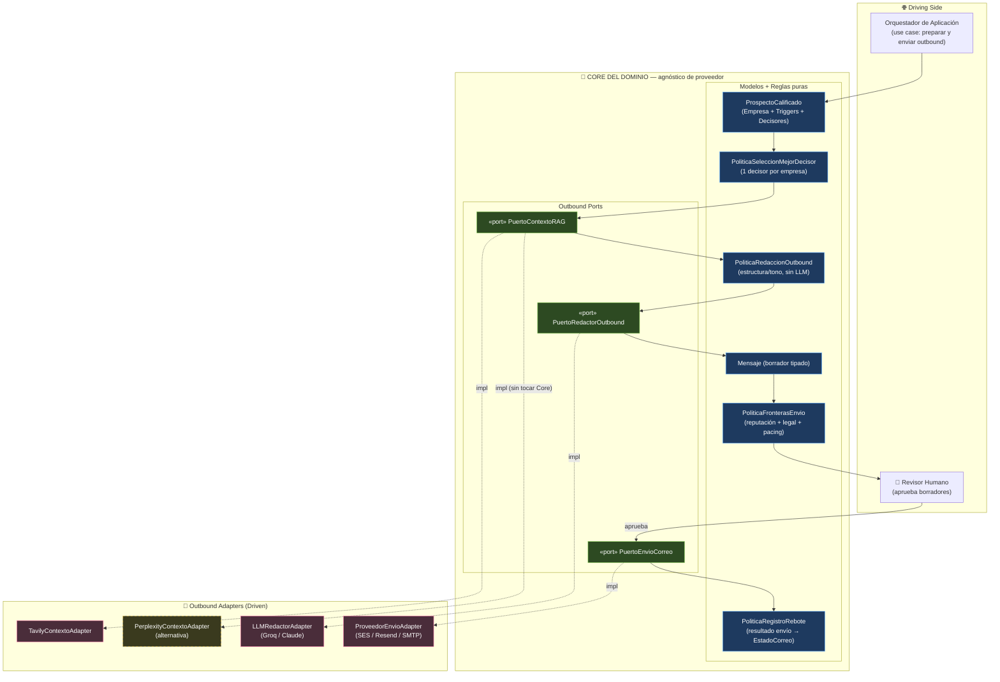
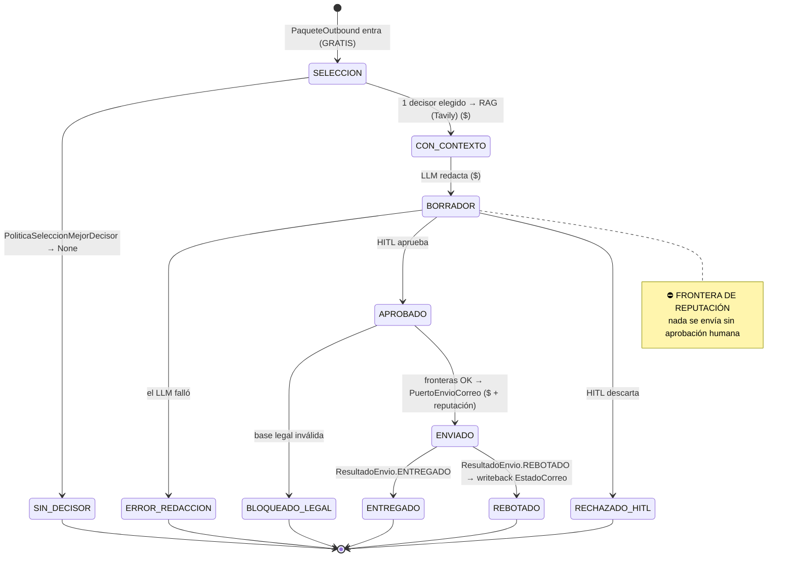

# Prospector — Diseño de Arquitectura M4 (Outbound RAG / Redacción y Envío)

---
*   **Proyecto:** El Prospector — Vía B Greenfield Build
*   **Fecha de Creación:** 15 de Julio de 2026
*   **Autoría:** Yeison Estiven Delgado Ordoñez · Fuente de la Verdad
*   **Estado:** ✅ SPEC APROBADA (revisión Principal Architect, 15-Jul-2026) — LUZ VERDE Fase 1 (Core + Puertos)
---

> **Naturaleza del documento.** Especificación de diseño técnico (no código de producción) para el
> Motor 4. Continúa la arquitectura hexagonal estricta de `prospector-m1-m2-design.md` y
> `prospector-m3-m4-design.md`: el Core es agnóstico de proveedor, los puertos son contratos y los
> adaptadores (Tavily, LLM, proveedor de envío) son piezas reemplazables inyectadas en el composition
> root. Ningún nombre de proveedor vive dentro del Core.
>
> Alineado con `modelos_dominio_core.md` (`Empresa`, `Decisor`, `Trigger`, `ManifiestoICP`,
> `EstadoCorreo`, `Seniority`, `AutoridadDecision`), con `prospector-m3-m4-design.md` (contrato de
> transición y `UmbralCalidadDecisor`) y con `validacion/validacion-fuentes.md` §6-§7 (pricing,
> Habeas Data, cold email).

---

## 0. El argumento de negocio (qué hace M4 y por qué su primer acto NO es vender)

El Motor 4 es el único punto del pipeline que **toca a un ser humano real por fuera**. Todo lo anterior
(M1-M3) ocurrió en privado, sobre datos. M4 envía. Eso lo convierte en el motor de mayor riesgo del
sistema: un mal envío no cuesta un crédito, cuesta la **reputación del dominio** (SPF/DKIM/DMARC) y la
**exposición legal** (Habeas Data, Ley 1581).

Por eso este diseño invierte la expectativa obvia:

> **El primer trabajo útil de M4 no es vender. Es cerrar el segundo KPI que dejó abierto el piloto de
> M3: el bounce rate real < 2%.** Ese número solo existe cuando alguien envía correos de verdad y
> cuenta rebotes. M4 es, antes que un redactor, el **instrumento de medición** que le faltaba a M3.

Tres formas concretas en que este diseño protege el negocio:

1. **Desduplicación en la raíz (problema Rappi).** El piloto reveló 5 decisores "VP of Engineering" en
   una sola empresa. Enviar a los 5 es spray-and-pray: quema dominio y marca. Una política pura del
   Core selecciona **un solo decisor por empresa** antes de gastar un token de RAG o de LLM.
2. **Doble frontera antes del envío.** Igual que M1/M2 tuvieron la frontera de costo (HITL antes de
   gastar créditos), M4 tiene la **frontera de reputación** (modo borrador + aprobación humana) y la
   **frontera legal** (check Habeas Data). Nada sale sin cruzar ambas.
3. **Medición como ciudadano de primera clase.** El lazo de retroalimentación de rebotes escribe de
   vuelta `EstadoCorreo.REBOTADO` en el `Decisor`. Sin este writeback, el KPI de M3 nunca se cierra y
   volaríamos a ciegas.

---

## 1. Cómo leer esta arquitectura (guía rápida)

- **Core:** decide *a quién de la empresa se le escribe* (`PoliticaSeleccionMejorDecisor`), *qué forma
  tiene un mensaje válido* (`Mensaje` + `PoliticaRedaccionOutbound`) y *cuándo un envío es apto para
  ejecutarse* (fronteras). No sabe que Tavily, Perplexity o un proveedor SMTP existen.
- **Puertos:** `PuertoContextoRAG` (traer contexto fresco), `PuertoRedactorOutbound` (redactar con LLM)
  y `PuertoEnvioCorreo` (enviar y reportar resultado). Enchufes en la pared.
- **Adaptadores:** `TavilyContextoAdapter`, `LLMRedactorAdapter`, `ProveedorEnvioAdapter`. Los aparatos.

> **Regla de oro de la dependencia (idéntica a M1/M2/M3):** las flechas apuntan hacia adentro. El
> adaptador conoce al Core; el Core JAMÁS conoce al adaptador.

---

## 2. Diagrama de Arquitectura Hexagonal (M4)



**Cómo leerlo:** la caja azul (Core) solo contiene reglas puras y contratos de puerto. Todo lo rosado
(Tavily, LLM, proveedor de envío) es reemplazable. El revisor humano (HITL) está en el camino crítico:
ningún mensaje llega a `PuertoEnvioCorreo` sin pasar por él.

---

## 3. Contrato de transición Motor 3 → Motor 4

M4 arranca **solo** con decisores que superaron el `UmbralCalidadDecisor` de M3 (aptos para outbound).
El input es el mismo `ProspectoCalificado` que ya definimos en el Core, **ahora enriquecido con los
decisores aptos** y con los triggers finalmente en uso.

```python
from pydantic import BaseModel, ConfigDict, Field

class PaqueteOutbound(BaseModel):
    """
    Contrato de transición M3 → M4. Inmutable.
    Empaqueta el prospecto calificado + los decisores YA filtrados por
    UmbralCalidadDecisor (solo VERIFICADO/INFERIDO con confianza >= 0.7).
    """
    model_config = ConfigDict(frozen=True)

    prospecto: ProspectoCalificado = Field(..., description="Empresa + Triggers + ManifiestoICP (de M2).")
    decisores_aptos: list[Decisor] = Field(..., min_length=1, description="Salida de UmbralCalidadDecisor.particionar()[0].")
```

| Input | Origen | Uso en M4 |
|-------|--------|-----------|
| `prospecto.empresa` | M2 | Contexto de empresa para el RAG y el mensaje |
| `prospecto.triggers` | M2 | **Aquí SÍ se usan.** Gancho de personalización ("vi que abrieron 3 vacantes de backend") |
| `prospecto.manifiesto` | M1 | Tono/ángulo según `categoria_empresa`, `dolor_operativo` |
| `decisores_aptos` | M3 | Candidatos a contactar — pasan por `PoliticaSeleccionMejorDecisor` |

> **Los Triggers por fin cobran sentido.** En M3 los marqué como metadata que viajaba sin usarse; en M4
> son la materia prima de la personalización. Un mensaje sin trigger concreto es spam genérico.

---

## 4. Filtro de Desduplicación — `PoliticaSeleccionMejorDecisor` (resuelve el problema Rappi)

Política de dominio pura. Vive en `src/core/domain/policies.py`. **Se ejecuta ANTES del RAG y del LLM**
para no gastar contexto ni tokens en decisores que vamos a descartar.

**Regla de negocio:** de todos los decisores aptos de UNA empresa, se elige **exactamente uno** — el de
mayor autoridad de decisión; a igual autoridad, el de mayor `confianza_dato`; a igual confianza, el de
mayor seniority. Esto convierte los 5 VPs de Rappi en 1 solo contacto, en la raíz.

```python
class PoliticaSeleccionMejorDecisor:
    """
    Selecciona el ÚNICO decisor a contactar por empresa. Determinista y pura.
    Resuelve el anti-patrón spray-and-pray detectado en el piloto (5 VPs de Rappi).
    """

    # Orden de prioridad de autoridad (mayor = mejor).
    _RANK_AUTORIDAD: dict[AutoridadDecision, int] = {
        AutoridadDecision.DECISION_MAKER: 3,
        AutoridadDecision.INFLUENCER: 2,
        AutoridadDecision.GATEKEEPER: 1,
        AutoridadDecision.UNKNOWN: 0,
    }

    # Orden de prioridad de seniority (desempate final).
    _RANK_SENIORITY: dict[Seniority, int] = {
        Seniority.C_LEVEL: 6, Seniority.VP: 5, Seniority.DIRECTOR: 4,
        Seniority.MANAGER: 3, Seniority.LEAD: 2, Seniority.IC: 1,
    }

    def seleccionar(self, decisores: list[Decisor]) -> Decisor | None:
        """
        Retorna el mejor decisor de la lista, o None si la lista está vacía.
        Criterio de orden (descendente): autoridad → confianza_dato → seniority.
        Todos los decisores deben pertenecer a la MISMA empresa (precondición
        del orquestador). No lanza excepción.
        """
        if not decisores:
            return None
        return max(
            decisores,
            key=lambda d: (
                self._RANK_AUTORIDAD.get(d.autoridad_decision, 0),
                d.confianza_dato,
                self._RANK_SENIORITY.get(d.seniority, 0),
            ),
        )
```

**Aplicado al piloto real:** para Rappi (5 decisores), la política habría elegido a Leandro Reox
(`Chief Technology Officer` → C_LEVEL, confianza 0.90) sobre los cuatro VPs. Un envío, no cinco.

> **Nota de política de producto (a validar con negocio):** ¿un contacto por empresa, o un contacto por
> *unidad de decisión*? En empresas grandes puede haber decisores legítimos en áreas distintas. Para el
> piloto de reputación, **estricto: uno por empresa**. Relajable después con datos.

---

## 5. Puertos del Dominio (nuevos en M4)

Viven en `src/core/ports/interfaces.py`. Contrato de error uniforme con el resto del sistema: **nunca
propagan excepción al Core**; error → valor vacío/seguro con log.

```python
from abc import ABC, abstractmethod

class PuertoContextoRAG(ABC):
    """
    Recupera contexto fresco y verificable sobre la empresa/decisor para
    fundamentar el mensaje (evita alucinación del LLM). Impl: Tavily, Perplexity.
    """
    @abstractmethod
    def obtener_contexto(self, empresa: Empresa, triggers: list[Trigger]) -> ContextoRAG:
        """
        Retorna evidencia citable (snippets + URLs fuente) alineada con los triggers.
        Contrato: nunca lanza al Core. Error/sin resultados → ContextoRAG vacío.
        """
        ...


class PuertoRedactorOutbound(ABC):
    """
    Genera un Mensaje tipado a partir de decisor + triggers + contexto RAG.
    Impl: LLMRedactorAdapter (Groq/Claude) detrás del puerto, salida validada.
    """
    @abstractmethod
    def redactar(self, decisor: Decisor, empresa: Empresa,
                 triggers: list[Trigger], contexto: ContextoRAG) -> Mensaje:
        """
        Retorna un Mensaje en estado BORRADOR. Nunca envía. Nunca lanza al Core:
        si el LLM falla, retorna Mensaje con estado ERROR_REDACCION y log.
        """
        ...


class PuertoEnvioCorreo(ABC):
    """
    Envía un Mensaje aprobado y reporta el resultado real del envío.
    Impl: SES / Resend / SMTP. Es el ÚNICO puerto que produce efectos externos.
    """
    @abstractmethod
    def enviar(self, mensaje: Mensaje, decisor: Decisor) -> ResultadoEnvio:
        """
        Retorna ResultadoEnvio (ENTREGADO / REBOTADO / DIFERIDO / RECHAZADO).
        Contrato: nunca lanza al Core. Error de red → ResultadoEnvio.ERROR con log.
        """
        ...
```

Modelos de apoyo (Core, Pydantic):

```python
class EstadoMensaje(str, Enum):
    BORRADOR         = "BORRADOR"          # generado, no revisado
    APROBADO         = "APROBADO"          # HITL dio visto bueno
    RECHAZADO_HITL   = "RECHAZADO_HITL"    # humano lo descartó
    ENVIADO          = "ENVIADO"
    ERROR_REDACCION  = "ERROR_REDACCION"   # el LLM falló

class ResultadoEnvio(str, Enum):
    ENTREGADO = "ENTREGADO"
    REBOTADO  = "REBOTADO"
    DIFERIDO  = "DIFERIDO"
    RECHAZADO = "RECHAZADO"
    ERROR     = "ERROR"

class ContextoRAG(BaseModel):
    model_config = ConfigDict(frozen=True)
    evidencias: list[str] = Field(default_factory=list, description="Snippets citables.")
    fuentes: list[str]    = Field(default_factory=list, description="URLs de respaldo (anti-alucinación).")

class Mensaje(BaseModel):
    model_config = ConfigDict(frozen=True)
    decisor_id: uuid.UUID   = Field(...)
    asunto: str             = Field(..., min_length=1)
    cuerpo: str             = Field(..., min_length=1)
    estado: EstadoMensaje   = Field(default=EstadoMensaje.BORRADOR)
    fuentes_citadas: list[str] = Field(default_factory=list, description="Trazabilidad del RAG.")
```

---

## 6. Lazo de Retroalimentación de Rebotes (cierra el KPI pendiente de M3)

Este es el paso que convierte a M4 en instrumento de medición. Cuando `PuertoEnvioCorreo.enviar()`
retorna un `ResultadoEnvio`, una política pura traduce ese resultado a un cambio de estado del
`Decisor`, **escribiéndolo de vuelta** en el repositorio.

```python
class PoliticaRegistroRebote:
    """
    Traduce el resultado real de un envío al EstadoCorreo del Decisor.
    Es el mecanismo que permite medir el bounce rate real (KPI de M3 §3.5).
    """
    def aplicar(self, decisor: Decisor, resultado: ResultadoEnvio) -> Decisor:
        """
        Retorna una COPIA del Decisor con estado_correo actualizado.
        REBOTADO → EstadoCorreo.REBOTADO (baja de confianza, se saca del pipeline).
        ENTREGADO → confirma el dato; mantiene VERIFICADO/INFERIDO.
        Decisor es frozen: se usa model_copy(update=...).
        """
        if resultado == ResultadoEnvio.REBOTADO:
            return decisor.model_copy(update={
                "estado_correo": EstadoCorreo.REBOTADO,
                "confianza_dato": 0.0,
            })
        return decisor
```

**Cómo se calcula el KPI (§3.5 de M3):**

```
bounce_rate_real = (# decisores con EstadoCorreo.REBOTADO tras envío)
                   / (# correos efectivamente enviados)
```

**Medición por cohorte de confianza (crítico).** El bounce rate se reporta **segmentado**:
`VERIFICADO` (0.90) vs. `INFERIDO`-0.70 vs. `INFERIDO`-0.65. Esto valida o refuta empíricamente la
calibración que aprobamos en M3 §3.2. Hipótesis a testear: el cohorte `INFERIDO`-0.70 concentrará la
mayoría de los rebotes. Si su bounce supera el 2%, subimos su umbral o lo mandamos a cola manual.

---

## 7. Fronteras de Reputación y Legal (requisitos estrictos antes del envío)

Dos compuertas en serie. Un mensaje **no se envía** hasta cruzar ambas. Es la analogía de la "frontera
de costo" de M1/M2, aplicada ahora a la reputación y al cumplimiento.

### 7.1 Frontera Legal (Habeas Data) — bloqueante duro

```python
class PoliticaFronteraLegal:
    """
    Gate de cumplimiento Habeas Data (Ley 1581/2012, Colombia).
    NO sustituye la asesoría legal real (pendiente en validacion-fuentes.md §7).
    Codifica los mínimos verificables por software.
    """
    BASES_LEGALES_VALIDAS = frozenset({BaseLegal.DATO_PUBLICO, BaseLegal.EJECUCION_CONTRATO,
                                       BaseLegal.CONSENTIMIENTO_EXPLICITO})

    def puede_contactar(self, manifiesto: ManifiestoICP) -> bool:
        """True solo si hay una base legal declarada y válida bajo Ley 1581."""
        return manifiesto.base_legal in self.BASES_LEGALES_VALIDAS
```

> ⚠️ **Bloqueante de producción (no resoluble por IA):** el primer envío real a PII de ciudadanos
> colombianos (ya la tenemos: nombres y correos del piloto) requiere validación de un abogado sobre la
> base legal y el mecanismo de baja. Documentado en `validacion/validacion-fuentes.md §7`. El diseño de
> M4 puede completarse; el *envío* queda bloqueado hasta ese visto bueno.

**Requisitos de cold email en el cuerpo del mensaje** (verificables por `PoliticaRedaccionOutbound`):
identificación clara del remitente, motivo del contacto, y **opción de baja (opt-out)** explícita.

### 7.2 Frontera de Reputación — HITL "Modo Borrador"

```python
class PoliticaFronterasEnvio:
    """
    Compuerta de reputación. Ningún Mensaje pasa a PuertoEnvioCorreo sin:
      1. base legal OK (PoliticaFronteraLegal),
      2. estado == APROBADO (un humano revisó el borrador),
      3. límite de pacing no excedido (rate limiting anti-spam).
    """
    MAX_ENVIOS_POR_DOMINIO_DIA: int = 20   # ajustable; conservador para dominio joven

    def es_enviable(self, mensaje: Mensaje, base_legal_ok: bool,
                    enviados_hoy: int) -> bool:
        return (
            base_legal_ok
            and mensaje.estado == EstadoMensaje.APROBADO
            and enviados_hoy < self.MAX_ENVIOS_POR_DOMINIO_DIA
        )
```

**Modo Borrador (el flujo por defecto del piloto):**
1. M4 genera los N mensajes en estado `BORRADOR` (RAG + LLM). **No envía nada.**
2. Un humano revisa calidad, pertinencia del trigger y tono → marca `APROBADO` o `RECHAZADO_HITL`.
3. Solo los `APROBADO` que cruzan la frontera legal + pacing llegan a `PuertoEnvioCorreo`.
4. Se arranca con un envío pequeño y controlado (los 8 aptos del piloto) para medir bounce real.

> **Estrategia de warm-up de dominio:** empezar con `VERIFICADO` (0.90) únicamente; incorporar el
> cohorte `INFERIDO` solo tras confirmar bounce < 2% en el primer lote. Esto protege el dominio joven.

---

## 8. Máquina de estados del Mensaje (M4)



**Orden de ejecución (barato → caro, con cortes tempranos):**

| Paso | Operación | Costo | Corte temprano |
|------|-----------|-------|-----------------|
| 1 | `PoliticaSeleccionMejorDecisor` | Cero | Sin decisor → no gasta RAG/LLM |
| 2 | `PuertoContextoRAG` (Tavily) | $ (créditos Tavily) | — |
| 3 | `PuertoRedactorOutbound` (LLM) | $ (tokens, baratos) | — |
| 4 | HITL + fronteras legal/pacing | Cero | Rechazo → no envía |
| 5 | `PuertoEnvioCorreo` | $ + reputación | — |
| 6 | `PoliticaRegistroRebote` (writeback) | Cero | Cierra el KPI de M3 |

---

## 9. Aislamiento hexagonal y extensibilidad

- **El Core no importa Tavily, ni el LLM, ni el proveedor de envío.** Solo define puertos y políticas
  puras (`PoliticaSeleccionMejorDecisor`, `PoliticaRedaccionOutbound`, `PoliticaFronterasEnvio`,
  `PoliticaFronteraLegal`, `PoliticaRegistroRebote`). Cero dependencias de red.
- **Proveedor de RAG intercambiable:** Tavily hoy, Perplexity mañana — otro adaptador, mismo puerto.
- **Proveedor de envío intercambiable:** SES / Resend / SMTP tras `PuertoEnvioCorreo`.
- **Determinismo testeable sin red:** selección de decisor, fronteras y registro de rebote se prueban
  con datos en memoria; los adaptadores se prueban con mocks (como en M2/M3, cero créditos en CI).

---

## 10. Qué queda fuera de esta spec (alcance explícito)

- **Secuencias de follow-up / cadencias multi-toque:** esta spec cubre el primer toque. Las cadencias
  son una iteración posterior.
- **A/B testing de asuntos/cuerpos:** fuera de alcance del piloto de reputación.
- **Persistencia y scheduler:** se asumen del diseño M1/M2 (repositorio, workers stateless). Aquí solo
  se define qué estado nuevo persiste (`EstadoMensaje`, writeback de `EstadoCorreo`).
- **Calibración fina de pacing:** `MAX_ENVIOS_POR_DOMINIO_DIA` es un punto de partida conservador.

---

## 11. Decisiones cerradas por el Principal Architect (15-Jul-2026)

| # | Punto abierto | Resolución | Sección afectada |
|---|----------------|------------|-------------------|
| 1 | Granularidad de desduplicación | **Estricta: 1 decisor por empresa.** No arriesgar reportes de spam por contactar dos personas del mismo corporativo. Si el primero rebota o rechaza, se itera después; de entrada, uno solo. | §4 |
| 2 | Proveedor de envío | **Resend.** Mejor DX que SES y webhooks nativos limpios para capturar rebotes y alimentar `PoliticaRegistroRebote`. El `ProveedorEnvioAdapter` se implementará sobre Resend. | §5, §6 |
| 3 | Umbral de pacing | **Aprobado: 20 envíos/día por dominio.** Límite responsable para calentar un dominio B2B nuevo. | §7.2 |
| 4 | Cohorte de arranque | **Aprobado: solo `VERIFICADO` (0.90) primero.** Construir reputación con los 0.90 antes de arriesgar el dominio con los `INFERIDO`-0.70. | §7.2 |

**Luz verde otorgada para Fase 1 de M4:** materializar en el Core el DTO `PaqueteOutbound`, los modelos
(`Mensaje`, `ContextoRAG`, `EstadoMensaje`, `ResultadoEnvio`), los 3 puertos (`PuertoContextoRAG`,
`PuertoRedactorOutbound`, `PuertoEnvioCorreo`) y las 4 políticas puras (`PoliticaSeleccionMejorDecisor`,
`PoliticaFronteraLegal`, `PoliticaFronterasEnvio`, `PoliticaRegistroRebote`). La `PoliticaRedaccionOutbound`
queda como abstracción (fuera de Fase 1). Los adaptadores concretos (Tavily, LLM, Resend) quedan fuera
de esta fase.

---

## 12. Fuentes consultadas
- `10-Memoria_Consolidada/tecnico/prospector-m1-m2-design.md` (arquitectura hexagonal, frontera de costo)
- `10-Memoria_Consolidada/tecnico/prospector-m3-m4-design.md` (contrato de transición, UmbralCalidadDecisor, KPI §3.5)
- `10-Memoria_Consolidada/modelos_dominio_core.md` (`Decisor`, `EstadoCorreo`, `AutoridadDecision`, `Seniority`)
- `10-Memoria_Consolidada/validacion/validacion-fuentes.md` §6 (pricing Tavily/LLM), §7 (Habeas Data, cold email)

*Nota: el contenido de fuentes externas fue reformulado y resumido por cumplimiento de restricciones de licencia.*
